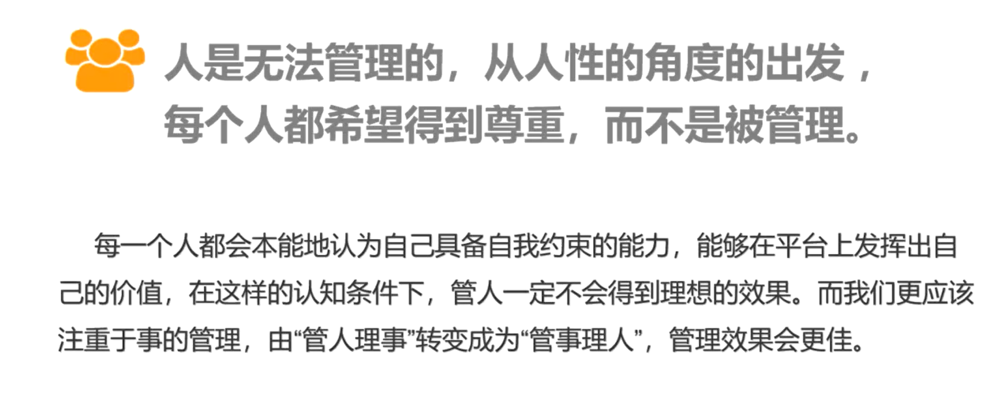
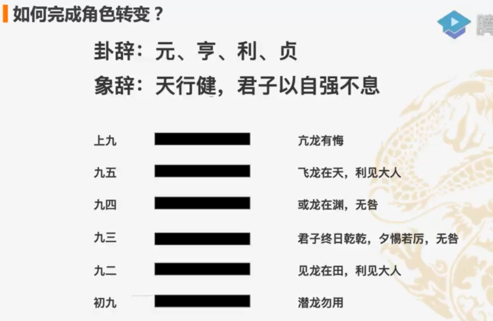

##### 你第一天入职，环境都没配，领导让你解决一个bug，你怎么办？

你是否可以和同事聊一聊，说我今天刚来，这个问题我也不太熟悉，你是不是比较熟悉，可以帮我一下，或者说你现在比较忙的话，有哪些活儿我可以帮你做，你可不可以帮我把我这个问题处理一下？

领导让你把这个bug解决掉，你解决掉就好了啊，而不是说领导在为难你，然后我环境还没配，我今天第一天入职...你说这些没有用，并没有把问题解决掉。

##### 老板让小张找一下物业，把画挂到墙上

物业没上班，你跑过去，跑回来，告诉老板说，物业没上班，挂不了。

老板告诉你去找物业，只不过是给了你一条可行的路径，但是最终你把路径当做工作，告诉老板说物业没上班，你觉得这样做就完成了吗？那幅画是不是还没在墙上？你只需要下楼买个钉子，把画搞上去就行了，我们要的是完成这件事，而不是你做了什么。

管理目的，就是你要完成从资源到价值的转化。不是脑子灵光才能做好这件事，只需要你思维模式变一下，就能完成这样一件事情。

这也是之前我们聊过，从p5升p6，从p6升p7，到底应该怎么去升级。

如果你只是机械的去完成一份作业，交给你什么，你去完成什么，甚至还不一定完成得好，这种情况下你想升级加薪，凭什么是你啊？如果你是老板的话，你会给这样的人升职加薪吗？

在一个团队里，什么性格的人都是存在的，对于有些人，这个事儿都不叫事儿，但是有一些人，他会觉得这个事儿比天还大。我们无法用刚性的制度去约束各有不同的人的复杂的行为，

netflix公司

不是说我说的一定是对的，而是以我十几年的管理经验来讲，我想跟大家分享一下我的思路和方法，抛砖引玉 ，看能不能给你们一些更好的启示。

### 角色变化带来哪些挑战？

你的面试官大概率是你的同事和领导，所以要注意一下气场合不合。问的时候尽量别局限在自己，比如我是什么职位啊，薪资怎么定啊，更重要的问题是，你要先聊一聊公司今年的目标是什么，他们打算做什么，以及他们过往的情况怎么样，成立了多久了，这些东西你要问清楚。如果这个公司不太适合的话，就不是他们pass你了，就是你把他们pass掉了。

##### 优势

- 内行领导内行，容易服众
- 容易把握具体技术问题
- 逻辑思维能力强
- 理性
- 单纯，原则性强

##### 不足（与优势对应）

- 缺乏人际沟通技能

- 不善于从大处着眼
- 形象思维能力弱
- 视野不开阔
- 缺乏变通

##### 改变思维和习惯

以前，你的时间都花在解决具体的问题上，现在，你要为你的整个团队考虑，你10个人也好，100个人也好，你需要为大家去考虑团队的目标和发展，你们今年的目标要做成什么样子，你怎么去培养这些人才，形成团队的梯度呢？这是你要改变的思维和习惯，哪些人是善于攻坚、冲在一线的，哪些人是实习生应届生去做的，哪些人交给他工作你可以放心？

你要重新分配时间，你的时间不应该再100%分配在具体的事情上，一定要留出思考的时间，去驱动整个团队。否则整个团队停滞不前。

多向你的上级学习，看看遇到问题他是怎么处理的，多复盘，多了解相关的概念，思维模式、方法论。

一个被管理者到管理者，这种角色上的转变，是要做好心理准备的。不同的角色，定位不同，职责自然不同。

##### 不要过早的将“人”介入到“事”

分配给别人任务后，反复确认：你理解我想要的是什么吗？你重复一遍？你打算怎么做呢？说出你的计划/做法？你大概什么时间能完成呢？需要我帮你解决什么呢？哪些问题是需要我来解决，哪些问题是你自己能完成的呢？这样你和他沟通完之后，你心里就有一个基本的概念/雏形了，80%大差不差了，出现问题也不会是太严重的问题了。

##### 公司没有你不行？

性子急，你觉得带人的功夫，自己早就做完了，什么事情都自己亲力亲为，最后别人觉得你不信任他们的能力，而且做事情的还是你自己。

一开始觉得挺骄傲，实际上是你没有管理能力。你一请假，全趴窝儿，没你不行，做不了决策。做管理，重要的是你的思维模式，是你做决策的依据，你要把这些东西灌输给你的团队成员，不要以为教会徒弟饿死师傅，他们都行了，恰恰证明你的能力。你要有意识的去培养你的人去正确的做事，做正确的事情。你要能克制，当你看到他明明做错，但又不干预，“不聋不瞎，无法当家”，你说了，他就过度依赖你。你出差很久的时候，团队依然能做的很好。如果在公司这么搞，分分钟自己不重要的话，说明你老板格局很小，他不认得什么是真正的人才。

##### 情绪管理

你平时怎么老迟到呢？需要送给你个闹钟吗？xxx难道不应该吗，xxx这你都不会吗，再加点语气词，我去，xxx，你行你来写，xxx...
这些话有什么用呢，除了让人想打一架，能解决什么问题呢？
这样的沟通是一时快感，还是你太年轻了，所以情绪管理，你不应该被你的情绪控制，而要控制情绪，让生活很美好很和谐...
就算你不做管理，这些也很有用
《关键对话》《非暴力沟通》《掌控谈话》《不妥协的谈判》

如果你做技术的话，需要知道一个残酷的现实，无论你做不做管理，这个事儿都不可避免，现实是要么你做技术管理，要么你用更高的视角去看待技术，要么你继续做你的工程师，即使是你继续做你的工程师的话，你也需要更高的视角去看待技术，不可能你工作了10年，还在一线做一个普通的“逻辑工程师”，每天只写业务逻辑，其他的事情一概不涉及。你编码时间减少，这是一定的。

##### 技术->管理，工作升维

遇到困难就像退缩，想回去做技术，这是正常的，只是你不得不面对一个现实，即便回头继续去做技术，你也不是原来那个只需要听指挥、听安排就好，做好执行就ok的一线工程师了，工作升维是一定的，这是不可避免的。一方面是每个人大家内心都有这样成长的诉求，我希望自己变得更好，希望拿的薪水更多、能有更好的发展；另一方面，公司和团队也更需要你去承担一些更复杂、更具挑战性的任务，否则，如果你一直原地踏步的话，下一波裁员可能就是你了。所以，不管你是做技术、做管理、还是做技术架构，开启一条技术升维之路，都是在所难免的。即便你不做技术管理者，你要做一个技术带头人，或者是架构师，你工作视角也会需要升级。

##### 技术升维之路

- 从目标出发去看待技术（你要知道你老板、你公司业务想干嘛、公司3年5年之内想干嘛）
- 从评估的角度去看待技术（一个技术方案，从哪些维度评估好坏、优劣？当出现问题的时候，要评估损失的边界有多大？这个问题有多紧急？要不要放下手头的项目，去立一个紧急的项目，去处理这样一个问题？线上崩了/静态页面不显示了，哪个着急？不是凭直觉。不是只专注写功能、写CRUD，两耳不闻窗外事这样）
- 从借助自己的技术到借助大家的技术（你不只做你自己的事情，你需要带人去做事情了，这时候你需要熟悉团队里每一个人的技术情况，知道谁能胜任做什么样的事儿、适合做什么样的事儿，然后借助大家的技术，一起去完成一件事情，完成一个大的项目。

##### 技术 or 管理，怎么选？

技术转管理的纠结，就是对管理的患得和对技术的患失，既然你已经看到了，做管理既不会患得，也不会患失的话，会不会让你安心一些。做管理不会让你失去什么，你什么都无需关心。

所以，如果你喜欢、愿意深耕技术，你可以做技术专家，如果你不擅长，或者你天花板很低，很容易达到你技术的天花板和瓶颈，那么有管理机会的时候，你要抓住，当做是一个锻炼的机会，你有后路，什么都不要怕，如果是不适合或者做不好，你还完全可以退回来。技术和管理的边界，没有那么清晰、没有那么明显。技术和管理关心的维度不同，无论你将来是深耕技术，还是转管理，你对技术更高视角的去看待这个事情是不可避免的，你不可能永远制作初级工程师。

##### 空降高层？

咱不说这些头部产品，比如微信啦，滴滴啊，美团啊，你能做一个千万级用户的产品，就算是挺成功的了，然后并且这件产品是出自你手、从0到1，可能你去下一家公司的话，很容易找到一个高层，要么你又一个特别好的背景，做出过一些杰出的贡献，要么你能为公司带来一些优势一些资源，如果说只是做技术本身的话，想空降到公司做高层很难。

单一的技术能力（你只会技术）/ 单一的协调能力（你只是能说），没有用，这都不足以让你在那个位置更优秀，作为技术管理者，除了技术以外，你的情商、你的谈判能力，有一些是实实在在你能看得见摸得着的本是，比如说你会写代码，技术能力很容易去评判，但是一个人其他的一部分能力，比如说眼界、格局这种事情，你怎么去评判呢？这些可能更虚一些，包括这些课，听的时候可能感觉挺有道理，都听完了觉得不知道听了啥。那就对了，因为我们讲的偏虚的东西要多一些。所以我们要虚实结合，两部分能力都要有。精通技术是肯定的的，除了技术以外的其他的一些能力，大家也要去锻炼一下。

##### 多读书

多读书的目的，不是把书里的东西背下来，包括我们听管理的一些课，并不是想要把所有的东西背下来，没有用。他说的是，当你听到的这些东西，你了解的这些东西，或者说你读到的这些东西，终究有一天，会变成你的血肉，这就像你从小到大吃了很多饭，每天都在吃，一日三餐，吃了这么多年，你已经记不起来你身上的哪块肉，是吃哪碗饭长大，是吃了什么东西长了哪块肉，这块肉属于哪碗饭，那块肉属于哪碗饭，你已经分不清了，但是你吃过的东西，最终会被你吸收、消化，最后变成你的血液，跟你融为一体。读书也是这样，当你读了很多书、了解了很多东西的时候，你已经不太清楚为什么你会有这样的决策和判断，以及你的价值观和认知来源于哪儿，但是你下意识的就能够做出这种决策，甚至有一天你重新翻开那本书的时候，你已经记不得书里的内容了，但是你感觉书里的每一条处事方法，跟你的处事方法是一样的，它已经跟你融为一体了（潜意识）

##### 你为什么不

没有人喜欢被改变

你说的越斩钉截铁，别人就越反对说教句式–>选择权句式

你见过有谁是因为说教改变的吗？说教是一种典型的无效沟通方式，它并不能帮我们解决问题

你应该 换成 我需要选择权在你身上，只是我需要而已，你可以满足，也可以不满足

"你为什么不"相当于你帮他复习了一下为什么不的理由

"你为什么不去健身呢"

“你为什么不去游泳呢”

“你为什么不学呢”

当你问为什么不的时候，他就要去解释为什么不，而当他每去解释一个，你就要告诉他，你刚才的理由不成立，没有人喜欢被改变，他就会生气，会不满，和你对抗。这样你能达到你的目的吗？

抽烟喝酒：你为什么不戒烟呢？-我平时抽的不太多。-你不觉得抽烟对身体不好吗？-还好吧，我平时没觉得有什么问题。-那你为什么不戒了呢？你戒了对你的身体不更好吗？当你问他为什么不戒烟的时候，他一直想的就是我为什么不戒烟、不戒烟的理由是什么，因为他在回答你的问题。所以你帮他复习了“你为什么不”，你的目的当然达不到。

##### 你为什么要

当你提出”你为什么要“的时候，他会自己分析为什么要的原因。

“你为什么要写bug呢”，他就会思考自己为什么要写bug呢

“曾经在你的脑海中有没有迸发出一瞬间想过戒烟的想法？”-想过 “0-10分，想戒烟的欲望有多高呢？” -“哦，6-7分，这么高呢，我以为只有2-3分呢，那你为什么要戒烟呢？” -”因为抽烟对身体也不好嘛” -那也不一定啊，很多人抽烟不也是没什么事儿吗？邓小平爷爷抽烟喝酒，活90多呢。“ -”那能一样吗，而且家里有老婆孩子，孩子吸二手烟，也不好吧" -"那也没这么严重吧，你就去外边抽呗" -"哎呀，反正我烟瘾也不大，能戒就戒呗。"

不是所有的沟通都百分百是魔法棒。当对方不想跟你谈论这个话题的时候，就算你的谈判技巧再高超，就算谈判专家来了，也没有用，就是说他压根就没有这个方向，十分抗拒这个话题，那你怎么起引导他呢。不是每一种方式的沟通。所以你应该先让他放松下来，先让他有一个安全的环境，然后不论你前面说了多少东西，只要他不是0分，他放下了他的抗拒，你就可以用你的方式和方法，继续去和他聊了。

> 把“你应该”换成“我需要”，把“你为什么不”换成“你为什么要”，在沟通的效果里，你就会发现你有显著的提升。

这个世界上没有什么魔法棒，你挥一挥就办成了，所以我们希望尽可能提高大家的沟通技巧和沟通的成功率。

##### 没有人喜欢不知情

我们在说服/改变/激励/鼓舞别人的时候，在想要影响别人的时候，我们总有一个问题，总以为让对方知道的越少越好，因为信息知道的多，别人不就能自己用来做判断了吗？最好是信息控制在我的手里，我只需要让你知道一小部分，甚至我只想让你知道我想让你改变的那一小部分，因为这样我才更有说服力啊。不是这样的，因为没有人喜欢不知情，而且他在不知情的时候，他知道你有东西没告诉我，这是掩盖不了的。

###### 警察案例

美国早年间，洛杉矶警方经常被投诉，“执勤时过度使用暴力”，他们一直想要降低投诉率，但始终居高不下。后来他们发现，不应该让警方去做一些执勤时候的行为方面的课程，而是让他们上一些语言方面的课程。“警察的第一武器是语言，其次是枪和警棍”，因为你的第一武器语言失效了，所以你才使用武器。

例如，你开车违章了，但是你不知道你违章了，警察摸着枪，让你把双手放在方向盘上，把车窗摇开，下车。你想把鞋穿上，然后再开门，但是你的这种行为在警察眼里是在摸武器，他不知道你不了解是什么情况，实际上只是靠边问一问就行了，这是他们信息沟通不知情造成的。在一个人不了解什么情况的时候，他很少乖乖的去配合的，第一行为就是抵触。比如现在过来一个人，告诉你靠边靠边，双手抱头什么的，你回去照做吗？为啥啊，你是干啥的，你谁啊，啥事儿啊，你一定是这种感觉。

###### 飞机延误案例

飞机延误，空姐通常告诉你“不好意思，因为航空管制的缘故，暂时不能起飞，请稍后等待通知，实在抱歉，请您耐心等待”，有一个人破口大骂，说如果你要是不飞的话，你就不要让我们上飞机，候机室的环境比飞机上要好一些吧，座椅、空间没有那么狭窄，我还可以倒杯水活动活动，上上厕所，想干嘛就干嘛，然后空乘不断的解释，“不好意思，现在因为航空管制，请您再等一下”，我是说你为什么让我们上飞机？”不好意思，航空管制，请您耐心等待...“

你会发现，他们说了半天，没有用。后来乘务长过来了，解释说，不好意思先生，请您耐心等待一下，我们现在在航空管制，为什么要让你们上飞机呢，因为上飞机是塔台的规定，所有飞机都排队起飞，根据塔台规定，只有乘客登机之后，才能进入排队序列里面，这样排到我们的时候，我们就可以直接去飞了，现在我们不清楚天气的状况什么时候会有好转，所以我们也要等待塔台的通知。如果我们现在让大家下飞机了，我们就会调到排队序列的最后一个，所以为了天气一好转，我们就能马上起飞，所以我们让您在飞机上等待。目前我们在排队序列的第3位。

乘务长说了这些之后，大哥的态度明显不一样了。不知道原因的话，会愤怒，知道了的话，虽然还是不满，但是不愤怒了。

> 所以，最简单的说服方式是，你告诉别人他不知道的那部分。而不是说“不好意思，这是规定”
>
> 有的时候，我们坦诚一些不是坏事，恰恰是你把所有的事情都告诉他了，这是最简单的说服方式，因为我们在共同寻找这个问题的解决方案，最起码你表现出了真诚。
>
> 沟通的时候，你瞒不住的，别人会看得出来有一些事情你没有告诉。

##### 所有人都希望有退路

> 没关系，你随时可以反悔

不满意随时退款，相比“一旦售出，概不退换”，让你更容易下决定。

“我们今天只是简单聊一聊，既不做评判标准，也不做绩效考核，如果你觉得回答不合适，你随时可以反悔“，员工是不是会放下一点点戒备心？这样不是为了让他怎么样，这样是为了达到你的目的。你不是喝酒聊天，你和员工谈话，是带着目的去的。

案例：（不是很赞同，但很有说服力）

渣男各种约女孩子，成功率很高。“一起吃顿饭”吃完饭之后做什么，有没有退路？

我们在地铁车厢见面，如果我不是你喜欢的类型，下一站你就可以直接下车了，吃饭的时候，你也随时可以走，我随时也可以走。之后每一个进展的节点中，都会给女孩留有选择的余地，你随时可以终止随时可以走随时可以撤退。我去上楼收拾一下房间，煮个咖啡，一会儿我下来的到时候，如果你还在，我们就一起上去，如果你不在了，那就没事儿了

整个过程一直在给对方留有退路！

你和产品沟通时候，也可以：可以先出一版，后面再一点点迭代（真随便了，没事儿找你该需求，这是另外一回事儿了，不是沟通的事儿）

你把别人逼上绝路了，没有退路了，他不跟你抗争，他干嘛呢？

##### 关键对话

当人紧张的时候，所有的血液会流向四肢，为了干嘛？要么打，要么跑。

如果让你上台发言，下面好几千人，大家会语无伦次，大脑一片空白，这时候就是你要么打，要么逃的状态。这是我们基因里的东西，没有办法去改变。

你精心设计的方案，被上司泼冷水。让下级加班的时候，下级以沉默相对抗。你让邻居遵守规则的时候，邻居依然我行我素。找朋友还钱，朋友找各种理由推脱。这种情况下，你是沉默以对，还是拍案而起？你是选择打，还是选择逃？

1. 对话双方的观点有很大的差距（老板、父母）
2. 对话存在很大风险（面试、求婚、加薪、谈判）
3. 对话双方情绪激烈（下属情绪失控、客户投诉、子女叛逆）

关键对话出现的时候，要确定你的真实目的。

1. 重新确立目标：你希望为自己实现什么样的目标？如果你知道自己很生气，现在不要谈话。生气的时候你的智商是0，你的大脑是没有办法思考的。“极怒时莫与人书,极喜时莫与人物”
2. 你希望为对方实现什么目标？（希望不叛逆）
3. 咱们共同达到什么目标？
4. 为了实现这个目标，我们需要怎么做？

##### 非暴力沟通的四要素

我观察到...，我感觉...，是因为...，我请求...

### 制度存在的问题

- 制度有会有漏洞，漏洞会被利用
- 制度不能解决问题，甚至产生新的问题（考勤打卡迟到/大峡谷垃圾）
- 制度导致员工不作为（符合规则就行，多余的事情不做）
- 制度让员工心安理得（即使错了，已经收到制度的惩罚）
- 制度有可能让结果变得更坏

##### 什么时候用制度？

不要轻易建立制度。当出现问题时，要想办法解决问题，而不是简单粗暴的出台制度。

不用制度，用什么？

> 不尚贤，使民不争；不贵难得之货，使民不为盗；不见可欲，使民心不乱。是以圣人之治，虚其心，实其腹；弱其志，强其骨。常使民无知无欲，使夫知者不敢为也。为无为，则无不治。——道德经第三章

只要你定了要求 1 2 3，就会有人不择手段去满足你的要求，才能升职加薪，这是让民众去起争夺之心。

##### 玩具屋实验

在紧张的需要控场的情况下，需要严厉，但是在长期的团队培养中，要以温和为主

如果真的要启用惩罚机制，使用最低限度有效性惩罚：只要生效，就可以

##### 管理中的流程如何制定

制度不能让你的团队成长，它只能限制成长。

当你的流程合理，要比制度靠谱很多。

什么是流程？把大象塞冰箱，分为几步？

流程是用来解决问题的，不是用来创造问题的，流程不是越复杂越好。

流程的意义：保证做事情的下限，当有人不靠谱的时候，它能保证最后的结果不会太差。另外，制度有传承性，不会因为某个人的缺位，而产生很大的影响。

- 明确目标
- 责任到人
- 检查复核
- 降低成本
- 全员共识

例子：挖坑 填坑 种树的人请假没来