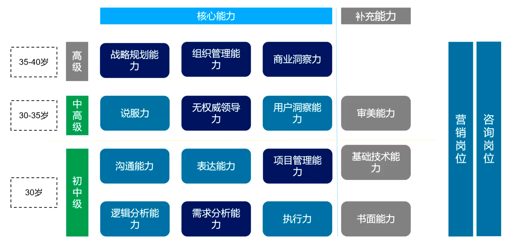

# 课程学习说明

#### 学什么？

学习切忌“我要学知识”

我想提升我的思维深度？

所有公司人员岗位定级的底层逻辑是什么，或者各层级人员之间的最本质差异是什么？

- 能力差异
- 知识差异
- 解决问题量级的差异（√）

知识和能力知识手段，体现在结果上，是你解决问题的量级的差异。

P7是解决一条产品线的问题，P8是解决多条产品线且融合的问题，P9是你要在在整个战略层级进行无中生有的情况，他们越级解决问题的量级之间是有提升的。

“三个臭皮匠，顶个诸葛亮”只在农业时代有效，在工业时代，人与人之间的微小差距通过计算机的放大，完全是量级上的差距。在这样的时代，谁能掌握更好的认知，谁有更好的基础能力的提升，这些微小的差异，都是我们能够在社会上取胜的法宝。

产品人员解决的最大的问题是无关对错的问题。

#### 产品人力能力模型图

思考：程序员的效率来自于哪里？- 明确的需求。有的产品经理思路不清晰，他说的一句话，我得干好几天。

例如：用户想买一个榨汁机，他的真正需求是什么？他的真正诉求，是他想**控制**他随时可以喝到鲜榨果汁的感觉。他买的是自我的安全感、自我的控制力，这才是他消费的本质。

> 推荐：福格行为模型

