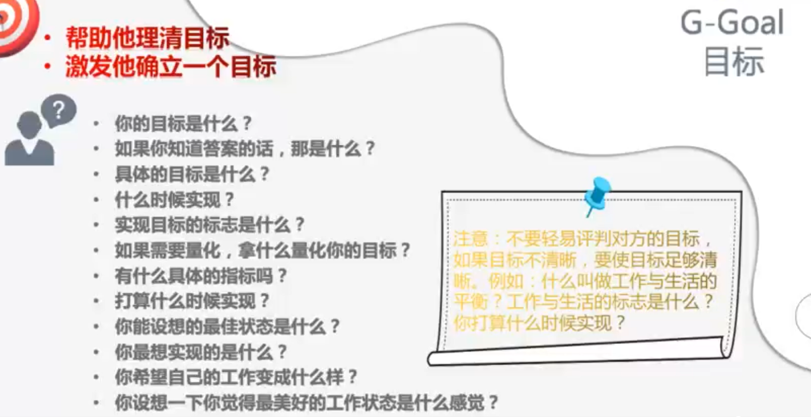
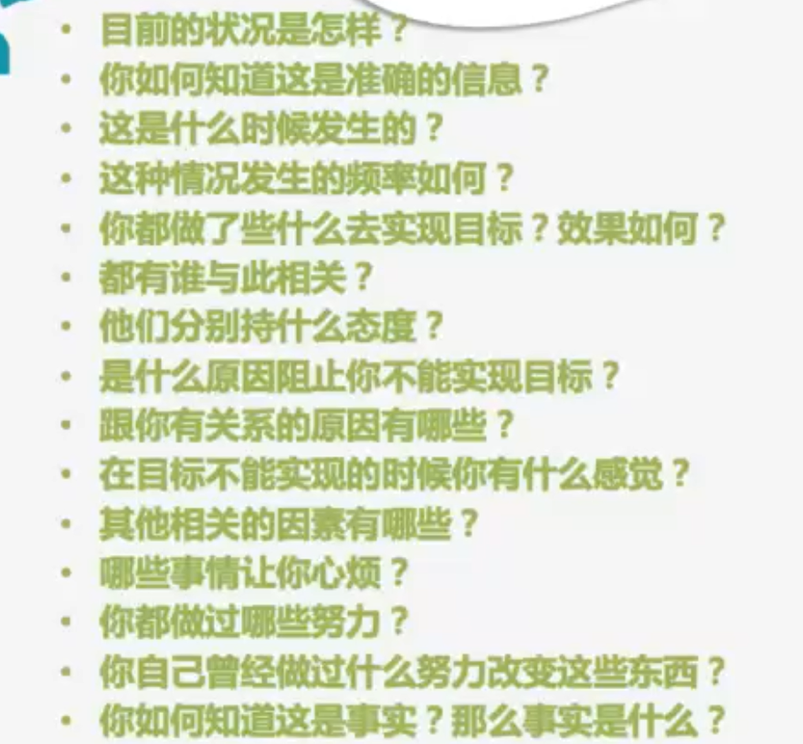
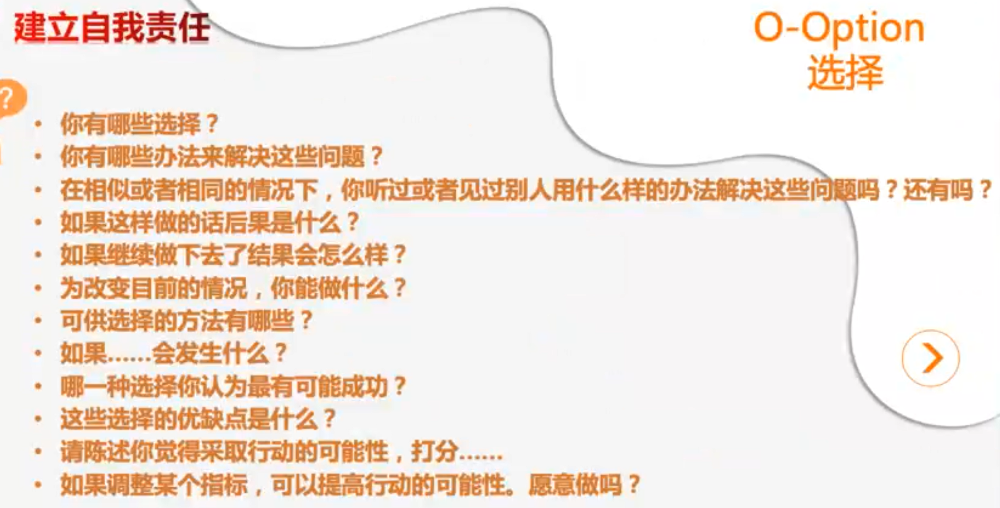
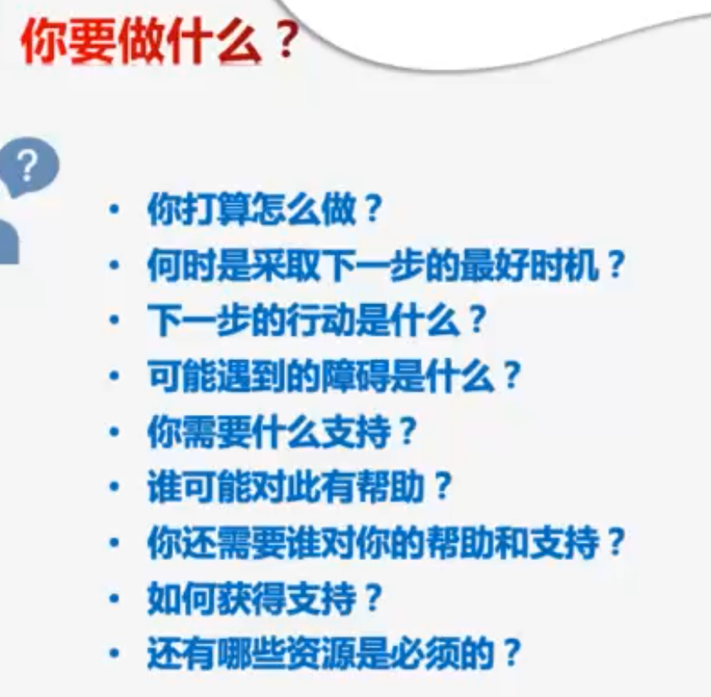

# 管理者需要具备的领导力

### 什么是领导力

- 管理：理性的部分
- 领导力：感情的部分，所有人愿意心服口服愿意追随你

政府、军队、上市公司，都有领导力，它不是一个头衔/职务，头衔/职务不能创造出领导。

领导力就像美，它难以定义，但是担心看到时，你就知道。

领导力教你怎么做人的艺术，而不是怎么做事情。

真正的领导是受人拥护的，担当一面的德才兼备者。

你自己要先成为一个德才兼备的人，否则你的天花板会很低。

有的时候你不需要告诉每一只羊应该去哪儿吃草。你只需要给他们一篇肥沃的草地，就可以了。

领导不合格没有地盘，没有人追随，下属应该怎么办？

### 关于提建议

《高绩效教练》

当你不停的给对方提建议的时候，对方会觉得他是一种谴责，即使你的建议很诚恳。

当你给对方建议的时候，无论你给什么建议，对方都会下意识的说不行。

人天生有一种自我保证的意识，当你告诉别人应该做什么的时候，他会试图找出各种理由。

“专科能进大厂吗？”问题是能还是不能吗？问题是你自己。

当你给别人建议的时候，你的建议70%是无效的。

即便是一个正确的建议，人们在使用的过程中，一定会遇到困难，他会把困难丢给你。

如果是他自己想的方法，他会想办法越过这道坎。

所以，当你定规矩的时候，尽量全员一起参与，最后说出的答案，去执行的时候，成功的概率很大，因为每个人都参与了，但是如果你自己拍脑门定了一个规矩，让大家去执行，通常执行的不太好。

### GROW 模型：Goal 目标，Reality现实，Will 意愿，Option 选择

当别人问你一个问题的时候，

1. Goal 问他，你的目标是什么？帮他理清目标，激发他确定一个目标（你最想实现什么？最完美的状态是什么？）有的人心里烦乱，因为他不知道自己想要什么。什么时间，什么地点，变成什么样。

   注意，不要轻易评判对方的目标，一旦你说地对方的目标不对，对方会立刻开始自我保护，你的对话就失败了。

   

2. Reality 现在是什么情况？哪些事让你心烦？你为此做过哪些努力？哪些人与此相关？他们分别是什么态度？让对方清楚现实是什么，而不是感觉

   

3. Option 你有什么解决问题的想法呢？还有呢？其他人是怎么解决类似的问题的呢？我有一个案例（可以去引导他），你想听一下吗？

   甚至有时候他说的方案会比你的更全面。

   但是，你不要评判他的方案不好，因为你不能保证你比他更专业，你要做的是让他到解决方案，而不是根据你的过往经验和认知，给他一个结论。

   

4. Will 0~10分的话，你愿意做的概率有几分呢？你认为什么是行动的最好时机呢？你认为哪些资源是必须的呢？需要我辅助你做什么呢？让他觉得他的方法是可行的，他就会迫不及待的想要试一下。

   

### 管理实操工具

> 问：那老师你的目标呢？
>
> 答：从团队上，无论我在不在现在的团队了，我都希望现在的团队能依然保持现在的文化，能持续不断的产生人才，然后希望我能影响更多的人，在这个团队里面，把目前我会的东西、已有的东西，能够传承下去，将来无论我在这个公司也好，不在这个公司也好，无论这个团队到哪儿去都能独当一面，并且能够源源不断的产生人才，这就是我特别想要的目标，而且现在也在为此而努力。
>
> 问：结课之后，长期聊聊也行
>
> 答：不行，占用马老师资源，你看今天就和C老师的课撞课了，咱这也不是开直播