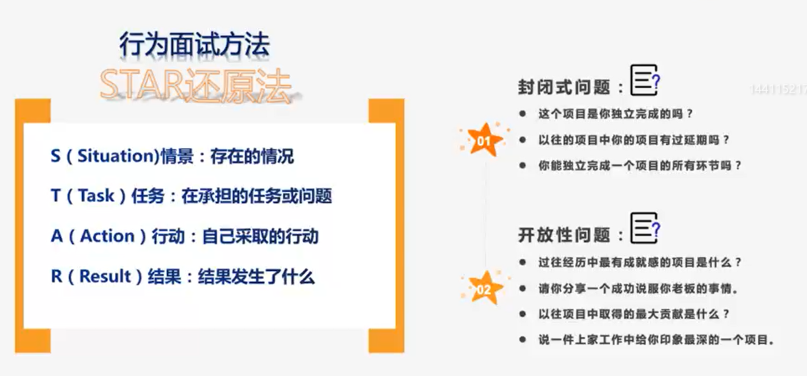
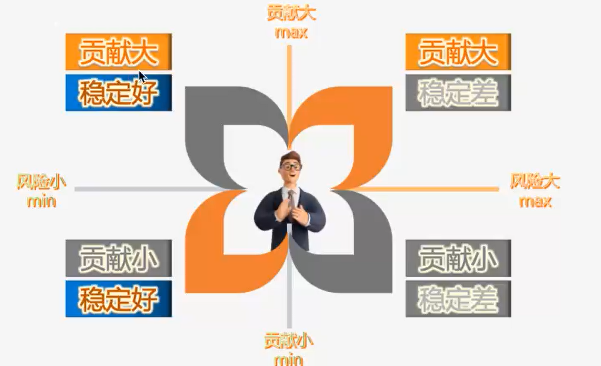

# 管理实操工具

### 糟糕的员工带来的问题

- 消耗管理者的精力：优秀的员工也是需要你管理和辅导的
- 团队讨论的质量得不到保证：开会时会拉低团队的整体智商
- 会强迫他人围绕他们展开工作
- 排挤其他追求卓越的员工
- 代表团队的态度是接受平庸，从而使问题更加严重

团队的人不是越多越好，它会给公司带来很高的成本。

### 怎么找到优秀的人？

行为面试法：人的行为是有规律的。基于面试者对以往事件的描述并加以追问，评判面试者在以往工作中的行为，并且推测在以后工作中的表现。

- 这件事是什么时候发生的？
- 当时你采取了什么措施？

1、定位你需要的人

两个架构师，没有授权主次，两人在工作中会花时间在竞争上。所以团队中要形成人才梯队，在招聘的时候，你就要知道自己需要什么样的员工。

2、保持面试的专业度

面试是双向选择的过程，你在挑优秀的人，同时优秀的人也在找 leader。

作为面试官，要：守时、尊重行为举止。会反映出公司文化、工作状态，哪怕你再忙，你要解释。很可能因为你的不专业而错失了人才。面试的时候，认真倾听，会有回应，而不是选择性倾听，打断的话要礼貌打断，而不强制打断。注意对方的身体语言，对方不想听的话，不要急于推销你的职位。

不专业：替候选人完成句子

保持中立，不要因为简历中的光环效应去主导。不是候选人不专业，而是面试官没问出来。

#### 面试流程

开场->专业匹配背景审核->动机匹配->职业化面试，掌控行为->行为面试，有效提问->无效提问（不要问，比如歧视专科问题）->结尾

我们认为你的描述和我们的岗位匹配，如果你不加入我们的话，可能的原因是什么呢？请给我们一周的时间，解决与否，都给你一个答复。

#### 人才保留

当下属交了离职信的时候，被动型人才保留很难成功的，要做前瞻性人才保留

第二象限的人，需要更多的反馈和发展空间

#### 绩效管理原则

- 绩效管理不要去追求平均。平均会让你的团队战斗力急速下降。

- 过程和结果并重

  只注重结果要让你的团队成员唯结果论，造成很多不考虑未来的短视行为->“技术债”，甚至不择手段，长期下来项目必死无疑，没有过程中的纠偏；

  只注重过程，使得团队的产出下降，无法适应公司节奏的发展

- 分级原则：困难事情，只奖不罚；简单事情，只罚不奖；中间事情，奖勤罚懒。这样相对公平公正。

运气好坏取决于你能不能发现生活中的机会

如果你只盯着bug，你的眼里就只有bug，如果你只盯着项目，你的眼里就只有项目，如果你只盯着你的部门，你眼里就只有你的部门

面试不在于答案对不对，比如问你 http 协议的原理你了解吗，了解不了解都不重要，你想问他的是什么呢？在于他对这个问题关不关注、有没有兴趣、是不是好奇，还是他只专注于业务。你要关注的是他这个人，而不是这个问题，在于他背后的行为习惯和思维模式

