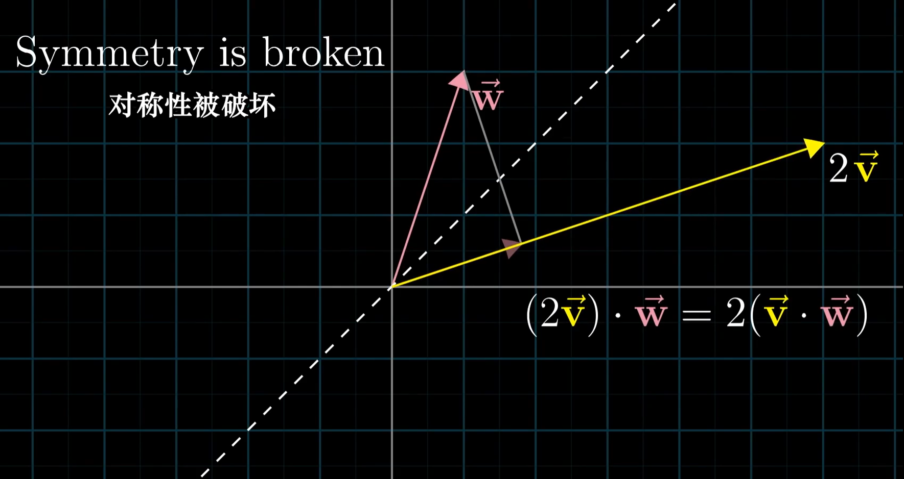

# 线性代数的几何意义

视频：[3Blue1Brown](https://space.bilibili.com/88461692)

对这个科目而言，形成正确的几何直观，以便在接下来的学习中收获累累硕果。

### 目录

### 1、向量究竟是什么？

##### 向量加法的理解

路径1：先向右走，再向上走，再向右走，再向上走

也可以看做路径2：将两个向右走合在一起，将两个向上走合在一起

##### 向量乘法的理解

表示对向量长度的缩放

### 2、线性组合、张成的空间与基

> 数学需要的不是天赋，而是少量的自由想象，但想象太过自由又会陷入疯狂。

##### 基向量

空间中的所有向量，都可以通过基向量经过线性组合（加法和数乘）得到

##### 基的严格定义

##### 张成的空间

二维空间的情况：

三维空间的情况：

##### 线性相关

当你有多个向量，并且可以移除其中一个而不减小张成的空间时，说明这一组向量中至少有一个是多余的，没有对张成空间做出任何贡献，当这种情况发生时，我们称它们是“线性相关”的。

另一种表述方法是，其中一个向量可以表示为其他向量的线性组合，因为这个向量已经落在其他向量张成的空间之中。

另一方面，如果所有的向量都给张成的空间增加了新的维度，它们就被称为是“线性无关”的。

##### 思考

### 3、矩阵与线性变换

线性变换：网格线保持平行且等距分布

你只需要记录两个基向量经过线性变换后的位置，其他的向量都会随之而动。

对矩阵进行旋转，相当于左乘"对基向量的变换"

- 左边绿色的向量是对向量x的变换
- 右边红色向量是对向量y的变换

每当你看到一个矩阵时，你都可以把它解读为对空间的一种特定变换，即对空间的挤压和伸展。它保持网格线平行且等距分布，并且保持原点不变。

### 4、矩阵乘法与线性变换复合

两步：

合成一步：复合矩阵捕捉到了旋转与剪切的整体效应。

### 附：三维空间中的线性变换

### 7、行列式

如果一个线性变换的行列式是6，则说明它将一个区域的面积增加为原来的6倍。

如果一个线性变换的行列式为0，则说明它将整个平面压缩到一条线，甚至是一个点上。

##### 负数倍行列式

将一个区域缩放负数倍是什么意思？这个变换相当于是将整个平面翻转了，如果你将二维空间想象为一张纸，这个变换像是将纸翻转到了另一面。

初始状态

变换之后

a,b,c,d 的含义

> 公开课：sal khan

### 8、逆矩阵、列空间与零空间

##### 线性方程组

Ax = v

矩阵 A 代表了一种线性变换，所以求解 Ax = v 意味着我们去寻找一个向量 x，使得 x 在进行了 A 的变换后与 v 重合。

你可以通过逆向变换，找到这个 x。当你逆向进行变换时，它实际上对应了另一个线性变换，通常被称为 A^(-1)

> 例如，如果 A 是逆时针旋转 90 度的变换，那么 A 的逆就是顺时针旋转 90 度的变换。
>
> 如果 A 是向右剪切的变换，将 (i, j) 当中的 j 向右移动一个单位，那么 A 的逆就是向左剪切的变换，将 j 向左移动一个单位。

A逆乘以A，相当于一个“什么都不做”的变换。

只要变换 A 不将空间压缩到一个更低的维度上（降维类似于有损压缩，你不能将一条线“解压缩”为一个平面），也就是它的行列式不为 0，那它就存在逆变换 A逆，使得应用 A 变换再应用 A 逆变换之后，结果与恒等变换无异。

于是，要想求解方程，你只需要将 A 逆与向量 v 相乘即可。

即使不存在逆变换，解仍然可能存在。比如，一个变换将空间压缩为一条直线，你得足够幸运，让向量 v 恰好处于这条直线上。

“秩”代表变换后空间的维数。

不管是一条直线、一个平面还是三维空间等，所有可能的变换结果的集合，被称为矩阵的“列空间”。因为矩阵的列告诉你基向量变换后的位置，这些变换后的基向量张成的空间，就是所有可能的变换结果。换句话说，列空间就是矩阵的列张成的空间。所以更精确的秩的定义是列空间的维数。

### 10、点积与对偶性

为什么点积的投影顺序可以被改变：

