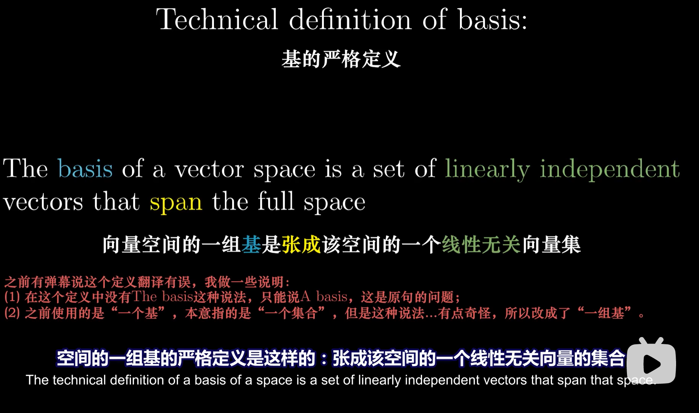

# 线性代数的几何意义

视频：[3Blue1Brown](https://space.bilibili.com/88461692)

对这个科目而言，形成正确的几何直观，以便在接下来的学习中收获累累硕果。

### 目录

### 1、向量究竟是什么？

##### 向量加法的理解

路径1：先向右走，再向上走，再向右走，再向上走

也可以看做路径2：将两个向右走合在一起，将两个向上走合在一起

##### 向量乘法的理解

表示对向量长度的缩放

### 2、线性组合、张成的空间与基

> 数学需要的不是天赋，而是少量的自由想象，但想象太过自由又会陷入疯狂。

##### 基向量

空间中的所有向量，都可以通过基向量经过线性组合（加法和数乘）得到

 

##### 基的严格定义

##### 张成的空间

二维空间的情况：

三维空间的情况：

##### 线性相关

当你有多个向量，并且可以移除其中一个而不减小张成的空间时，说明这一组向量中至少有一个是多余的，没有对张成空间做出任何贡献，当这种情况发生时，我们称它们是“线性相关”的。

另一种表述方法是，其中一个向量可以表示为其他向量的线性组合，因为这个向量已经落在其他向量张成的空间之中。

另一方面，如果所有的向量都给张成的空间增加了新的维度，它们就被称为是“线性无关”的。

##### 思考

### 3、矩阵与线性变换

线性变换：网格线保持平行且等距分布

你只需要记录两个基向量经过线性变换后的位置，其他的向量都会随之而动。

对矩阵进行旋转，相当于左乘"对基向量的变换"

- 左边绿色的向量是对向量x的变换
- 右边红色向量是对向量y的变换

每当你看到一个矩阵时，你都可以把它解读为对空间的一种特定变换，即对空间的挤压和伸展。它保持网格线平行且等距分布，并且保持原点不变。

### 4、矩阵乘法与线性变换复合

两步：

合成一步：复合矩阵捕捉到了旋转与剪切的整体效应。

### 附：三维空间中的线性变换

### 7、行列式

如果一个线性变换的行列式是6，则说明它将一个区域的面积增加为原来的6倍。

如果一个线性变换的行列式为0，则说明它将整个平面压缩到一条线，甚至是一个点上。

