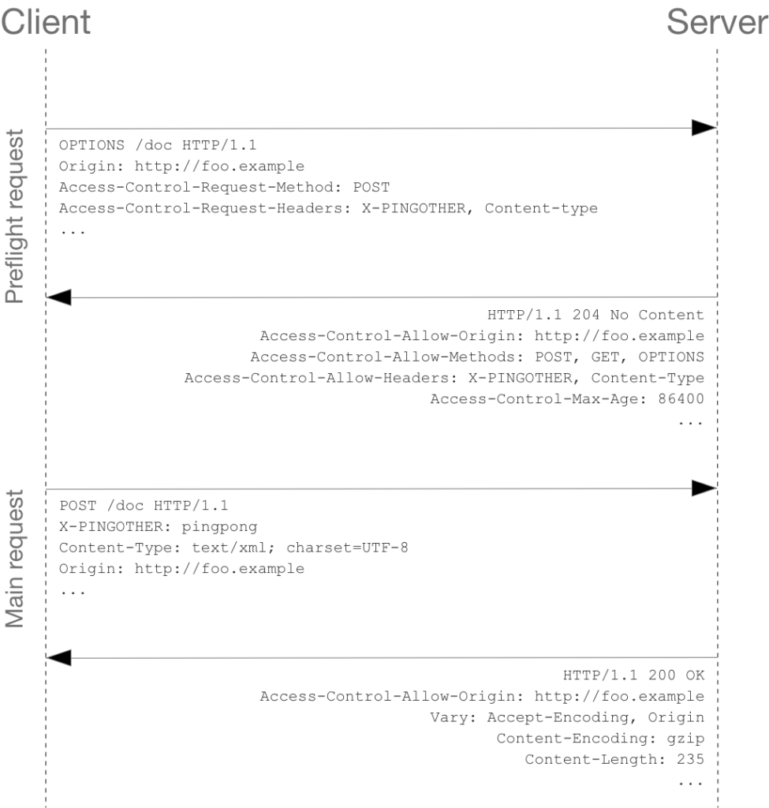

# 互联网中的跨域资源共享（CORS）策略

> https://dgideas.net/2020/cors-policy/
>
> 发布日期：2020年9月26日，作者：[DGideas](https://dgideas.net/author/dgideas/)

> 本文参考了来自 [MDN Web Docs](https://developer.mozilla.org/en-US/) 的诸多内容。

网站开发者在开发调试过程中常会遇到有关浏览器阻止对*跨域资源*（Cross-Origin Resource，COR）进行任意访问的问题：当位于某个域（如 `example.com`）的网站想要去访问位于另一个域（比如 `user.example.com`）的资源时，同源访问（跨域资源共享）的相关策略便会生效。在上例中，开发者或许只是想动态拉取位于 `user.example.com/user.json` 的用户列表文件，用于在网页中向用户展示，而现代浏览器的[跨域资源共享](https://developer.mozilla.org/en-US/docs/Web/HTTP/CORS)（Cross-Origin Resource Sharing，CORS）策略却禁止了这种访问方式。发生了什么？


## 跨域资源访问中的安全性问题

要了解现代浏览器为何对访问跨域资源做出限制，我们首先需要考虑允许任意跨域资源共享可能带来的安全性问题。试想用户在购物网站 A 中有自己的账户并绑定了快速支付方式，然后该用户正在浏览恶意网站 B 中的网页，而 B 网页中隐含了在 A 网站下单并支付的恶意脚本（如 JavaScript）代码。如果浏览器没有任何安全策略，用户在浏览 B 网页的过程中就会不知不觉在 A 网站上“下了单”，造成*未授权访问*（Unauthorized Access）——类似的场景还有很多，例如在没有安全控制的场景下恶意网站 B 不但能使用脚本的方式代替用户进行访问，甚至还能通过跨源 AJAX 请求读取用户在其他网站上存储的数据。

在这里，安全性问题主要在于 A 网站受到了非预期的访问：浏览器忠实执行 B 网页中的脚本逻辑，而没有对代码的访问权限做出任何控制。典型的控制方式叫做“同源”，即网页中的脚本只能访问和自己位于同一来源的内容。相同的请求协议-主机名称-端口号组合构成了同一个源：由于上述三个因素任何一个不同都会导致*目的*地址的实际控制者可能和预期不同，所以不属于同源：试想一个博客托管网站下的 `a.example.com` 以及 `b.example.com` 属于不用的用户，就很好理解为什么判断同源的标准要如此设置了。

| 网络协议 | `http` 与 `https`，或者 `ftp`                         |
| -------- | ----------------------------------------------------- |
| 主机名称 | `example.com` 与 `user.example.com`，或者 `127.0.0.1` |
| 端口号   | `80` 与 `443`，或者 `8080`                            |

不符合同源标准的因素举例

然而，在大多数典型情况下，网页总有向位于其他源的服务器进行交互（如图片或用户列表等）的需求。浏览器为类似类似这种需求放开了一些限制，总结起来就是：当网页向另一个源进行写请求（比如提交表单）时，一般不受到 CORS 的限制；而请求另一个源中的资源时，则可能受到限制。以下是一些被允许访问的常见场景：

- 通过 `<script>` 或 `<link rel="stylesheet">` 嵌入来自其他域的脚本或层叠样式表（CSS）资源，这也包括 [Web 字体](https://www.w3.org/TR/css-fonts-3/#font-fetching-requirements)。
- 通过 ``、`<video>`、`<audio>` 等标签引用的多媒体资源
- 通过 `<object>`、`<embed>`、`<applet>` 引用的插件，以及通过 `<iframe>` 嵌入的网页框架等

详细的描述可以参考[这里](https://developer.mozilla.org/en-US/docs/Web/Security/Same-origin_policy)。而对于其他类型的请求来说，浏览器则必须与网页开发者紧密合作，通过共同遵守一套可行的机制，以确保用户访问 Web 时的安全性。

跨域资源共享（CORS）控制头保障了用户使用 Web 时的安全性，图片采用[知识共享署名-相同方式分享 2.5 通用协议](https://creativecommons.org/licenses/by-sa/2.5/)发布，贡献者为 Mozilla Contributors

## HTTP CORS 标头

由于不可能通过验证请求的来源网站（源域）的可靠性，控制跨域资源共享策略的责任就落在了被调用网站本身。自 [XMLHttpRequest](https://developer.mozilla.org/en-US/docs/Web/API/XMLHttpRequest) v2 始，当一个网页中的脚本试图通过跨源 AJAX 请求（例如，XMLHttpRequest 和 Fetch API）调用其他域的资源时，浏览器会预先向对端服务器发送一个“检查请求”，用于判断接下来脚本进行的跨域请求是否能够安全发送。对端服务器通过对于该“检查请求”的响应数据包中附带额外控制信息的方式告知*用户浏览器***该服务器是否接受来自特定域网站对该服务器的跨源请求**。该“检查请求”通常采用无副作用的 `**[OPTIONS](https://dgideas.net/2020/http-method-and-its-idempotence/#options-method)**` 作为 [**HTTP 动词**](https://dgideas.net/2020/http-method-and-its-idempotence/)。

一个典型的浏览器处理跨源 AJAX 请求的方式，首先，浏览器向对端服务器发送“检查请求”，收到确切响应后，再将网页脚本所需的请求发送至对端服务器，图片采用[知识共享署名-相同方式分享 2.5 通用协议](https://creativecommons.org/licenses/by-sa/2.5/)发布，贡献者为 Mozilla Contributors

正如上图所示，对端服务器所发送的一个可能的响应数据如下：

```
HTTP/1.1 204 No Content
Date: Mon, 01 Dec 2008 01:15:39 GMT
Server: Apache/2
Access-Control-Allow-Origin: https://foo.example
Access-Control-Allow-Methods: POST, GET, OPTIONS
Access-Control-Allow-Headers: X-PINGOTHER, Content-Type
Access-Control-Max-Age: 86400
Vary: Accept-Encoding, Origin
Keep-Alive: timeout=2, max=100
Connection: Keep-Alive
```

注意其中以 Access-Control-* 开头的四个响应头，这些响应头向用户浏览器表明了对端服务器接受何种跨源请求。

### `Access-Control-Allow-Origin` 头

Access-Control-Allow-Origin 头向客户浏览器表明拥有哪些名称的主机网页脚本可以安全调用跨源服务器上的资源。该响应头的典型语法如下：

```
Access-Control-Allow-Origin: <origin> | *
```

其中，如果需要任意主机访问该服务器中的资源（特别是如果对端服务器正在提供一个 API 接口，并且希望任何人可以调用）时，可以将 ACAO 头设置为任意（`*`）。

### `Access-Control-Allow-Methods` 头

ACAM 头指示客户端浏览器其支持何种 **[HTTP 动词](https://dgideas.net/2020/http-method-and-its-idempotence/)**。HTTP 动词是一组预定义好的请求方法，以表明要对给定资源执行的操作。该响应头的典型语法如下：

```
Access-Control-Allow-Methods: <method>[, <method>]*
```

在上例中，示例服务器发送了一组值为 `Access-Control-Allow-Methods: POST, GET, OPTIONS` 的 ACAM 响应头。该响应头则表明客户浏览器可以在该页面安全地向对端服务器（位于不同源）发送 `POST`、`GET` 以及 `OPTIONS` 请求。有趣的是，由于一开始客户浏览器并不知道对端服务器能够接收什么样的 HTTP 动词，所以几乎总会以发送一个 `OPTIONS` “预检请求”开头。


### `Access-Control-Allow-Headers` 头

ACAH 头用于指示客户端浏览器在接下来（预检请求后的）实际请求中允许发送哪些 [HTTP 请求头](https://developer.mozilla.org/en-US/docs/Web/HTTP/Headers)。典型格式如下：

```
Access-Control-Allow-Headers: <header-name>[, <header-name>]*
```

有意思的是，几乎我看到的所有参考资料对为什么针对跨域资源的访问控制需要控制 *HTTP 请求头*都没有解释得很清楚。事实上，对于客户端浏览器发送 HTTP 请求头可能的潜在攻击面是，恶意网站在用户不知情的情况下通过 HTTP [`Authorization` 头](https://developer.mozilla.org/zh-CN/docs/Web/HTTP/Headers/Authorization)自动向对端服务器发送大量登录尝试请求。

### `Access-Control-Max-Age` 头

为了避免客户端每次向对端服务器发送跨源请求前都进行预检，ACMA 头定义了客户端浏览器向相同对端服务器发送跨源请求时缓存上一次预检结果的时间。比如若 ACMA 头设置为 `Access-Control-Max-Age: 86400`，则表示在未来的 24 小时内客户端浏览器针对向相同对端服务器发送的跨源请求不再发送额外的预检请求，而是将先前对端服务器的返回结果缓存使用。

## 写在最后

现代浏览器通过预检请求以及 CORS 头与对端服务器紧密配合，保障用户浏览 Web 时的安全性。浏览器在收到对端服务器对预检请求的*响应数据包*后，通过 CORS 响应头了解对端服务器的安全限制，并遵循这些限制因素。对于这项技术感兴趣的用户，也可以考虑偶尔在浏览网页时注意浏览器开发人员工具中的“网络请求”一项，你也许会发现就在你浏览一些网页时，浏览器已经默默为脚本的跨域请求完成了许多确保安全的事务性工作。

很多情况下前端开发者为了调试网页方便，经常会在后台接口尚未完成调试或发布之前使用爆改版浏览器进行测试——这些浏览器特意将 CORS 策略关闭，以实现脚本中对于任意域的无限制请求。但需要注意，正如上文中对于安全性的讨论一样，**永远不要在浏览不信任的网页时关闭 CORS 控制策略**。同样地，作为 API 开发者，在使用诸如 Python 语言中的 [Flask](https://flask.palletsprojects.com/) 等 HTTP 服务器模块向互联网暴露服务时，需要使用类似 [flask-cors](https://flask-cors.readthedocs.io/en/latest/) 等工具，以允许接受任何网页向接口发送的调用请求。

CORS 的安全性由客户端浏览器实现。由于现代浏览器的安全策略完备性，恶意网站已不易利用跨源请求制造安全风险事件。不过，任何高层系统的安全性首先取决于其依赖的底层架构的安全性。在应用层以下，还有更多可能被恶意用户利用的攻击面存在，我们将在以后的博文中详细讨论这些内容。