## 深入理解Linux高性能网络框架的那些事

[开发内功修炼](javascript:void(0);):https://mp.weixin.qq.com/s/OBTpagG7x6Plij0qP-J0-w

通过本文你将会了解到以下内容：

- **IO事件和IO复用**
- **线程模型和事件驱动模型的架构**
- **基于事件驱动的Reactor模式详解**
- **同步IO和异步IO简介**

## 2. IO事件和IO复用

### 2.1 什么是IO事件

IO指的是输入Input/输出Output，但是从汉语角度来说，出和入是相对的，所以我们需要个参照物。

这里我们的参照物选择为程序运行时的主存储空间，外部通常包括网卡、磁盘等。

有了上述的设定理解起来就方便多了，我们来一起看下：

> **IO的本质是数据的流动，数据可以从网卡到程序内存，也可以从程序内存写到网卡，磁盘操作也是如此。**

所以可以把常见的IO分为:

- **网络IO**：内存和网卡的数据交互
- **文件IO**：内存和磁盘的数据交互

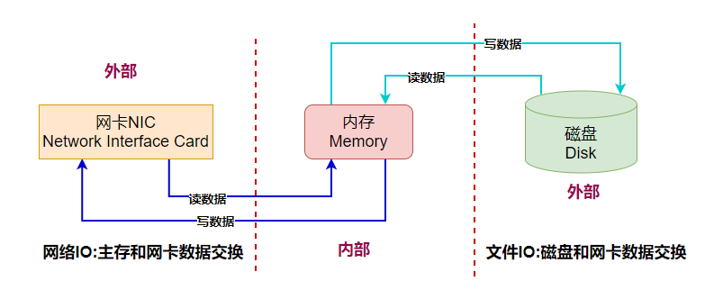

那什么又是IO事件呢？

事件可以理解为一种状态或者动作，也就是状态的迁移会触发一种相应的动作。

网络IO的事件通常包括：

- **可读事件**
- **可写事件**
- **异常事件**

理解可读可写事件是非常有必要的，一般来说一个socket大部分时候是可写的，但是并不是都可读。

可读一般代表是一个新连接或者原有连接有新数据交互，对于服务端程序来说也是重点关注的事件。

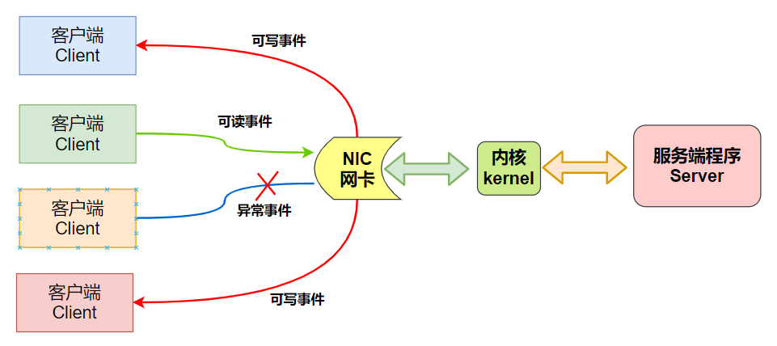

### 2.2 什么是IO复用

设想假如有几万个IO事件，那么应用程序该如何管理呢？这就要提到IO复用了。

**IO复用从本质上来说就是应用程序借助于IO复用函数向内核注册很多类型的IO事件，当这些注册的IO事件发生变化时内核就通过IO复用函数来通知应用程序。**

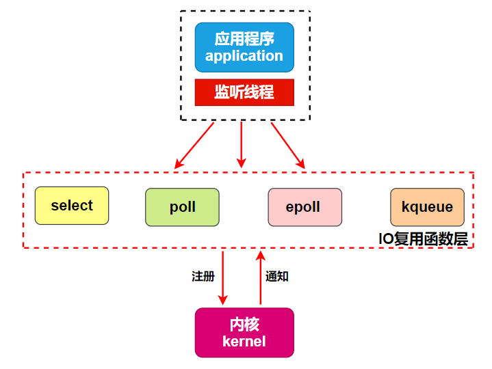

从图中可以看到，IO复用中复用的就是一个负责监听管理这些IO事件的线程。

之所以可以实现一个线程管理成百上千个IO事件，是因为大部分时间里某个时刻只有少量IO事件被触发。

大概就像这样：**草原上的一只大狗可以看管几十只绵羊，因为大部分时候只有个别绵羊不守规矩乱跑，其他的都是乖乖吃草**。

## 3. 网络框架设计要素

要理解网络框架有哪些，必须要清楚网络框架完成了哪些事情。

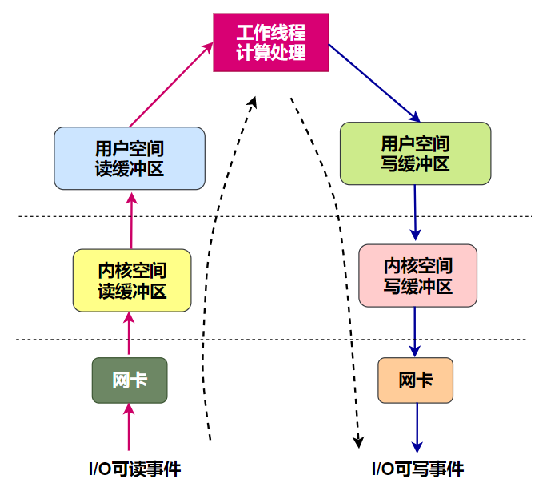

大致描述下这个请求处理的流程：

- 远端的机器A发送了一个HTTP请求到服务器B，此时服务器B网卡接收到数据并产生一个IO可读事件;
- 我们以同步IO为例，此时内核将该可读事件通知到应用程序的Listen线程;
- Listen线程将任务甩给Handler线程，由Handler将数据从内核读缓冲区拷贝到用户空间读缓冲区;
- 请求数据包在应用程序内部进行计算和处理并封装响应包;
- Handler线程等待可写事件的到来;
- 当这个连接可写时将数据从用户态写缓冲区拷贝到内核缓冲区，并通过网卡发送出去;

> 备注：上述例子是以同步IO为例，并且将线程中的角色分为Listen线程、Handler线程、Worker线程，分别完成不同的工作，后续会详细展开。

所以我们可以知道，要完成一个数据交互，涉及了几大块内容：

- **IO事件监听**
- **数据拷贝**
- **数据处理和计算**

大白认为，这三大块内容，不论什么形式的框架都绕不开，也是理解网络架构的关键所在。

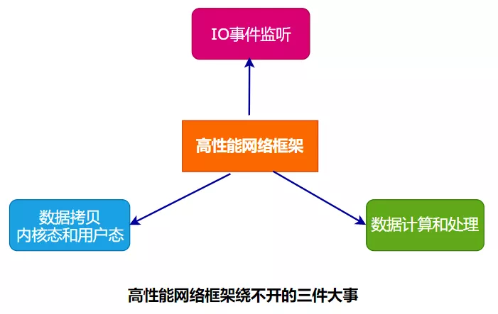

## 4. 高性能网络框架实践

### 4.1 基于线程模型

在早期并发数不多的场景中，有一种One Request One Thread的架构模式。

该模式下每次接收一个新请求就创建一个处理线程，线程虽然消耗资源并不多，但是成千上万请求打过来，性能也是扛不住的。

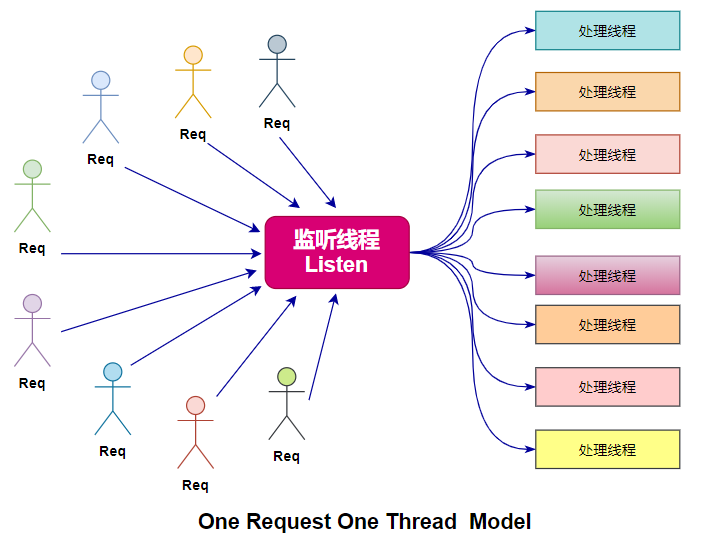

这是一种比较原始的架构，思路也非常清晰，创建多个线程来提供处理能力，但在高并发生产环境中几乎没有应用，本文不再展开。

### 4.2 基于事件驱动模型

当前流行的是基于事件驱动的IO复用模型，相比多线程模型优势很明显。

在此我们先理解一下什么是事件驱动Event-Drive-Model。

> 事件驱动编程是一种编程范式，程序的执行流由外部事件来决定，它的特点是包含一个事件循环，当外部事件发生时使用回调机制来触发相应的处理。

通俗来说就是：**有一个循环装置在一直等待各种事件的到来，并将到达的事件放到队列中，再由一个分拣装置来调用对应的处理装置来响应**。

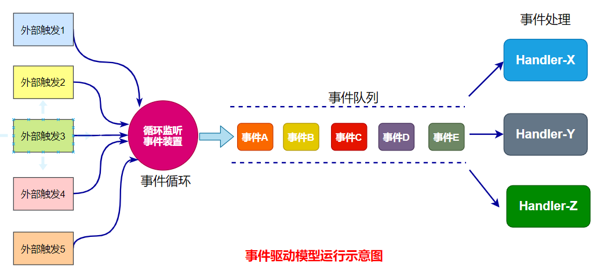

### 4.3 Reactor反应堆模式

第一次听到这个模式的时候很困惑，究竟反应堆是个啥？

研究了一下发现，反应堆是个核物理的概念，大致是这个样子的：

> 核反应堆是核电站的心脏 ，它的工作原理是这样的：原子由原子核与核外电子组成，原子核由质子与中子组成。

> **当铀235的原子核受到外来中子轰击时，一个原子核会吸收一个中子分裂成两个质量较小的原子核，同时放出2-3个中子。**

> **这裂变产生的中子又去轰击另外的铀235原子核，引起新的裂变**，**如此持续进行就是裂变的链式反应。**

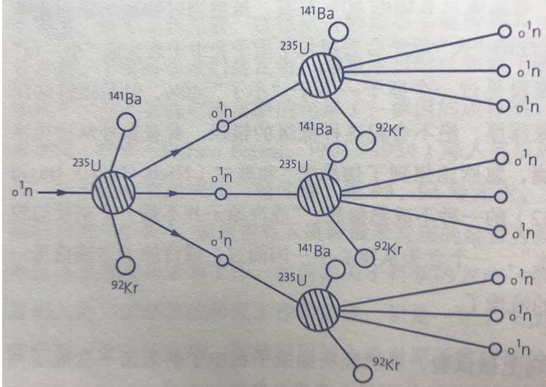

结合这种核裂变的图，好像**是一个请求打过来，服务器内部瞬间延伸出很多分支来完成响应，一变二，二变四，甚至更多**，确实有种反应堆的感觉。

接下来我们看看究竟反应堆模式是如何构建高性能网络框架的。

## 5.反应堆模式详解

**反应堆模式是一种思想，形式却有很多种。**

### 5.1 反应堆模式的本质是什么

从本质上理解，无论什么网络框架都要完成两部分操作：

- **IO操作**：数据包的读取和写入
- **CPU操作**：数据请求的处理和封装

所以上述这些问题**由谁来做以及多少线程来做，就衍生出了很多形式**，所以不要被表面现象迷惑，出现必有原因，追溯之后我们才能真正掌握它。

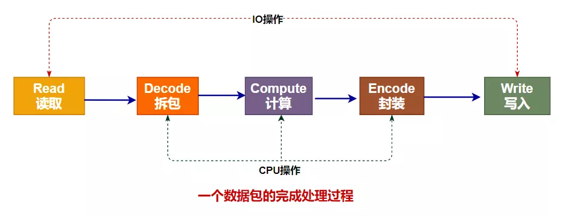

反应堆模式根据处理IO环节和处理数据环节的数量差异分为如下几种：

- **单Reactor线程**
- **单Reactor线程和线程池**
- **多Reactor线程和线程池**

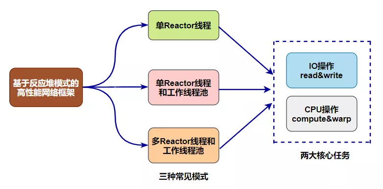

我们来看看这三种常见模式的特点、原理、优缺点、应用场景等。

### 5.2 单Reactor线程模式

这种模式最为简洁，一个线程完成了连接的监听、接收新连接、处理连接、读取数据、写入数据全套工作。

由于只使用了一个线程，对于多核利用率偏低，但是编程简单。

是不是觉得这个种单线程的模式没有市场？那可未必，不信你看Redis。

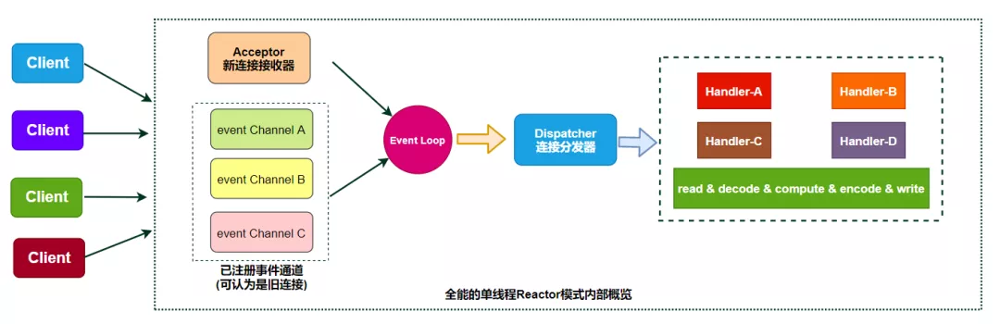

在这种模式种IO操作和CPU操作是没有分开的，都是由1个线程来完成的，显然如果在Handler处理某个请求超时了将会阻塞客户端的正常连接。

在Redis中由于都是内存操作，速度很快，这种瓶颈虽然存在但是不够明显。

### 5.3 单Reactor线程和线程池模式

为了解决IO操作和CPU操作的不匹配，也就是IO操作和CPU操作是在一个线程内部串行执行的，这样就拉低了CPU操作效率。

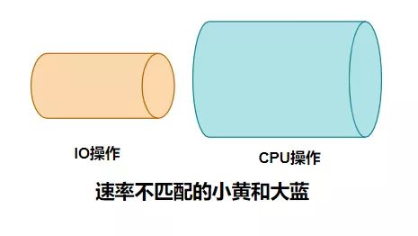

一种解决方法就是将IO操作和CPU操作分别由单独的线程来完成，各玩各的互不影响。

单Reactor线程完成IO操作、复用工作线程池来完成CPU操作就是一种解决思路。

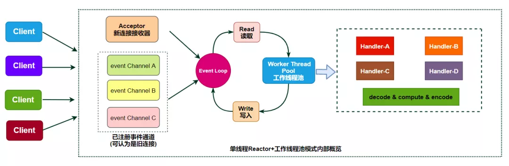

在这种模式种由Reactor线程完成连接的管理和数据读取&写回，完全掌管IO操作。

工作线程池处理来自上游分发的任务，对其中的数据进行解码、计算、编码再返回给Reactor线程和客户端完成交互。

这种模式有效利用了多核，但是单Reactor线程来完成IO操作在高并发场景中仍然会出现瓶颈。

换句话说，连接实在太多了，一个Reactor线程忙不过来建立新连接和响应旧连接这些事情，因此Reactor线程也需要几个帮手。

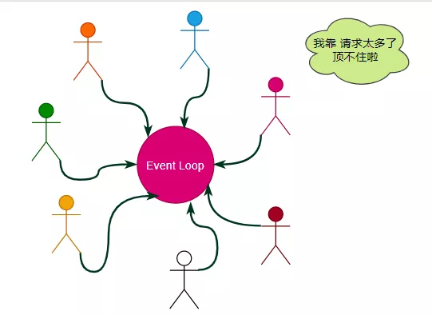

### 5.4 多Reactor线程和线程池模式

水平扩展往往是提供性能的有效方法。

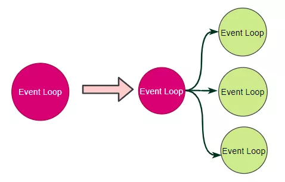

我们将Reactor线程进行扩展，一个Reactor线程负责处理新连接，多个Reactor线程负责处理连接成功的IO数据读写。

也就是进一步将监听&创建连接 和 处理连接 分别由两个及以上的线程来完成，进一步提高了IO操作部分的效率。

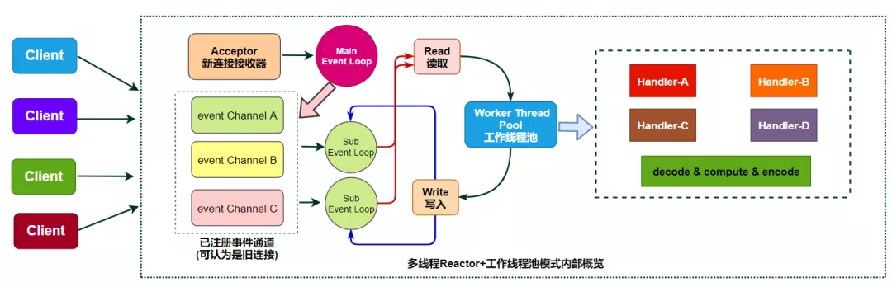

这种模式算是比较高配的版本了，在实际生产环境也有使用。

### 5.5 拓展：同步IO和异步IO

我们可以轻易区分什么是阻塞IO和非阻塞IO，那么什么是同步IO和异步IO呢？

前面提到Reactor模式其中非常重要的一环就是调用read/write函数来完成数据拷贝，这部分是应用程序自己完成的，内核只负责通知监控的事件到来了，所以本质上Reactor模式属于非阻塞同步IO。

还有一种Preactor模式，借助于系统本身的异步IO特性，由操作系统进行数据拷贝，在完成之后来通知应用程序来取就可以，效率更高一些，但是底层需要借助于内核的异步IO机制来实现。

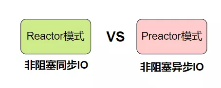

底层的异步IO机制可能借助于DMA和Zero-Copy技术来实现，理论上性能更高。

当前Windows系统通过IOCP实现了真正的异步I/O，而在Linux 系统的异步I/O还不完善，比如Linux中的boost.asio模块就是异步IO的支持，但是目前Linux系统还是以基于Reactor模式的非阻塞同步IO为主。

## 6. 小结

本文从IO事件和IO复用出发，阐述了网络架构最底层的组成。

继续展开了基于线程模型和基于事件驱动模型的网络框架特点及其设计要素。

之后重点描述了反应堆模式的核心本质，以及生产环境中的多种形式。

最后简单介绍了同步IO和异步IO的区别，以及Preactor模式的优势。

希望读者朋友可以摒弃专业术语和表述，抓住问题的本质和重点，找到一个适合自己思维方法去理解和掌握高性能网络架构的设计之道。

**或许，高性能网络框架只是一个纸老虎。**
