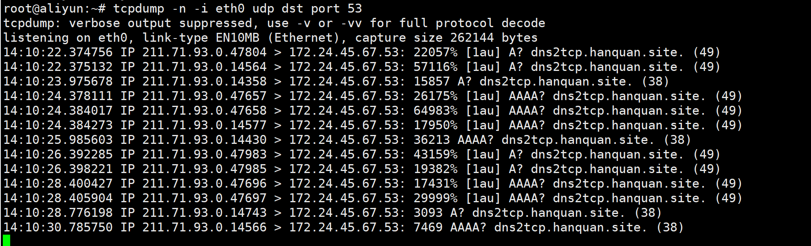
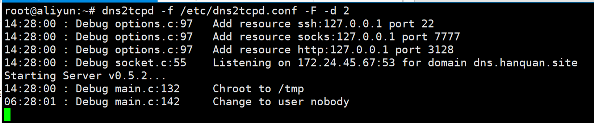

### 校园网认证原理

https://note.cfyqy.com/posts/390158a6.html

https://www.cnblogs.com/nkqlhqc/p/7805837.html

当我们连上校园网的无线路由器后，虽然上不了网，但是我们的计算机却分配到了IP地址（那么为什么要给我们分配IP呢？很好回答啦，不分配IP地址web认证就实现不了呀！）此时若我们进行一些上网的操作，例如访问百度主页，那么计算机的数据包将从TCP443端口上发出，校园网网关就会拦截从这个端口上发出的数据包。同理从其它端口上发出的数据包也会遭到拦截。

但是有一个神奇的端口，从这个端口发出的数据包不会遭到网关拦截，它就是UDP53端口。对计算机网络稍微了解的朋友应该知道在UDP53端口上运行的协议是DNS协议（域名解析协议）也就是说我们现在可以正常查询网站域名对应的IP地址。例如用Windows自带的nslookup命令查询百度的IP地址时会返回一个正确的结果：

```bash
# 联实验室网查看
C:\Users\gongluyang>nslookup baidu.com
Server:  Hiwifi.lan
Address:  192.168.199.1

Non-authoritative answer:
Name:    baidu.com
Addresses:  220.181.38.251
          220.181.38.148
# bjut-wifi未登录查看
C:\Users\gongluyang>nslookup baidu.com
Server:  UnKnown
Address:  10.21.200.28

Non-authoritative answer:
Name:    baidu.com
Addresses:  220.181.38.251
          220.181.38.148
```


apt-get install dns2tcp


```
listen = 172.24.45.67     #【删注释】这里写你的云服务器的内网IP，一般为10.0.0.4
port = 53
user = nobody
chroot = /tmp
domain = dns.hanquan.site         #这里写你设置的NS记录值
resources = ssh:127.0.0.1:22,socks:127.0.0.1:7777,http:127.0.0.1:3128

listen = 0.0.0.0
port = 53
user = nobody
chroot = /tmp
domain = dns2tcp.hanquan.site
resources = socks:123.57.183.166:7777
```

dns2tcp中的资源（resources）不是dns2tcp自带的，需要自己动手实现。在我给出的配置文件中只写了一个名为“socks”的资源，其IP地址是云服务器公网IP，端口号是我随手敲的。这个资源是一个socks代理，我想要实现的是办公电脑通过DNS隧道后直接连接到一个socks代理上，使用此代理访问互联网。


```bash
# tcpdump -n -i eth0 udp dst port 53
nslookup dns2tcp.hanquan.site
nslookup dns.hanquan.site
c:/softwares/dns2tcpc -r ssh -z dns2tcp.hanquan.site 123.57.183.166  -l 8888 -d 2
c:/softwares/dns2tcpc -r socks -z dns2tcp.hanquan.site -l 8888 -d 2
c:/softwares/dns2tcpc -r socks -z dns2tcp.hanquan.site dns.hanquan.site -l 8888 -d 2
```



坑：绑定MAC地址的无感知设备维护	。


C嵌入式编程设计模式

https://blog.werner.wiki/building-a-dns-tunnel-with-dns2tcp/


```
ping dns.hanquan.site
nslookup dns2tcp.hanquan.site
```

安装 dante-server https://www.inet.no/dante/doc/1.3.x/config/install.html，最后换了ubuntu装按照这个装的https://hamy.io/post/0014/setting-up-an-encrypted-socks-proxy-using-dante-and-stunnel/

https://ipsec.in/2019-04-11/No-configuration-file-found-at-root-esmtprc-or-etc-esmtprc.html

socks5代理服务器dante(sockd)--使用心得https://blog.csdn.net/jassfuchang/article/details/7170321

Centos使用dante安装配置socks5代理http://www.ouvps.com/?p=1232

How to Setup a SOCKS5 Proxy Server Using SS5 on CentOS 7https://www.proxyrack.com/how-to-setup-a-socks5-proxy-server-using-ss5-on-centos7/

Dante Socks Serverhttp://wiki.kartbuilding.net/index.php/Dante_Socks_Server#Other_SOCKS_Servers

```
logoutput: /var/log/sockd.log
internal: eth0 port = 7777
external: eth0
socksmethod: username none
clientmethod: none
user.privileged: proxy
user.unprivileged: nobody
client pass {
    from: 0.0.0.0/0 port 1-65535 to: 0.0.0.0/0
}
socks pass {
    from: 0.0.0.0/0 to: 0.0.0.0/0
    protocol: tcp udp
}
```


```
systemctl restart danted.service
screen -S dns2tcpd　　　　　　　　　    　 #创建后台会话
dns2tcpd -f /etc/dns2tcpd.conf -F -d 2　   　 #启动dns2tcp
```



？？明明是 socks 协议，你用 ssh 登录干啥。。


##### 其他

- kali
- tcpdump 可以抓udp的包？为啥叫tcpdump

