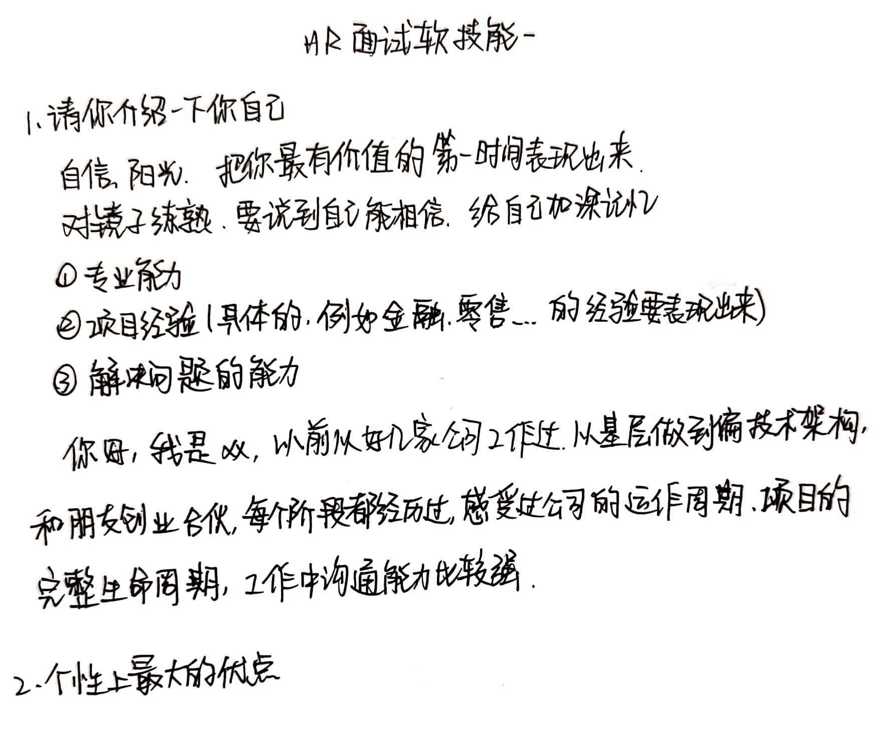

# HR面试软技能

不要频繁跳槽（5年3跳），否则就和大厂无缘了。至少在某一家公司时间比较长。

硬技能上来，软技巧才能跟得上。

##### 5年以内的职业规划？

表达的意思就是跟你好好干。可以反问一下公司人才的晋升体系。

##### 朋友对你的评价？

朋友觉得踏实，加一个例子。

##### 还有什么要问？

上下班时间，公司社保。个人福利问题少问。

问一下组里现在做什么项目，对自己能有什么发展。

回答这个问题的出发点是，我能为公司做什么。只有找到更适合自己的工作，才能更好的为公司做贡献，投入进去。

也可以问一下公司的文化、价值观是什么。

##### 如果录用了，过一段时间发现不适合，怎么办？

这个问题看面试者的主观能动性。面试官想知道的是，如果你在公司中遇到问题熬不下去，怎么处理？

回答是：新人到公司，会有不适应期，以及面临一些挑战，是很正常的。如果能力跟不上，是自己的原因，要自己招人帮助、自己学习，补上来，用于接受挑战，表现出你的责任心。

##### 完成某项工作的时候，认为领导方法不是最好的，还有更好的，怎么办？

这在考验你的情商。

**对你自己来说**，如果遇到打压你实力的领导，尽量不要去，如果其他方面过于吸引你，你选择去这家公司了，在交流的时候要多给领导面子。

**从回答问题的角度**，这个问题，还要看是谁问的。

- 如果是HR问的，就说，如果领导违反规则了，我会向上面反馈。
- 如果是领导问的，就表现服从。因为面试官可能是你的领导，他考察你是一个什么样的人。回答方式是：因为是刚来新人，所以当然会服从领导。私下和领导说你的建议，如果采纳了，皆大欢喜，也不要揽功劳。如果不采纳，还是按照领导的来做。如果说了两三次，领导都不当回事，以后就别说了。

##### 有成就感的事情？

提前准备好，不要临时想，临时不容易想出来。

##### 工作失误给公司造成损失，怎么办？

有责任心，主动承担责任，也要说出补救措施。该扣钱扣钱，该通报通报。

##### 没被录用怎么打算？

看你对这家公司是否有兴趣，还是随便面试玩？

把态度拿出来，让别人认为你是认真的。

来咱们公司是因为认同，所以一次不过的话，我会再争取一下，然后看自己欠缺在哪里，下次再来。

> 这次我说了真话，你们没录用我；下次我准备准备，来说些假话。。

##### 你在工作中受到上级表扬，主管却说是他做的，你怎么办？

回答：我们是一个team，因此对我来说，谁的功劳无所谓，况且我在这个过程中也得到了能力上的成长，这才是最重要的。

另外，这件事情你要有正确的认知：你是做事情的，功劳本来就是领导的。举个例子，包子铺卖包子的就是领导，和面/和肉馅的是你，这个功劳本来就是卖包子的。那么在上级看来，这个功劳就是主管的，是因为主管用了你，所以项目才做得好，包子才好吃。不要突出自己的功劳，更不要越级。

##### 你对跳槽的看法？

一般来讲，你如果一个员工在公司小于18个月，那公司是赔钱的。所以回答这个问题的时候，你要表现出你的稳定性。

如果你面试的是领导岗位，你要表现出两点：

1. 作为领导，不是说你手下的人都不能跳槽。你应该希望团队有活力，有新的员工注入进来，而不是一潭死水。
2. 从你带的团队的角度，你团队的人，包括你自己，都是要给公司创建长久的价值的，所以不会轻易的跳槽。同时要给团队中每一个人成长的空间。

##### 工作中难以和上司/同事相处，怎么办？

首先要表现出不会出现这种情况。“我没遇到过这种问题，因为我人畜无害。。”

如果问题真的发生了，遇到了和同事相处上的问题，就要去解决它。我可能跟领导问问，看看他们给什么建议。

最后，如果是自己的问题，就要自己改正。如果是别人的问题，和别人吃个饭，心平气和地聊。

##### 得到领导肯定，别人孤立你，怎么办？

得到领导肯定，说明成绩突出，干的确实不错——带出自己能力。

被孤立怎么办：是否是因为做事情太专注，忽视了别人感受。以后应该多沟通，也不过于突出自己的功劳。

回答方法：可能过去因为以项目为重心，所以忽略了一些其他的方面，比如与人沟通上，和同事关系没那么好，希望领导能能够帮帮我，给我一些建议。这样的回答是顾大局，识大体（以项目为重）。

##### 有没有培训经历？

回答时要表达出对学习的渴望：我要学，所以报了班。培训经历可以说，只要不要说得那么猥琐就可以了。可以谈一谈课程内容，比如因为xxx技术不会，想听听过来人的意见。

可以说，平时养成了没事儿就看课提升自己的习惯，每年拿出工资的百分之五用在提升自己上。

如果你有技术分享的习惯，可以贴一下你的链接。

你最大的资产，就是你自己！

##### 对我们公司的了解？

这个要提前了解。招聘信息可能只是写了一些技术内容，如果是你特别想去的公司的话，你要了解一下业务线，面试的时候不经意间带出来一些术语，很加分。

##### 选择这份工作的动机？

表明你的工作不是随便找的，比较看重你们这家公司不一样的地方，话要捧着说。你是一个有价值的人。

1. 向往这份工作
2. 能力匹配这份工作

##### 你擅长的技术方向？

提前准备一下。微服务？架构设计？算法？等等。还是要看你技术的积累，能cover住就行。

阿里很多hr是程序员出身。要对hr给尊重，有的hr也会问技术问题。

> 一个人如果技术好，情商也好，在公司可以胜任任何岗位。如果情商不够，技术再强，也难做到很nb。和人打交道，是你一生需要锻炼的能力。

##### 你能为公司带来什么？

程序员的话，说技术能力。高级岗位的话，说一下带团队的能力。

##### 最能概括自己的三个词？

提前准备好，回答时假装想一下。

例如，适应能力强，有责任心，做事有始有终，随和，聪明，乐观，专注，喜欢往前冲，踏实，靠谱。

##### 业余爱好？

爱学习，爱运动。不要说睡觉、打游戏。

回答看书的话，要准备好，确实看过。说一些自己的体会。

##### 给面试官打分？

说以前从来没有人问我这样的问题。然后先说几个优点：技术能力强，有深度、有广度；为人谦和、给人见面的感受特别好，以后如果能合作，一定非常愉快。（每个人都喜欢被捧着说）

##### 怎么理解你应聘的职位？

根据招聘JD突出自己的优势。

这个岗位需要xxx，我理解项目应该缺的是xxx，正好是我擅长的。

##### 喜欢这份工作中的哪一点？

根据招聘JD，找一个方向，假装很喜欢。

公司氛围好 / 场景 / 喜欢这个行业 / 年轻人想要接触新生事物

要展现你对这个工作极大地兴趣。

##### 为什么要离职？

不要说上一家公司坏话，不要说前领导坏话。

- 客观理由：不可抗力，比如疫情影响

- 主管理由：原公司和我职业发展规划不符，比较看好咱们公司。如果你技术好的话，可以说以前的业务已经做的非常完善了，现在我需要更大的平台，更好的资源，来不断提升自己。