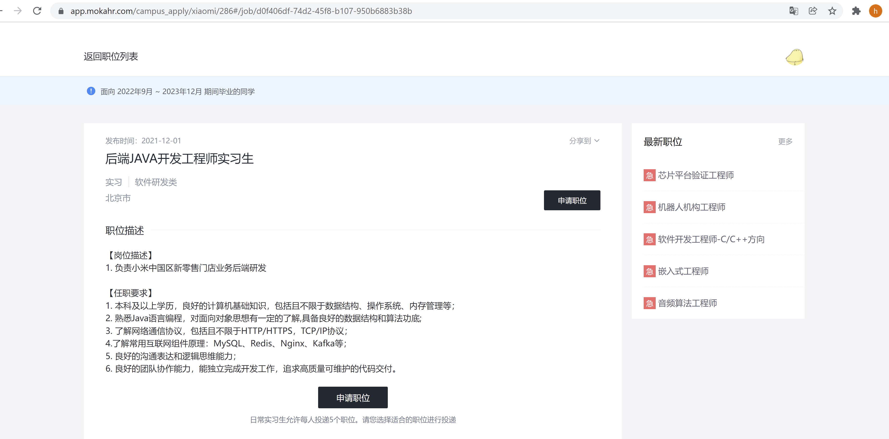
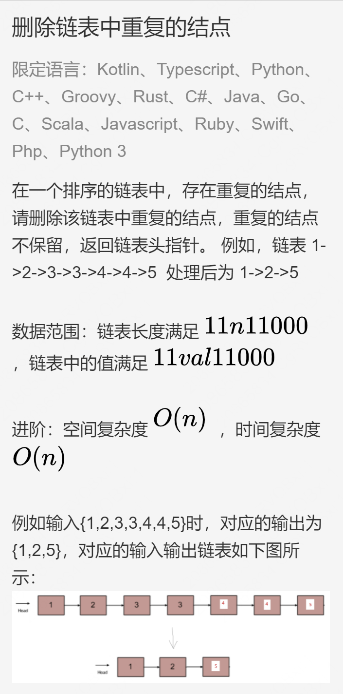

# 2021-12-09 小米1面 视频 68分钟



- 自我介绍，以及为啥本科金融
- 聊下项目
  - 流式和批式怎么更新？两份数据不一样的话怎么办？
  - 项目中有没有高并发、性能问题？
  - 说下用到的 flink boradcast 模式的原理？
- volatile 有啥用？和 syncronized 有啥区别？（不想背一堆八股文说原理了，就简单说了下）
- 说一下 Java 内存模型？
- 有没有遇到过 HashMap 线程安全问题？它为什么多线程不安全？多线程扩容的时候死循环遇到过吗？
- 线程池用过吗？说一下场景，说一下创建线程池时候的参数
- 进程和线程区别？协程用过吗？

  - 用户态和内核态说一下
- http 的可靠性是怎么保证的？

  - 有一些丢包、重复发包，怎么处理的？
  - 重传的时间是怎么确定的？
  - http 怎么做流量控制的？
  - 说一下滑动窗口？
  - 拥塞避免用在哪里？
  - http 状态码？1xx 状态码做什么用的？
- MySQL vs ES 技术选型？
- kafka 说一下设计模型，怎么同步的
- MySQL

  - 说一下 MVCC？
  - 联合索引建立的顺序？a, b, c 的联合索引，直接查 b 的话能查到吗？
  - 为什么选 B+ tree 作为索引？
  - 磁盘操作和内存操作量级差别多大？
- Redis 内存模型说一下

  - redis 的瓶颈？redis 哪些操作会影响性能？
  - redis 和 mysql 的双写一致性怎么保证？
- linux 查看端口的命令？
- 代码题：删除链表中重复的节点（花了15分钟，通过）




```java
/*
 public class ListNode {
    int val;
    ListNode next = null;

    ListNode(int val) {
        this.val = val;
    }
}
*/
public class Solution {
    public ListNode deleteDuplication(ListNode pHead) {
        // 考虑头结点重复的情况
        ListNode preHead = new ListNode(-1);
        preHead.next = pHead;
        
        if (preHead.next == null) return pHead;
        ListNode ppre = preHead;
        ListNode pre = ppre.next;
        while (pre != null) {
            int val = pre.val;
            ListNode cur = pre;
            int count = 0; // 重复数字的个数
            while (cur != null && cur.val == val) {
                count++;
                cur = cur.next;
            }
            // 删除重复的数字
            if (count > 1) {
                ppre.next = cur;
                pre = ppre.next;
            }else{
                ppre = pre;
                pre = pre.next;
            }
        }
        return preHead.next;
    }
}

// 1,2,3,3,4,4,5
// 1,1,1,8
```

- 反问环节，问了下新零售门店业务主要做啥


