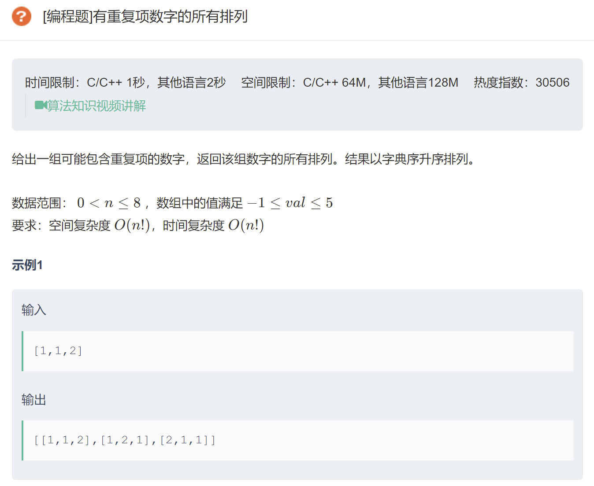

# 2021-12-14 小米二面 视频 70分钟

- 自我介绍，说下本科专业
- 聊聊项目

  - 最大的收获？（技术上、做事情上）
  - 入职多长时间开始做的这个需求？
  - 压力大吗？
  - mentor 给了什么帮助？
- kafka 的结构？

  - zk 用来做什么？
  - kafka 为什么快？零拷贝、顺序读写（不管是磁盘寻道/缓存命中，都比随机读写有优势）
  - kafka 用到的算法了解过吗？
  - kafka 做读写分离了解过吗？
  - kafka 的推拉模式了解过吗？
  - 其它的消息队列了解过吗？
- MySQL 调优方面有哪些实操经验？
  - 索引
  - 连接池
  - 分库分表、读写分离？（知道，没用过，当时小项目没必要）
- Hive 和 MySQL 有什么区别？
- Redis 的数据类型
  - Redis 对 geo 的支持了解过吗？
  - Redis 的线程模型？
  - Redis 支持事务吗？和 MySQL 的事务有什么区别？
  - 分布式锁怎么实现？用纯 Redis 怎么实现？（setnx）
  - 怎么避免死锁？（setex）
- http 和 https 的区别？
  - http 加密的过程了解过吗？拿到证书之后怎么做？
  - 四次挥手说一下
  - 客户端发送 ack 之后，多久断开连接？
  - 服务端发了 FIN 之后，客户端不响应，会发生什么？
- 说一下对 docker 的了解？
- 算法题，先说了下思路没问题，然后实现一下，15分钟没写完，时间原因不继续写了，下一环节
- 反问环节
  - 新零售做啥，讲了下业务
  - 组里主要技术栈
  - 什么时候开始做的门店业务，组里多少人在做

