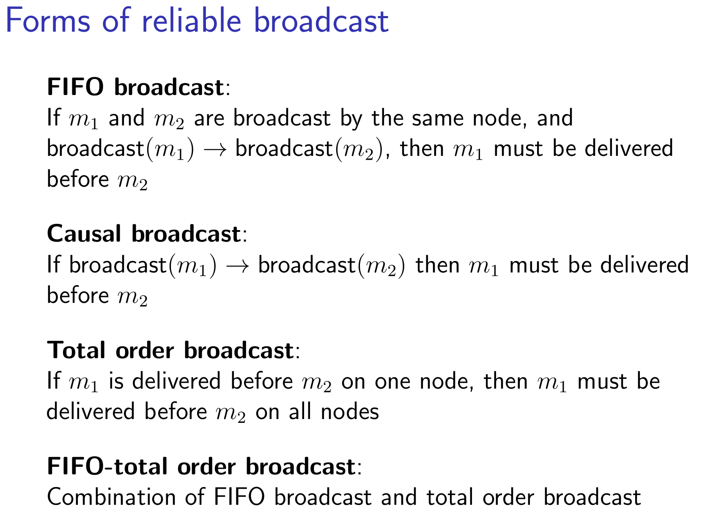
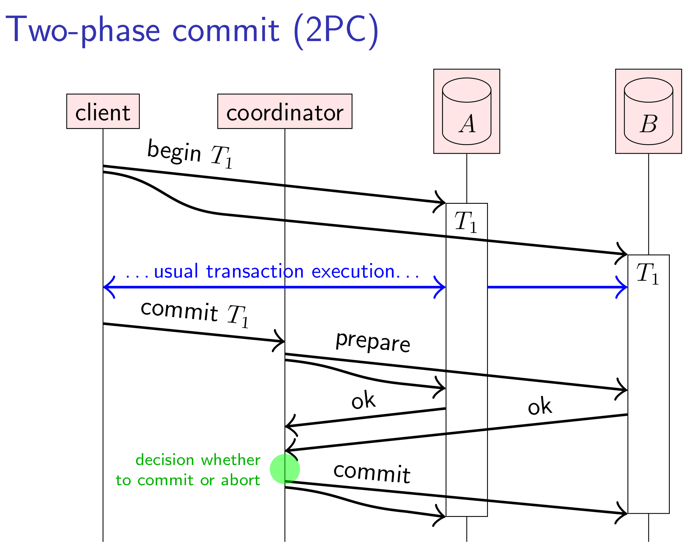
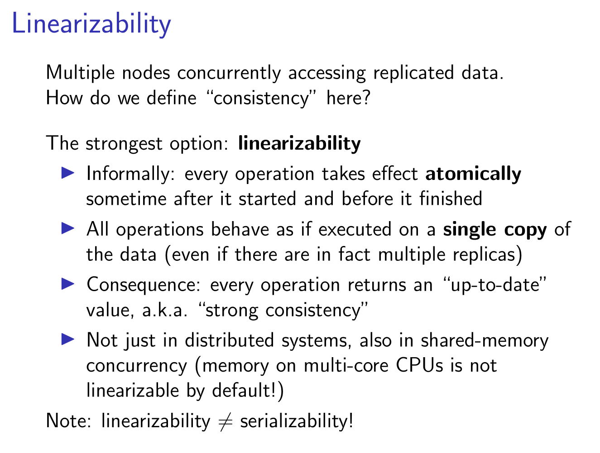

# Linearizability 线性一致性

线性一致性又叫做原子一致性。在并发编程中，如果一个操作对于系统的其他部分是不可中断的，那这个操作就可以称之为原子的，线性的，不可分割的。那这个操作就可以称之为具有线性一致性的特性。

原子操作具有”要么成功要么失败”的特性，就是说要么这个操作成功修改系统的状态，要么不会有任何作用。

操作系统的多线程编程就是一种并发编程。在做多线程编程时，并发控制是我们最需要考虑的一个事情，我们常常用各种锁来保护（shared-data）共享数据。那么操作系统是如何实现的这些锁那？在硬件层面，硬件会提供一些具有线性一致性的指令，比如atomic read-write，atomic swap，test-and-set，操作系统基于这些指令建立mutual exclusion、 semaphores 等锁结构。

在分布式领域中，我们也会说线性一致性，例如Zookeeper是线性一致性的，再比如分布式领域著名的CAP定理中的C，也是指线性一致性。

**Linearizability** therefore requires client 3’s operation to observe a state no older than client 2’s operation

> 我常说，学一些不变的东西吧，这就是一个很好的例子。很有趣的一件事，Redis 和 CPU L1 L2 L3 都是缓存，多机分布式场景下的 Linearizability 和单机多核 CPU 的 shared-memory concurrency 都是多副本场景下的一致性问题。
>
> Linearizability is a useful concept not only in distributed systems, but also in the context of shared-memory concurrency on a single machine. Interestingly, on a computer with multiple CPU cores (pretty much all servers, laptops and smartphones nowadays), memory access is not linearizable by default! This is because each CPU core has its own caches, and an update made by one core is not immediately reflected in another core’s cache. Thus, **even a single computer starts behaving a bit like a replicated system.** The L304 unit in Part III goes into detail of multicore memory behaviour.

拓展：数据库隔离级别