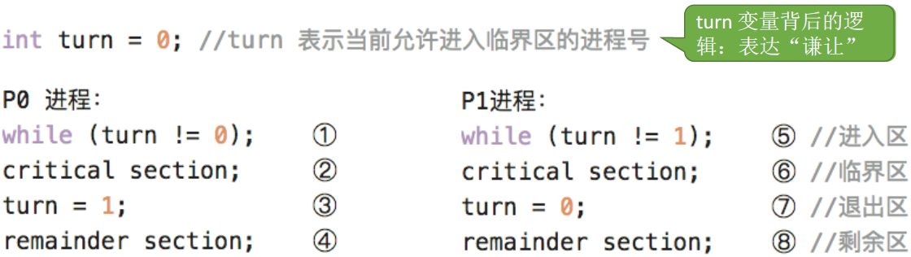
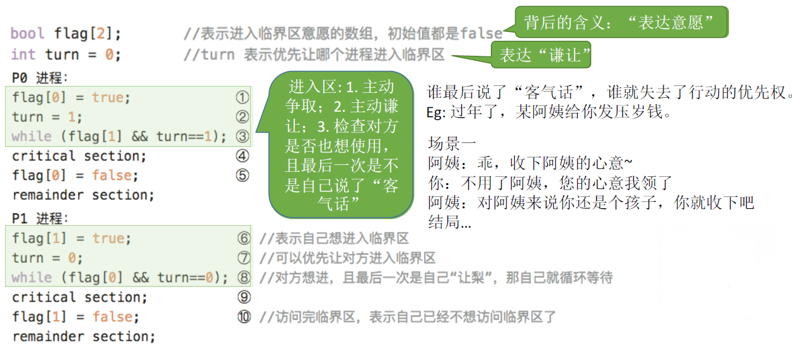
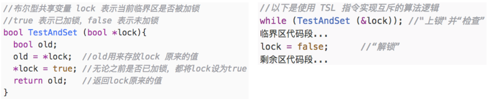
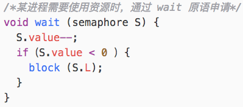
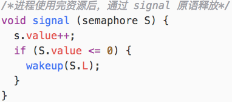
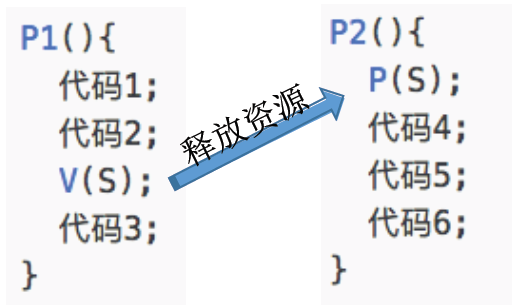
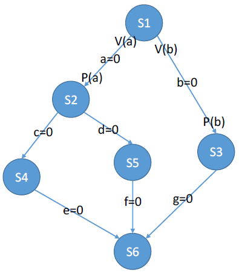
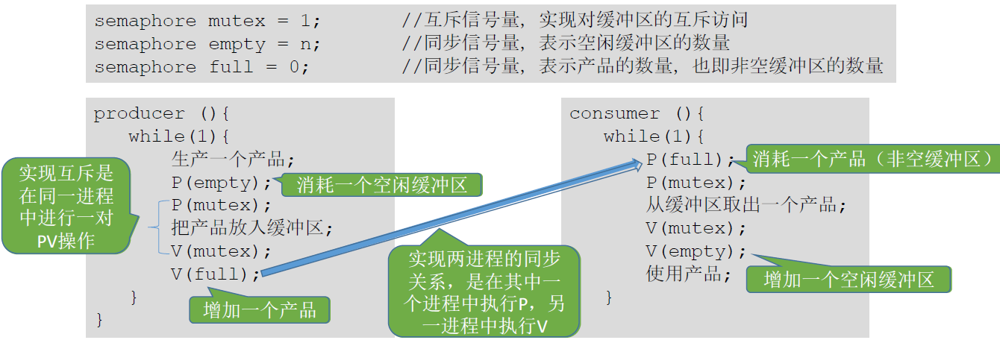
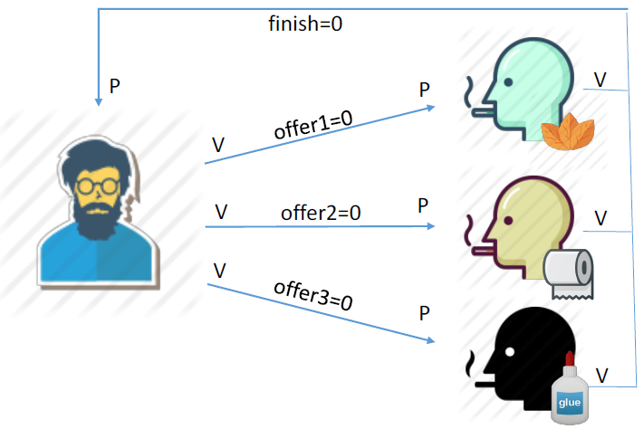
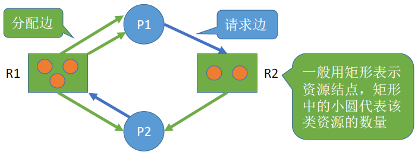

# 第二章 进程管理3 - 进程同步与互斥

### 什么是进程同步

知识点回顾：进程具有异步性的特征。异步性是指，各并发执行的进程以各自独立的、不可预知的速度向前推进。

由于并发必然导致异步性。而实际应用中，又必须按照某种顺序执行，如何解决这种异步问题，就是“进程同步”所讨论的内容。

**同步** 亦称直接 **制约关系**，它是指为完成某种任务而建立的两个或多个进程，这些进程因为需要在某些位置上 **协调它们的工作次序** 而产生的制约关系。

对临界资源的互斥访问，可以在逻辑上分为如下四个部分：


### 进程互斥的原则

为了实现对临界资源的互斥访问，同时保证系统整体性能，需要遵循以下原则：

1. **空闲让进**。临界区空闲时，可以允许一个请求进入临界区的进程立即进入临界区；
2. **忙则等待**。当已有进程进入临界区时，其他试图进入临界区的进程必须等待；
3. **有限等待**。对请求访问的进程，应保证能在有限时间内进入临界区（保证不会饥饿）；
4. **让权等待**。当进程不能进入临界区时，应立即释放处理机，防止进程忙等待。


### 进程互斥的软件实现方法

#### 1、单标志法

算法思想：两个进程在访问完临界区后会把使用临界区的权限转交给另一个进程。也就是说，每个进程进入临界区的权限只能被另一个进程赋予。

turn 的初值为 0，即刚开始只允许 0 号进程进入临界区。




该算法可以实现**同一时刻最多只允许一个进程访问临界区**，但是两个进程必须轮流访问。如果 P0 一直不访问临界区，虽然临界区空闲，但并不允许 P1 访问。**违背“空闲让进”原则**。

#### 2、双标志先检查法

算法思想：设置一个布尔型数组flag[]，数组中各个元素用来标记各进程想进入临界区的意愿，比如“flag[0] = ture”意味着0 号进程P0 现在想要进入临界区。每个进程在进入临界区之前先检查当前有没有别的进程想进入临界区，如果没有，则把自身对应的标志flag[i] 设为true，之后开始访问临界区。


由于进入区的“检查”和“上锁” 两个处理**不是一气呵成**的，**“检查”后、“上锁”前** 可能发生进程切换。

主要问题是：**违反“忙则等待”**原则，并发时可能导致两个进程同时访问临界区。

#### 3、双标志后检查法

先“上锁”后“检查”的方法，来避免上述问题。


若按照①⑤②⑥的顺序执行，P0 和 P1 将无法进入临界区。

此方法虽然 **解决了“忙则等待”** 的问题，但是又 **违背了“空闲让进”、“有限等待”原则**。

#### 4、Peterson 算法

算法思想：结合双标志法、单标志法的思想。如果双方都争着想进入临界区，那可以让进程尝试谦让

谁最后设置了 turn 的值，谁就失去了行动的优先权。




Peterson 算法用软件方法解决了进程互斥问题，**遵循了空闲让进、忙则等待、有限等待**三个原则，但是依然**未遵循让权等待**的原则（进程无法获得使用权的时候，一直while循环检测，消耗CPU资源）。

Peterson 算法相较于之前三种软件解决方案来说是最好的，但依然不够好。


### 进程互斥的硬件实现方法

#### 1、中断屏蔽方法

与原语的实现思想相同，即在某进程开始访问临界区到结束访问为止，都不允许被中断。

```java
开中断;
临界区;
关中断;
```

优点：

- 简单，高效

缺点：

- 不适用于多处理机
- 由于开/关中断指令是特权指令，只能运行在内核态，因此只适用于内核级进程，不适用于用户级进程

#### 2、TestAndSetLock 指令

TSL 是 Test and Set Lock 的缩写。要实现 TSL 需要硬件的支持。

硬件指令：

```asm
TSL RX, LOCK # 测试并加锁
```

该指令所做的事情：

- 读取 Lock 的值，存入寄存器RX中
- 给 Lock 设置一个非0值（设置到LOCK对应的内存中）

以上三个步骤是一个 **不可拆分** 的原子操作，执行该指令的CPU将会 **锁住内存总线**（memory bus），以禁止其他CPU在本指令结束之前访问内存。

##### TSL和中断屏蔽的区别

当一个CPU将中断屏蔽后，只影响当前屏蔽中断的CPU，其他CPU还是依然可以照样访问内存的（想要中断）。唯一一个当一个CPU在访问内存时阻止其他CPU访问内存的方法就是将内存总线锁住，这个需要硬件的支持，TSL可以达到该目的。

##### 利用TSL完成进程间互斥 - 《现代操作系统》P71

```asm
enter_region:
    TSL REGISTER, LOCK                    /*复制锁到寄存器并将锁置1*/
    CMP REGISTER, #0                      /*判断寄存器内容是否为0*/
    JNE enter_region                      /*若不是0，说明锁已经被设置，跳转到enter_region循环*/
    RET                                   /*返回调用者，进入临界区*/

leave_region:
    MOVE LOCK, #0                         /*在锁中置0*/
    RET                                   /*返回调用者*/
```

1. 如果LOCK的值为0，则将LOCK的值设置为1，且进入临界区
2. 如果LOCK的值为1，则一直循环等待
3. 如果多个进程同时调用TSL，利用TSL的特性：只有一个进程访问，其他的会被block

（下图图源王道）




#### 3、XCHG 指令

一个可替换 TSL 的指令是 XCHG，它原子性地交换了两个位置的内容。它本质上与 TSL 的解决方法一样。

```asm
enter_region:
    MOVE REGISTER, #1                       /*给寄存器中置1*/
    XCHG REGISTER, LOCK                     /*交换寄存器与锁变量的内容*/
    CMP REGISTER, #0                        /*判断寄存器内容是否为0？*/
    JNE enter_region                        /*若不是0跳转到enter_region*/
    RET                                     /*返回调用者，进入临界区*/
leave_region:
    MOVE LOCK, #0                           /*在锁中置0*/
    RET                                     /*返回调用者*/
```

优点：

- 使用硬件方式实现简单；适用于多处理机环境

缺点：

- 不满足“让权等待”原则，暂时无法进入临界区的进程会占用 CPU 资源并循环执行 TSL 指令，导致忙等


### 信号量机制

以上所有方案都无法实现让权等待，而信号量机制实现了让权等待。

用户进程通过使用操作系统提供的**一对原语**来对信号量进行操作，实现了进程互斥、进程同步。

- P 操作：申请 / wait(S) / P(S)

- V 操作：释放 / signal(S) / V(S)

#### 1、整型信号量

用一个 **整数型的变量** 作为信号量，表示系统中某种资源的数量。对信号量的三种操作：

- 初始化
- P 操作（将“检查”和“上锁”一气呵成，避免并发 / 异步导致的问题）
- V 操作

存在的问题：不满足“让权等待”原则，会发生“忙等”，一直 while 占用处理机

#### 2、记录型信号量（默认）

##### 记录型信号量定义

S.value 表示系统中某种资源的数目。


##### P 操作（wait 操作）

对信号量 S 执行一次 P 操作，即执行 S.value--，表示资源数减 1

若 S.value < 0 时，该资源已分配完毕，进程调用 block 原语自我阻塞（运行态 -> 阻塞态），主动放弃处理机，并插入该类资源的等待队列 S.L 中。遵循了“让权等待”原则。




##### V 操作（signal 操作）

对信号量 S 执行一次 V 操作，即执行 S.value++，表示资源数加 1

若 S.value <= 0，仍有进程在等待资源，则调用 wakeup 原语唤醒等待队列中第一个进程（阻塞态 -> 就绪态）




#### 信号量机制实现进程互斥

1. 分析并发进程的关键活动，划定临界区（如：对临界资源打印机的访问就应放在临界区）
2. 设置互斥信号量 mutex，初值为 1
3. 在进入区 P(mutex)——申请资源
4. 在退出区 V(mutex)——释放资源


#### 信号量机制实现进程同步 - 前 V 后 P

1. 分析什么地方需要实现“同步关系”，即必须保证“一前一后”执行的两个操作
2. 设置同步信号量 S, 初始为 0
3. 在“前操作”之后执行 V(S)
4. 在“后操作”之前执行 P(S)

P2 需要这种资源，而只有 P1 才能产生这种资源。即，只有执行了 V 操作之后，P 操作之后的代码才会执行。




#### 信号量机制实现前驱关系 - 前 V 后 P

进程P1 中有句代码S1，P2 中有句代码S2 ，P3中有句代码S3 …… P6 中有句代码S6。这些代码要求按如下前驱图所示的顺序来执行：



其实每一对前驱关系都是一个进程同步问题（需要保证一前一后的操作）因此，
1. 要为每一对前驱关系各设置一个同步信号量
2. 在“前操作”之后对相应的同步信号量执行V 操作
3. 在“后操作”之前对相应的同步信号量执行P 操作


## 经典的 IPC 问题

生产者、消费者共享一个初始为空、大小为n的缓冲区。缓冲区是临界资源，各进程必须互斥地访问。

- 若缓冲区 **不满**，生产者可以 **生产**  ->  **V(full) 释放**

- 若缓冲区 **非空**，消费者可以 **消费**  ->  **P(full) 申请**


仍然满足 **前 V 后 P**：consumer 需要这种资源，而只有 producer 才能产生这种资源。即，只有执行了 V(full) 操作之后，P(full) 操作之后的代码才会执行。




```java
semaphore mutex = 1; 	// 互斥信号量，实现对缓冲区的互斥访问
semaphore empty = n; 	// 同步信号量，表示空闲缓冲区的数量
semaphore full = 0; 	// 同步信号量，表示产品的数量，也即非空缓冲区的数量

producer (){			// 生产者
    while(1){
        生产一个产品;
        P(empty);		// 实现互斥的 P 操作必须在实现同步的 P 操作之后，否则会导致死锁
        P(mutex);
        把产品放入缓冲区;
        V(mutex);		// 可以改变相邻 V 操作的顺序
        V(full);
    }
}

consumer (){			// 消费者
    while(1){
        P(full);
        P(mutex);
        从缓冲区取出一个产品;
        V(mutex);
        V(empty);
        使用产品;
    }
}
```


### 多生产者 - 多消费者问题

桌上有一盘子，每次只能放入一个水果。爸爸只放苹果，妈妈只放橘子，儿子只吃橘子，女儿只吃苹果。

盘子空才能放，盘子有正确的水果才能取。用 PV 操作实现上述过程。

生产者生产的产品、消费者消费的产品类别各不相同。

##### 分析同步关系（一前一后）：

1. 父亲将苹果放入盘子后，女儿才能取苹果
2. 母亲将橘子放入盘子后，儿子才能取橘子
3. 只有盘子为空时，父亲或母亲才能放入水果


> 总结：在生产者-消费者问题中，如果缓冲区大小为1，那么有可能不需要设置互斥信号量就可以实现互斥访问缓冲区的功能。这不是绝对的，要具体问题具体分析。
>
> 建议：在考试中如果来不及仔细分析，可以加上互斥信号量，保证各进程一定会互斥地访问缓冲区。但需要注意的是，**实现互斥的 P 操作一定要在实现同步的 P 操作之后**，否则可能引起“死锁”。

##### 代码

```java
// semaphore mutex = 1; // 实现互斥访问盘子（缓冲区）
semaphore apple = 0; 	// 盘子中有几个苹果
semaphore orange = 0; 	// 盘子中有几个橘子
semaphore plate = 1; 	// 盘子中还可以放多少个水果
dad (){
    while(1){
        准备一个苹果;
        P(plate);		// P 申请盘子里的一个空位
        把苹果放入盘子;
        V(apple);		// V 释放一个苹果
    }
}
mom (){
    while(1){
        准备一个橘子;
        P(plate);
        把橘子放入盘子;
        V(orange);
    }
}
daughter (){
    while(1){
        P(apple);		// P 申请一个苹果
        从盘中取出苹果;
        V(plate);		// V 释放盘子一个空位
        吃掉苹果;
    }
}
son(){
    while(1){
        P(orange);
        从盘中取出橘子;
        V(plate);
        吃掉橘子;
    }
}
```


### 吸烟者问题

#### 可以生产多个产品的单生产者问题

系统中有 **三个抽烟者进程**，每个抽烟者不断地卷烟并抽烟。抽烟者卷起并抽掉一颗烟需要有三种材料：烟草、纸、胶水。一个抽烟者有烟草，一个有纸，另一个有胶水。

系统中还有 **一个供应者进程**，它们无限地供应所有三种材料，但每次仅轮流提供三种材料中的两种。

得到缺失的两种材料的抽烟者在卷起并抽掉一颗烟后，会发信号通知供应者，让它继续提供另外的两种材料。这一过程重复进行。

请用以上介绍的 IPC 同步机制编程，实现该问题要求的功能。

#### 分析关系

桌子：容量为1的缓冲区，要互斥访问

##### 三种组合

1. 纸 + 胶水
2. 烟草 + 胶水
3. 烟草 + 纸

##### 同步关系（从事件角度分析）

1. 桌上有组合 1 -> 第 1 个抽烟者取走东西
2. 桌上有组合 2 -> 第 2 个抽烟者取走东西
3. 桌上有组合 3 -> 第 3 个抽烟者取走东西

发出完成信号 -> 供应者将下一个组合放到桌上



##### 代码

不需要设置一个专门的同步信号量。因为缓冲区大小为 1，故同一时刻，四个同步信号量中至多有一个为 1。

```java
semaphore offer1 = 0;	// 桌上组合一的数量
semaphore offer2 = 0; 	// 桌上组合二的数量
semaphore offer3 = 0; 	// 桌上组合三的数量
semaphore finish = 0; 	// 抽烟是否完成
int i = 0; 				// 用于实现“三个抽烟者轮流流抽烟”

provider (){
    while(1){
        if(i==0) {
        	将组合一放桌上;
        	V(offer1);
        } else if(i==1){
        	将组合二放桌上;
        	V(offer2);
        } else if(i==2){
        	将组合三放桌上;
        	V(offer3);
        }
        i = (i+1)%3;
        P(finish);
    }
}

smoker1 (){
    while(1){
        P(offer1);
        从桌上拿走组合一；卷烟；抽掉；
        V(finish);
    }
}

smoker2 (){
    while(1){
        P(offer2);
        从桌上拿走组合二；卷烟；抽掉；
        V(finish);
    }
}

smoker3 (){
    while(1){
        P(offer3);
        从桌上拿走组合三；卷烟；抽掉；
        V(finish);
    }
}
```


### 读者写者问题

有读者、写者两组并发进程，共享一个文件。规则：

- 允许 **多个读者** 同时 **读** 文件
- 只允许 **一个写者** 写文件
- **写完成** 之前 **不允许读**
- **读完成** 之前 **不允许写**

**互斥关系**

- 互斥：写 - 写 / 写 - 读

- 不互斥：读 - 读

##### 代码

读写公平法：即使连续有 **多个读者** 到来，也 **不会使写者一直饥饿**，是相对公平的先来连服务原则。

```java
semaphore rw = 1; 		// 读写信号量，实现只读或只写（互斥访问）
int count = 0; 			// 记录当前有几个读者程在访问文件
semaphore mutex = 1; 	// 用于保证对count变量的互斥访问
semaphore w = 1; 		// 用于保证写者不会饥饿

writer (){				// 写者
    while(1){
        P(w);			// 用于保证写者不会饥饿
        P(rw);			// 写者申请一个读写信号量（意味着只写）
        写文件;
        V(rw);
        V(w);
    }
}

reader (){				// 读者
    while(1){
        P(w);			// 用于保证写者不会饥饿
        P(mutex);		// 对count操作前，需要申请count变量的独占
        if(count == 0){	// 没有读者
            P(rw);		// 读者申请一个读写信号量（意味着只读）
        }
        count++;		// 全局变量增加一个写进程
        V(mutex);		// 释放count变量的独占
        V(w);
        读文件;
        P(mutex);
        count--;
        if(count == 0){
            V(rw);
        }
        V(mutex);
    }
}
```


### 哲学家就餐问题

圆桌坐着 5 名哲学家，每两个哲学家之间有一根筷子，哲学家交替进行思考和进餐。进餐时，试图一根一根拿起左、右两根筷子，只有同时拿起两根筷子才能进餐，否则需要等待。进餐完毕后，哲学家放下筷子继续思考。

##### 关系分析

- 5 个哲学家进程
- 相邻哲学家对中间筷子的访问是互斥关系

每个哲学家进程需要同时持有两个临界资源才能开始吃饭。如何避免死锁现象，才是哲学家问题的精髓。

定义互斥信号量数组 `chopstick[5] = {1, 1, 1, 1, 1}` 用于实现对 5 个筷子的互斥访问。并对哲学家按 0 ~ 4 编号，哲学家 i 左边的筷子编号为 `i`，右边的筷子编号为 `(i + 1) % 5`


##### 如何防止死锁的发生呢？

有很多种方式，举几个例子：

1. 最多允许四个哲学家同时进餐，这样保证至少有一个哲学家能拿到左右两只筷子.
2. 奇数号哲学家先拿左边的筷子再拿右边的筷子，偶数号哲学家相反。这样保证如果相邻的两个奇偶号哲学家都想吃饭，那么只会有其中一个可以拿起第一只筷子。
3. 仅当一个哲学家左右两支筷子都可用时，才允许他抓起筷子。

##### 代码

思想：使用 mutex 来实现 **只允许一个哲学家** 处于 **只拿起了一只筷子的状态**

```java
semaphore chopstick[5]={1,1,1,1,1};
semaphore mutex = 1; 			// 互斥地取筷子
Pi (){ 							// i 号哲学家的进程
    while(1){
        P(mutex);
        P(chopstick[i]); 		// 拿左
        P(chopstick[(i+1)%5]); 	// 拿右
        V(mutex);
        吃饭;
        V(chopstick[i]); 		// 放左
        V(chopstick[(i+1)%5]); 	// 放右
        思考;
    }
}
```


## 管程

> 《现代操作系统》P79
>
> 由于使用信号量时要非常小心，而且出现的错误都是竞争条件、死锁以及其它一些不可预测或不可再现的行为，而为了更易于编写正确的程序，提出了一种高级同步原语，称为管程（monitor）
>
> 一个 **管程** 是由一个过程、变量及数据结构等组成的一个集合，它们组成一个 **特殊的模块** 或 **软件包**。
>
> 管程有一个很重要的特性：任一时刻，管程中只能有一个活跃进程。
>
> 管程是编程语言的组成部分，编译器知道它们的特殊性，因此可以采用与其它过程调用不同的方法来处理对管程的调用。由编译器而非程序员来安排互斥，出错的可能性要小很多。
>
> - Java 的 syncronized 就是一个管程，也可使用 wait() / notify() 实现进程的同步。
>
> - C，Pascal 以及多数其他语言都没有管程。

##### 管程的特征

1. 局部于管程的数据只能被局部于管程的过程所访问
2. 一个进程只有通过调用管程内的过程，才能进入管程访问共享数据
3. 每次只允许一个进程在管程内执行某个内部过程


## 死锁

#### 易混概念辨析

**死锁**：各进程互相等待对方手里的资源，导致各进程都阻塞，无法向前推进（操作系统考虑）

**饥饿**：由于长期得不到想要的资源，某进程无法向前推进（操作系统考虑）

**死循环**：某进程执行过程中一直跳不出某个循环，是可以上处理机运行的（开发人员考虑）


#### 死锁产生的必要条件

##### 1、互斥条件

只有对必须互斥使用的资源的争抢才会导致死锁（如哲学家的筷子、打印机设备）。像内存、扬声器这样可以同时让多个进程使用的资源是不会导致死锁的（因为进程不用阻塞等待这种资源）。

##### 2、不剥夺条件

进程所获得的资源在未使用完之前，不能由其他进程强行夺走，只能主动释放。

##### 3、请求和保持条件

进程已经保持了至少一个资源，但又提出了新的资源请求，而该资源又被其他进程占有，此时请求进程被阻塞，但又对自己已有的资源保持不放。

##### 4、循环等待条件

存在一种进程资源的循环等待链，链中的每一个进程已获得的资源同时被下一个进程所请求。


#### 什么时候会发生死锁

##### 1、对系统资源的竞争

各进程对不可剥夺的资源（如打印机）的竞争可能引起死锁，对可剥夺的资源（CPU）的竞争是不会引起死锁的。

##### 2、进程推进顺序非法

请求和释放资源的顺序不当，也同样会导致死锁。例如，并发执行的进程P1、P2 分别申请并占有R1、R2，之后进程P1申请R2，进程P2申请R1，两者因为申请的资源被对方占有而阻塞，发生死锁。

##### 2、信号量的使用不当

如生产者-消费者问题中，如果实现互斥的P操作在实现同步的P操作之前，就有可能导致死锁。（可以把互斥信号量、同步信号量也看做是一种抽象的系统资源）


### 死锁的处理策略

#### 1、预防死锁

破坏死锁产生的四个必要条件中的一个或几个。

##### （1）破坏互斥条件

###### 方案

把只能互斥使用的资源改造为允许共享使用，则系统不会进入死锁状态。比如，操作系统可以采用 SPOOLing 技术把独占设备在逻辑上改造成共享设备。

###### 缺点：

并不是所有的资源都可以改造成可共享使用的资源。很多时候无法破坏互斥条件。

##### （2）破坏不剥夺条件

###### 不剥夺条件

进程所获得的资源在未使用完之前，不能由其他进程强行夺走，只能主动释放。

###### 方案

- 方案一：当某个进程请求新的资源得不到满足时，它必须立即释放保持的所有资源，待以后需要时再重新申请。也就是说，即使某些资源尚未使用完，也需要主动释放，从而破坏了不可剥夺条件。
- 方案二：当某个进程需要的资源被其他进程所占有的时候，可以由操作系统协助，将想要的资源强行剥夺。这种方式一般需要考虑各进程的优先级（比如：剥夺调度方式，就是将处理机资源强行剥夺给优先级更高的进程使用）

###### 缺点

1. 实现起来比较复杂。
2. 释放已获得的资源可能造成前一阶段工作的失效，因此只适用于易保存和恢复状态的资源，如CPU。
3. 反复申请释放资源，增加系统开销，降低系统吞吐量。
4. 方案一会导致进程饥饿。

##### （3）破坏请求和保持条件

###### 请求和保持条件

进程已经保持了至少一个资源，但又提出了新的资源请求，而该资源又被其他进程占有，此时请求进程被阻塞，但又对自己已有的资源保持不放。

###### 方案

采用 **静态分配** 方法，进程在运行前，一次申请完它需要的全部资源才能投入运行。一旦投入运行，一直保持资源，且不再请求别的任何资源，直到运行结束，释放资源。

###### 缺点

1. 进程整个运行期间一直保持所有资源，造成资源浪费
2. 可能导致某些进程饥饿（请求资源多的进程难以集齐所有资源）

##### （4）破坏循环等待条件

###### 循环等待条件

存在一种进程资源的循环等待链，链中的每一个进程已获得的资源同时被下一个进程所请求。

###### 方案

顺序资源分配法。首先给系统中的资源编号，规定每个进程必须按编号递增的顺序请求资源，同类资源（即编号相同的资源）一次申请完。

###### 原理

一个进程只有已占有小编号的资源时，才有资格申请更大编号的资源。

- 任一时刻，总有一进程拥有的资源编号是最大的，此进程对其余资源的获取必畅通无阻
- 已持有大编号资源的进程不可能逆向地回来申请小编号的资源，从而就不会产生循环等待的现象

###### 缺点：

1. 不方便增加新的设备，因为可能需要重新分配所有的编号；
2. 进程实际使用资源的顺序可能和编号递增顺序不一致，会导致资源浪费；
3. 必须按规定次序申请资源，用户编程不便。


#### 2、避免死锁

用某种方法防止系统进入不安全状态，从而避免死锁（银行家算法）

##### 银行家算法

一个小城镇的银行家向一群客户分别承诺了一定的贷款额度，只有当借款总数达到客户最大要求时，客户才归还贷款，否则无论之前借了多少钱，都拿不回来。

###### 银行家算法的步骤：

1. 检查此次申请是否超过之前声明的最大需求数
2. 检查此时系统剩余可用资源是否还能满足此次请求
3. 试探分配，更各个改数据结构
4. 用安全型算法检查此次分配是否会导致系统进入不安全状态

###### 安全性算法的步骤：

1. 检查当前剩余可用资源是否能满足某个资源的最大需求，如果可以，就将该进程加入安全序列
2. 等到这个进程执行完毕就将它占有的全部资源回收
3. 不断重复上述过程，看看最终是否能让所有进程都加入安全序列

##### 安全序列

所谓的安全序列，就是指系统如果按照这种序列分配资源，则每个进程都能顺利完成。只要能找出一个安全序列，系统就处于安全状态。当然，安全序列可以有多个。

一个 **找不到** 安全序列的例子：（剩余资源总数 3  3  2）可以拓展到有 n 个进程，m 种资源

|    进程     |    最大需求        |    已分配   |   最多还需要        |
| :-----: | :--------: | :---: | :-------: |
|   P0    |   8  5  3   | 0  1  0 |   8  4  3   |
|   P1    |   3  2  2   | 2  0  0 | 1  2  2 |
|   P2    |   9  5  2   | 3  0  2 | 6  5  0 |
|   P3    |   2  2  2   | 2  1  1 | 0  1  1 |
|   P4    |   4  3  6   | 0  0  2 | 4  3  4 |


#### 3、死锁的检测和解除

允许死锁的发生，不过操作系统会负责检测出死锁的发生，然后采取某种措施解除死锁。

- 死锁检测算法：用于检测系统状态，以确定系统中是否发生了死锁。
- 死锁解除算法：当认定系统中已经发生了死锁，利用该算法可将系统从死锁状态中解脱出来。


##### 死锁检测思想：

依次消除与不阻塞进程相连的边，直到无边可消。

- 如果最终 **能消除所有边**，就称这个图是可完全简化的。此时一定没有发生死锁（即找到一个 **安全序列**）

- 如果最终 **不能消除所有边**，那么此时就是 **发生了死锁**。剩余连着边的进程，就是处于死锁状态的进程。




##### 死锁检测算法：

1. 在资源分配图中，找出既不阻塞又不是孤点的进程 Pi，消去它所有的请求边和分配变，使之称为孤立的结点。上图中的 P1 是满足这一条件的进程结点，于是将 P1 的所有边消去。
2. 进程 Pi 所释放的资源，可以唤醒某些等待这些资源的阻塞进程，原来的阻塞进程可能变为非阻塞进程（下图 P2）。重复整个过程，若能消去途中所有的边，则称该图是可完全简化的。

##### 解除死锁方法：

1. 资源剥夺法。挂起（暂时放到外存上）某些死锁进程，并抢占它的资源，分配给其他的死锁进程。
2. 撤销进程法（或称终止进程法）。强制撤销部分、甚至全部死锁进程，并剥夺这些进程的资源。
3. 进程回退法。让一个 / 多个死锁进程回退到足以避免死锁的地步。要求系统要记录进程的历史信息，设置还原点。