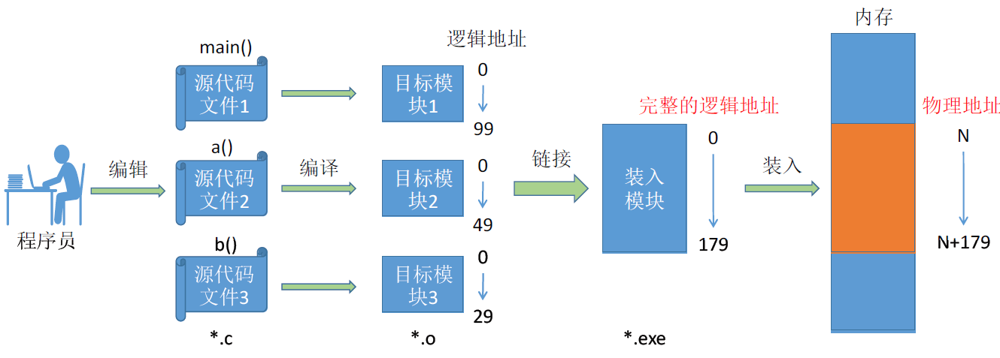
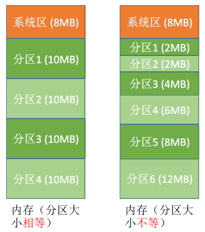
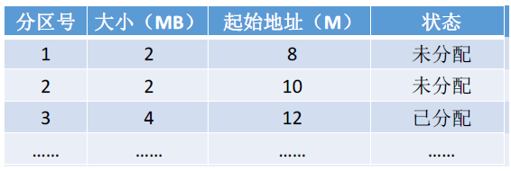
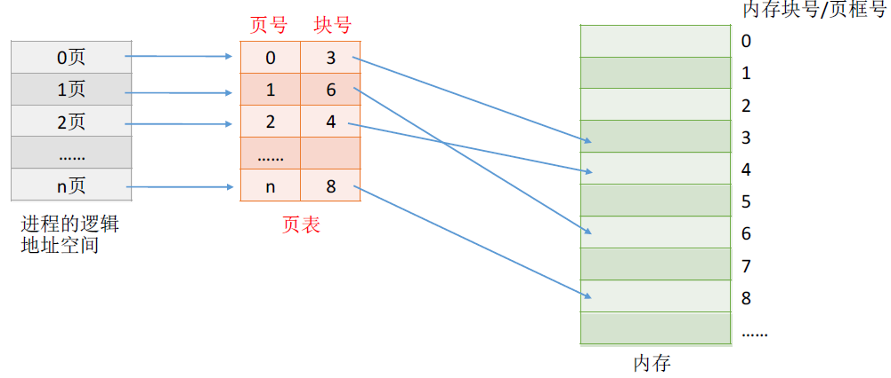
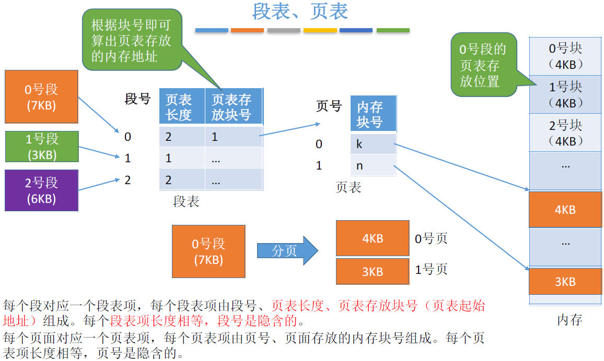

# 第三章 内存管理1 - 空间分配

## 基础知识

1 Byte（字节） = 8 bit

1 字 = 16 / 32 / ... bit，字由若干个字节构成，不同的机器有不同的字长。

> 2^10 = 1 K（千）
> 2^20 = 1 M（兆，百万）
> 2^30 = 1 G （十亿，百兆）

例如，4 GB = 4 * 2^30 bit = 2^32 bit

### 逻辑地址 / 物理地址

为了简化理解，本节中我们默认操作系统给进程分配的是一片连续的内存空间

#### 装入的三种方式

##### 1、绝对装入：编译时完成地址变换

- 编译时，如果知道程序将放到内存中的哪个位置，**编译程序** 将产生 **绝对地址** 的目标代码。
- 装入时，装入程序按照装入模块中的地址，将程序和数据装入内存。

特点：只适用于单道程序环境。

##### 2、静态重定位：装入时完成地址变换

- 编译、链接后的装入模块的地址都是 **从 0 开始** 的 **逻辑地址**。
- 装入时，根据内存的当前情况，对地址进行 **重定位**，将 **逻辑地址** 变换为 **物理地址**。

特点：一个作业装入内存时，必须分配其要求的全部内存空间，如果没有足够的内存，就不能装入该作业。作业一旦进入内存，在运行期间不能再移动，也不能再申请内存空间。

##### 3、动态重定位：运行时才进行地址变换表（普遍使用）

- 编译、链接后的装入模块的地址都是 **从 0 开始**。
- 执行时，才将 **逻辑地址** 转换为 **物理地址**。这种方式需要一个 **重定位寄存器** 的支持。

特点：允许程序在内存中发生移动。

#### 从写程序到程序运行

1. 编译：由编译程序将用户源代码编译成若干个目标模块（编译就是把高级语言翻译为机器语言）
2. 链接：由链接程序将编译后形成的一组目标模块，以及所需库函数链接在一起，形成一个完整的装入模块
3. 装入（装载）：由装入程序将装入模块装入内存运行

##### 链接的三种方式

1. 静态链接：程序运行之前，先将各目标模块及它们所需的库函数连接成一个完整的可执行文件（装入模块），之后不再拆开。
2. 装入时动态链接：将各目标模块装入内存时，边装入边链接。
3. 运行时动态链接：在程序执行中需要该目标模块时，才对它进行链接。便于修改、更新、共享模块。

## 内存管理：内存空间的分配与回收

为实现多道程序并发，系统必须将多个程序调入内存。为解决多道程序越界、溢出等多种问题，存储管理有以下方法：

- 分区法（只有分区法要求占用连续空间，其他均为离散分配方式。分区法不用特殊硬件支持，如带地址加法器的CPU等，代价较小）
- 分页法
- 分段法
- 段页式存储管理

### 覆盖技术（只用于早期的操作系统）

思想：将程序分为多个段（多个模块）。常用的段常驻内存，不常用的段在需要时调入内存。

内存中分为一个 **固定区** 和若干 **覆盖区**。

- 常驻内存的段放在“固定区”中，运行过程中不再调出
- 不常用的段放在“覆盖区”，根据需要调入调出

由程序员声明覆盖结构，操作系统完成自动覆盖。对用户不透明，增加了用户编程负担。

### 交换技术

内存紧张时，换出某些进程以腾出内存空间，再换入某些进程。进程的 PCB 需要常驻内存。

**中级调度** 就是要决定将哪个处于挂起状态的进程重新调入内存。

磁盘分为 **文件区** 和 **对换区**（swap分区），换出的进程放在对换区。

- 文件区：离散分配方式，空间利用率高
- 交换区：连续分配方式，IO 速度快

##### 覆盖与交换的区别

覆盖是在同一个程序 / 进程中的，交换是在不同进程 / 作业间的。

### 连续分配管理方式

为用户进程分配的必须是一个连续的内存空间

#### 1、单一连续分配

支持单道程序，内存分为系统区 / 用户区

- 系统区：存放操作系统相关数据
- 用户区：存放用户进程相关数据。内存中只能有一道用户程序，独占整个用户区空间。

无外部碎片，有内部碎片

#### 2、固定分区分配

支持多道程序，内存用户空间分为若干个固定大小的分区，每个分区只能装一道作业

两种分区方式：分区大小相等 / 分区大小不等

分区说明表（可用数组 / 链表表示）

无外部碎片，有内部碎片

#### 3、动态分区分配（可变分区分配）

支持多道程序，在程序装入内存时，根据进程的大小动态地建立分区

无内部碎片，有外部碎片

回收内存分区时，可能遇到的四种情况：空间相邻的分区需要合并

- 回收区之后有相邻的空闲分区
- 回收区之前有相邻的空闲分区
- 回收区前后都有相邻的空闲分区
- 回收区前后都没有相邻的空闲分区

##### 动态分区分配算法 

两种常用的数据结构：空闲分区链 / 空闲分区表

| 算法     | 算法思想                                               | 分区排列顺序                                   | 优点                                                         | 缺点                                                         |
| -------- | ------------------------------------------------------ | ---------------------------------------------- | ------------------------------------------------------------ | ------------------------------------------------------------ |
| 首次适应 | **从头到尾**找适合的分区                               | 空闲分区以地址递增次序排列                     | 综合看性能最好。**算法开销小**，回收分区后一般不需要对空闲分区队列重新排序 | 低地址不断划分，产生很多小外部碎片，而每次从低地址开始找，增大了查找开销 |
| 最佳适应 | **优先使用更小的分区**，以保留更多大分区               | 空闲分区以容量递增次序排列                     | 会有更多的大分区被保留下来，更能满足大进程需求               | 会产生很多 **很小的、难以利用的碎片**；**算法开销大**，回收分区后可能需要对空闲分区队列重新排序 |
| 最坏适应 | **优先使用更大的分区**，以防止产生太小的不可用的碎片   | 空闲分区以容量递减次序排列                     | 可以减少难以利用的小碎片                                     | 大分区容易被用完，不利于大进程；**算法开销大**（原因同上）   |
| 邻近适应 | 由首次适应演变而来，每次从**上次查找结束位置**开始查找 | 空闲分区以地址递增次序排列（可排列成循环链表） | 不用每次都从低地址的小分区开始检索。**算法开销小**（原因同首次适应算法） | 会使高地址的大分区先被用完                                   |

### 非连续分配管理方式

#### 1、基本分页存储管理

分页存储管理是将一个进程的逻辑地址空间分成若干个大小相等的片（成为页面或页），并为各页加以编号，相应地，也把内存空间分成与页面相同大小的若干个存储块，称为物理块或页框（Frame），也同样为它们加以编号。

页式存储管理对用户是透明的。

##### 思想

- 把进程分页，各页面放入不同内存块中

##### 易混

- 页框 = 页帧 = 内存块 = 物理块 = 物理页面**（内存空间划分）** **VS** 页 = 页面**（进程逻辑空间划分）**
- 页框号 = 页帧号 = 内存块号 = 物理块号 = 物理页号 **VS** 页号 = 页面号
- **页面** 与 **页框** 是一一对应关系，使用 **页表** 记录这种对应关系

##### 页表（page frame）

- 页表记录 页面 -> 内存块 映射关系
- **一个进程对应一张页表**，页表驻留在内存中。进程每一页对应一个页表项（页号 + 块号）
- 页表项的大小相同。页号隐含，不占空间
- i 号页表项存放地址 = 页表地址 + i * 页表项大小

##### 逻辑地址结构

- 逻辑地址用 **页号、页内偏移量** 表示

  - 页号 = 逻辑地址 / 页面大小

  - 页内偏移量 = 逻辑地址 / 页面大小  -> 为何页面大小取 2 的整数次幂？类似于子网掩码，方便二进制运算

    >假设物理地址也用32个二进制位表示，则由于内存块的大小=页面大小，因此：
    >
    >0 号内存块的起始物理地址是 **00000000000000000000** 000000000000
    >1 号内存块的起始物理地址是 **00000000000000000001** 000000000000
    >2 号内存块的起始物理地址是 **00000000000000000010** 000000000000
    >3 号内存块的起始物理地址是 **00000000000000000011** 000000000000
    >
    >假设通过查询页表得知，1 号页面存放的内存块号是 9（1001）
    >
    >则 9 号内存块的起始地址 = 9*4096 = 0000000000000000100100000000000
    >
    >则逻辑地址 4097 对应的物理地址 = 页面在内存中存放的起始地址+ 页内偏移量 = 00000000000000000011000000000001
    >
    >即，如果页面大小刚好是2的整数幂，则只需把页 **表中记录的物理块号** 拼接上 **页内偏移量**，就能得到对应的 **物理地址**

##### 如何实现地址转换

1. 计算出逻辑地址的页号、页内偏移量
2. 找到对应页面在内存中的存放位置（查页表）
3. 物理地址 = 页面地址 + 页内偏移量

##### 基本地址变换机构

是用于实现 **逻辑地址** 到 **物理地址** 转换的一组硬件机构

页表寄存器存放 **页表起始地址、页表长度**

地址变换手算过程：

1. 计算页号、页内偏移量
2. 比较页号 P 和页表长度 M，若 P≥M，则产生越界中断，否则继续执行（页号从0开始）
3. 页表项地址 = 页表起始地址F + 页号P * 页表项长度，取出该页表项内容b，即为内存块号
4. 计算E = b * L + W，用得到的物理地址E 去访存（若二进制，可直接拼接）

其他小细节：

- 页内偏移量位数、页面大小之间可以互相计算
- 页式管理中，程序员只需用一个符号表示地址，所以地址空间是 一维 的
- 实际应用中，通常使一个页框恰好能放入整个页表项
- 为了方便找到页表项，页表一般是放在连续的内存块中的

##### 具有快表的地址变换机构

快表，又称联想寄存器（TLB, translation lookaside buffer），是一种高速缓存。由于程序的局部性原理，通过存放最近访问的页表项的副本，加快地址变换的速度。

对应地，内存中的页表常称为慢表。

引入快表前后的地址变换过程：

|                        | 地址变换过程                                                 | 访问一个逻辑地址的访存次数                      |
| ---------------------- | ------------------------------------------------------------ | ----------------------------------------------- |
| 基本地址变换机构       | ①算页号、页内偏移量 ②检查页号合法性 ③查页表，找到页面存放的内存块号 ④根据内存块号与页内偏移量得到物理地址 ⑤访问目标内存单元 | 两次访存                                        |
| 具有快表的地址变换机构 | ①算页号、页内偏移量 ②检查页号合法性 ③查快表。若**快表命中**，即可知道页面存放的内存块号，可直接进行⑤；若未命中，则进行④ ④查页表，找到页面存放的内存块号，并且将页表项复制到快表中 ⑤根据内存块号与页内偏移量得到物理地址 ⑥访问目标内存单元 | 快表命中，只需一次访存;快表未命中，需要两次访存 |

##### 两级页表

单级页表存在的问题：

- 所有页表项必须连续存放，页表过大时需要很大的连续空间
- 在一段时间内并非所有页面都用得到，因此没必要让整个页表常驻内存

两级页表：

- 将长长的页表再分页
- 逻辑地址结构：一级页号 / 二级页号 / 页内偏移量
- 注意几个术语：页目录表 / 外层页表 / 顶级页表

如何实现地址变换：

- 按照地址结构将逻辑地址拆分成三份
- 从 PCB 中读出页目录表起始地址，根据一级页号查询页目录表，找到下一级页表在内存中的存放位置
- 根据二级页表查表，找到最终想访问的内存号
- 结合业内偏移量得到物理地址

几个细节

- 多级页表中，各级页表的大小不能超过一个页面，若两级页表不够，可以分更多级
- 多级页表的访问次数（假设没有快表机构）：N 级页表访问一个逻辑地址需要 N+1 次访存

##### 例题

#### 2、基本分段存储管理

##### 分段

以段为单位进行分配，段内连续，段间可不相邻。

分段系统的逻辑地址结构由段号（段名）和段内地址（段内偏移量）所组成。

- **段号的位数** 决定了每个进程最多可以分几个段
- **段内地址位数** 决定了每个段的最大长度是多少

##### 段表

为了能从物理内存中找到各个逻辑段的存放位置，需为每个进程建立一张段映射表，称 **段表**。

各个段表项的长度是相同的。因此段号是隐含的，不占存储空间。

##### 地址变换

1. 根据逻辑地址得到段号、段内地址
2. 判断 **段号是否越界**。若 S ≥ M，则产生越界中断（段表长度至少是1，而段号从0开始）
3. 查询段表，找到对应的段表项，段表项的存放地址 = F + S * 段表项长度
4. 检查 **段内地址是否超过段长**（因为段长各不相同）。若 W ≥ C，则产生越界中断
5. 计算得到物理地址
6. 访问目标内存单元

##### 分段、分页管理的对比

- 页是物理单位。分页是系统管理，对用户不可见；因为程序员只需用一个符号表示地址，所以地址空间是 一维 的。
- 段是逻辑单位。分段是用户需求，需要程序员指出段名。因为段长不固定，所以地址空间是 二维 的（段名 + 段内地址）

注：分段存储也可以引入快表机构。

#### 3、段页式存储管理

| 存储管理方式        | 优点                                                         | 缺点                                                         |
| ------------------- | ------------------------------------------------------------ | ------------------------------------------------------------ |
| **分页** 式存储管理 | 每一页长度都一样（对应固定），所以不会产生外部碎片，只有少量页内碎片。内存空间利用率高。 | 不方便按照逻辑模块实现信息的共享和保护                       |
| **分段** 式存储管理 | 每一页的长度都不一样（对应不固定），所以会产生外部碎片，但不会产生内部碎片。方便按照逻辑模块实现信息共享 / 保护。 | 如果段长过大，为其分配很大的连续空间会很不方便。段式管理会产生外部碎片。 |

段页式系统的逻辑地址结构由段号、页号、页内地址（页内偏移量）组成。会产生内部碎片，碎片比分页存储管理更多，因为一个进程往往有很多个段，在段页式管理下每个段都会有一个页内碎片存在；而在页式管理下，一个进程只有一个页内碎片。

“分段”对用户是可见的，程序员编程时需要显式地给出段号、段内地址。而将各段“分页”对用户是不可见的。系统会根据段内地址自动划分页号和页内偏移量。因此段页式管理的地址结构是二维的。

- 段号的位数决定了每个进程最多可以分几个段
- 页号位数决定了每个段最大有多少页
- 页内偏移量决定了页面大小、内存块大小是多少

##### 地址变换

1. 由逻辑地址得到段号、页号、页内偏移量
2. 段号与段表寄存器中的段长度比较，检查是否越界
3. 由段表起始地址、段号，找到对应的段表项
4. 根据段表中记录的页表长度，检查页号是否越界
5. 由段表中的页表地址、页号得到查询页表，找到相应页表项
6. 由页面存放的内存块号、页内偏移量，得到最终物理地址
7. 访问目标单元

##### 访存次数

3 次访存。分别是：

1. 查段表
2. 查页表
3. 访问目标单元

可引入快表机构，由（段号+页号）直接找到目标地址，只需要一次访存。

### 内存空间的扩充

暂无

### 地址转换

暂无

### 存储保护

存储保护：当多个用户共享主存时，应防止由于一个用户程序出错而破坏其他用户的程序和系统软件，以及一个用户程序不合法地访问不是分配给它的主存区域。在多道程序系统中，内存中既有操作系统，又有许多用户程序。为使系统正常运行，避免内存中各程序相互干扰，必须对内存中的程序和数据进行保护。存储保护可以从以下两个方面进行：

- 防止地址越界、防止操作越权