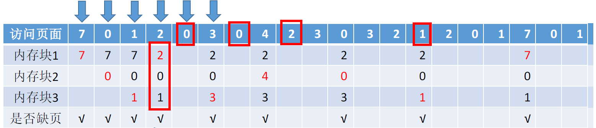
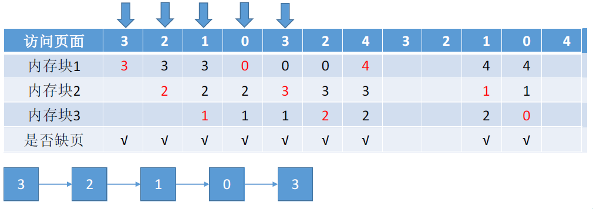
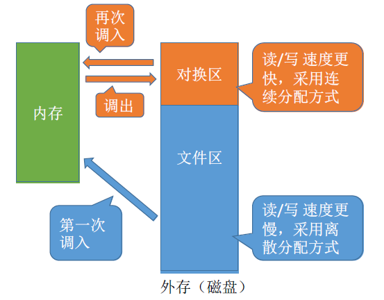

# 第三章 内存管理2 - 虚拟内存

### 虚拟内存的定义

基于局部性原理，在程序装入时，将会用到的部分装入内存，暂时不用的部分留在外存，程序就可以执行。在操作系统的管理下，在用户看来似乎有一个 **比实际内存大得多** 的内存，这就是 **虚拟内存**。

- 若访问信息不在内存，由操作系统从将信息从外存调入内存。（请求调页）

- 若内存空间不够，将暂时不用的信息换出到外存。（页面置换）

虚拟内存只能基于非连续分配技术。

### 虚拟内存的特征

1. 多次性：作业运行无需一次全部装入内存，允许多次调入内存。
2. 对换性：作业运行时无需常驻内存，允许在运行过程中换入换出。
3. 虚拟性：从逻辑上扩充了内存的容量，用户看到的内存容量远大于实际容量。

## 虚拟内存的实现

### 请求分页存储管理

#### 页表机制

| 页号  | 内存块号 | 状态位 | 访问字段 | 修改位 | 外存地址 |
| ----- | -------- | ------ | -------- | ------ | -------- |
| **0** | c        | 1      | 0        | 0      | x        |
| **1** | b        | 1      | 10       | 0      | y        |
| **2** | 无       | 0      | 6        | 1      | z        |

在 **基本分页存储管理** 的基础上，增加了：

- 状态位：表示页面是否已在内存中
- 访问字段：记录最近被访问过几次 / 上次访问的时间，供置换算法选择换出页面时间时参考
- 修改位：表示页面调入内存后是否被修改过，只有修改过的页面才需要在置换时写回外存
- 外存地址：页面在外存中存放的位置

#### 缺页中断（内中断）

在请求分页系统中，若要访问的页面不在内存，则产生一个 **缺页中断**，由操作系统的 **缺页中断处理程序** 处理。

缺页的进程阻塞，放入阻塞队列。调页完成后唤醒，放回就绪队列。

- 将目标页面调入内存，必要时换出页面

- 缺页中断属于内中断中的“故障”，即可能被系统修复的异常

  

- 一条指令在执行过程中可能产生多次缺页中断，如 copy A to B

#### 地址变换机构

重点关注与基本分页不同的地方：

- 找到页表项时，需要检查是否在内存中
- 若页面不在内存中，需要请求调页
- 若内存空间不够，需要换出页面
- 页面调入内存后，需要修改响应页表项

#### 请求分页中的地址变换过程

#### 页面置换算法

##### 1、最佳置换算法 OPT

每次选择 **最长时间不再被访问** 的页面淘汰，保证缺页率最低。由于无法预测未来，实际上是无法实现的。

##### 2、先进先出置换算法 FIFO

每次淘汰 **最早进入内存** 的页面。将页面根据先后顺序排成一个队列，每次淘汰队头页面即可。

① 分配 3 个内存块时，缺页次数 9 次

② 分配 4 个内存块时，缺页次数 10 次

**Belady 异常**：当为进程分配的物理块数增大时，缺页次数不减反增的异常现象。这种异常的原因是：对于FIFO算法来说，在同一时刻，使用4个页框时缓存中保存的页面并不完全包含使用3个页框时保存的页面，二者不是超集子集关系，造成都某些特殊的页面请求序列，4个页框命中率反而低。

只有 FIFO 算法会产生 Belady 异常，并没有考虑到进程运行时规律。算法性能差。而对LRU算法，任何时刻，缓存大的算法中保存的页面，都包含了缓存小的算法中的页面，所以缓存越大，命中率越高。

##### 3、最近最久未使用算法 LRU

每次淘汰 **最近最久未使用** 的页面。性能好，但是开销大。需要硬件支持。

##### 4、时钟置换算法 CLOCK / 最近未使用算法 NRU

1.  **简单的 clock 算法**

   用 `(访问位)` 表示页面状态。0 表示未访问过，1 表示访问过。

   

   **算法规则：**

   - 某页被访问时，访问位置为 1
   - 第一轮：如果是 0，则将该页换出；如果是1，则置 0 且暂不换出
   - 第二轮：一定能找到访问位为 0 的页面

2.  **改进的 clock 算法**

   用 `(访问位,修改位)` 表示页面状态。0 表示未被访问 / 未被修改过，1 表示被访问 / 修改过。

   

   **算法规则：**

   服从 (0,0) -> (0,1) -> (1,0) -> (1,1) 的淘汰次序，即：
   
   - 第一轮：从当前位置开始扫描到 **第一个 (0,0)** 的帧用于替换
     - 最近没访问，且没修改的页面
   - 第二轮：第一轮扫描失败则重新扫描，找 **第一个 (0,1)** 的帧用于替换，同时将 **扫描过的访问位改为 0**
     - 最近没访问，但修改过的页面
   - 第三轮：第二轮扫描失败则重新扫描，找 **第一个 (0,0)** 的帧用于替换
     - 最近访问过，但修改过的页面
- 第四轮：第三轮扫描失败则重新扫描，找 **第一个 (0,1)** 的帧用于替换
     - 最近访问过，且修改过的页面
   
   **注**：由于第二轮已将所有帧的访问位置 0，因此经过第三、四轮扫描一定会有帧被选中。

### 请求分段存储管理

每段的长度不同（不固定），无内部碎片，有外部碎片

### 请求段页式存储管理

暂无

## 页面分配策略

#### 固定分配 / 可变分配

驻留集，指请求分页存储管理中给进程分配的物理块的集合。根据 **驻留集大小是否可变**，分为：

- 固定分配：驻留集大小不变。操作系统为每个进程分配一组固定数目的物理块
- 可变分配：先为每个进程分配一定数目的物理块，在进程运行期间，可根据情况做适当的增加或减少。

#### 局部 / 全局置换

根据 **页面置换时的置换范围**，分为：

- 局部置换：发生缺页时只能选 **进程自己的物理块** 进行置换。
- 全局置换：可以将空闲物理块分配给缺页进程，也可将 **别的进程的物理块** 置换到外存，再分配给缺页进程。

在请求分页系统中，页面分配策略与页面置换策略的常用组合包括：

- 可变分配、全局置换
- 可变分配、局部置换
- 固定分配、局部置换
- （对一个进程进行固定分配时，页面数不变，不可能出现 “固定分配、全局置换” 的情况。）

#### 何时调入页面

- 预调页策略：（运行前调入）略主要用于进程的首次调入，由程序员指出应该先调入哪些部分。
- 请求调页策略：（进程运行期间使用）发现缺页时，才将所缺页面调入内存。

#### 从何处调入页面

1. 对换区空间足够

页面的调入、调出都在内存与对换区之间进行，这样可以保证页面的调入、调出速度很快。在进程运行前，需将进程相关的数据从文件区复制到对换区。

2. 对换区空间不足

  不会被修改的数据，直接从文件区调入，换出时不写回。

  可能被修改的部分，换出时写回磁盘对换区，需要时再从对换区调入。

3. UNIX 方式：运行前，进程数据全部放在文件区。使用过的页面换出到对换区，需要时从对换区调入。

#### 驻留集 / 工作集区别

- 驻留集：指请求分页存储管理中 **给进程分配的内存块** 的集合。
- 工作集：指在某段时间间隔里，进程 **实际访问页面** 的集合。

操作系统会根据“窗口尺寸”来算出工作集。例：

某进程的页面访问序列如下，窗口尺寸为4，各时刻的工作集为？

驻留集大小不能小于工作集大小，否则进程运行过程中将频繁缺页，发生抖动现象。