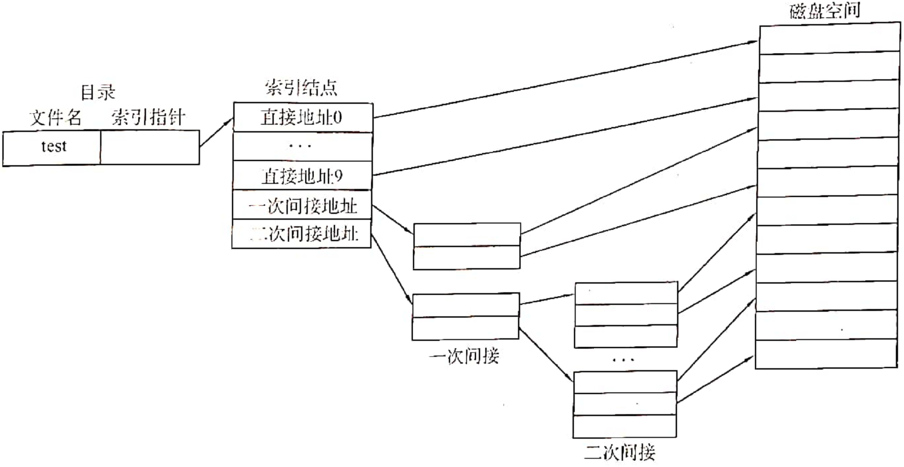
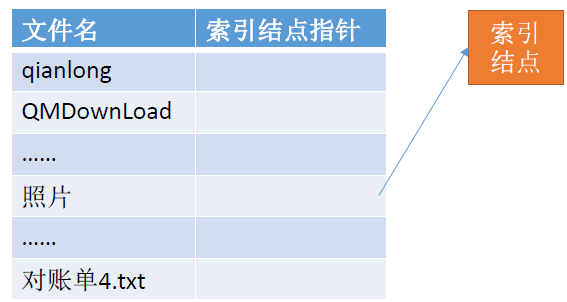
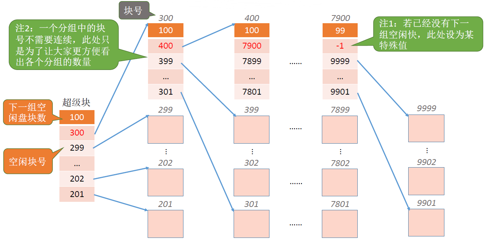
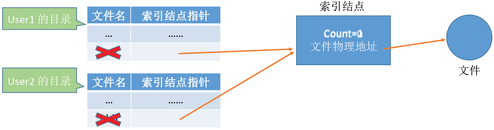
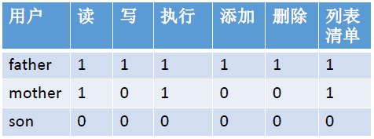

# 第四章 文件管理1 - 文件系统

### 文件基础知识

对一个文件的访问，常由用户访问权限和文件属性共同限制。

#### 文件的属性

文件名、标识符、类型、位置、大小、保护信息 ...

#### 操作系统提供的系统调用

- 创建文件：create
- 读文件：read
  - 从外存读入内存
- 写文件：write
  - 从内存写回外存
- 删除文件：delete
- 打开文件：open（文件和目录都必须先打开、后使用）
  - open 操作：将目录项中的信息复制到打开文件表中（将文件控制块读到内存中），并将打开文件表的索引号（文件描述符）返回给用户
  - 打开文件之后，当用户再要求对该文件进行相应的操作时，便可利用系统返回的索引号向系统提出操作请求，这时系统便可以直接利用该索引号到内存中的打开文件表中查找。文件的操作不需要每一次都查询目录，避免了该文件的再次检索。
  - 每个进程有自己的打开文件表（包含读写指针、访问权限...）
  - 操作系统有一张总打开文件表（包含打开计数器...）
- 关闭文件：close
  - 将进程打开文件表中的相应表项删除
  - 系统打开文件表的打开计数器 -1，如果为 0，则删除表项
- 复制文件
  - 使用 create + read + write 的组合实现

### 文件的逻辑结构 / 物理结构

> 物理结构：操作系统角度，文件数据如何存放在外存中
>
> 逻辑结构：用户角度，文件内部数据如何组织

#### 文件的逻辑结构

- **无结构文件**：二进制字符流，流式文件。例如：记事本文件

- **有结构文件**：**记录** 是一组 **数据项** 的集合。例如：数据库表

  根据 **各条记录长度是否相等**，分为：

  - **定长记录**（可以随机存取）
  - **可变长记录**（无法随机存取）

  根据 **有结构文件的逻辑结构**，分为：

  - **顺序文件**：采用顺序存储（可以随机存取）/ 链式存储（无法随机存取）。

    根据 **记录是否按关键字有序** 排列，分为串结构（无序）/ 顺序结构（有序）

  - **索引文件**：建立一张 **索引表**，每个记录对应一个表项。对索引文件进行存取时需要检索索引表，找到相应的表项。再利用该表项中给出的指向记录的指针值去访问所需的记录。对主文件的每个记录在索引表中都设有一个相应的表项，用于记录该记录的长度 L 及指向该记录的指针（指向该记录在 **逻辑地址** 空间的首地址）

    可以用不同的数据项 **建立多个索引表**，例如：id, username 分别作为索引

  - **索引顺序文件**：将记录分组，**一组记录** 对应 **一个索引表项**。检索时，先顺序查索引表，找到分组，再顺序查找分组。可以建立多级索引顺序文件。

#### 文件的物理结构（文件分配方式）

**适合随机存取的程度总结为：连续分配（类似于下标访问） > 索引分配 > 链接分配**

##### 连续分配

连续分配策略下是没有指针的，对每个数据块的访问都可以直接用块号寻址到。每个文件在磁盘上占有一组连续的块。

支持顺序访问 / 随机访问，但不便于文件长度的动态增长。

可能出现外部碎片，即在存储介质上存在很多不连续的空闲块，无法被连续文件使用，造成浪费

##### 链接分配

- 隐式链接：目录中存放 **文件名、起始块号、结束块号**，每个磁盘块中保存下一个盘块的指针。不支持随机访问。
- 显式链接：目录中存放 **文件名、起始块号**，操作系统维护 FAT **文件分配表 <物理块号,下一块>**。支持随机访问。

##### 索引分配

每个文件建立一张索引表。索引分配具有随机存取功能，也便于文件长度动态增长。

- 链接方案：一个索引块装不下，可以将多个索引块链接起来存放。

- 单级索引：将每个文件对应的盘块号集中放在一起，为每个文件分配一个索引块（表），再把分配给该文件的所有盘块号都记录在该索引块中，因而该索引块就是一个包含多个盘块号的数组。

  

- 多级索引：建立多层索引，使第一层索引块指向第二层的索引块，类推。

  

- 混合索引：顶级索引表中包含 **直接地址索引（直接指向数据块）、一级间接索引、两级间接索引**。对于小文件来说，访问一个数据块所需的读磁盘次数更少。

  

**区分：FAT 是一个磁盘对应一张，索引表是一个文件对应一张。**

### 文件目录

#### 文件控制块 FCB

文件控制块在调用 create() 时建立。FCB 的有序集合称为 “文件目录”，FCB 实现了 **文件名** 和 **文件** 的映射。FCB 中包含：

- 文件的基本信息（文件名、物理地址、逻辑结构、物理结构等）
- 存取控制信息（是否可读/可写、禁止访问的用户名单等）
- 使用信息（如文件的建立时间、修改时间等）
- 文件名、文件物理地址
- 文件长度

需要对目录进行的操作：

- 搜索：当用户要使用一个文件时，系统要根据文件名搜索目录，找到该文件对应的目录项
- 创建文件：增加目录项
- 删除文件：删除目录项
- 显示目录：用户请求显示目录的内容，如：所有文件、相应属性
- 修改目录：保存在目录中的文件属性变化，如：文件重命名

目录结构

- 单级目录结构：不允许文件重名
- 两级目录结构：允许不同用户的文件重名
- 多级目录结构：又称树形目录结构，不同目录下的文件可以重名
- 无环图目录结构：整个目录成为一个有向无环图，方便用户间文件共享。每个共享结点设置一个共享计数器，有共享计数器减为 0 时，才删除结点。

#### 索引结点（FCB的改进）

原有的文件目录表项：

将冗余信息放在索引节点中：节省空间，减少 IO 次数，提升文件检索速度

找到文件名对应的目录项后，才需要将索引结点调入内存，然后根据“存放位置”即可找到文件。

### 文件存储空间管理

操作系统需要对磁盘块进行哪些管理：

- 对非空闲磁盘块的管理：（文件的物理结构）连续分配、链接分配、索引分配
- 对空闲磁盘块的管理：空闲表法、空闲链表法（空闲盘快链 / 空闲盘区链）、位示图法、成组链接法

##### 空闲表法

##### 空闲链表法

空闲盘快链：以盘区为单位组成一条空闲链

空闲盘区链：以盘区为单位组成一条空闲链

##### 位示图法

要能自己推出盘块号与（字号,位号）相互转换的公式：若n表示字长，则

> (字号,位号)=(i, j)的二进制位对应的盘块号b = ni + j
>
> b号盘块对应的字号i = b/n，位号j = b%n

##### 成组链接法

UNIX 采用的策略，适合大型文件系统

### 文件共享

#### 硬链接：基于索引结点的共享方式

- 两个变量名指向了同一个物理位置，硬链接的文件拥有相同的 inode。操作系统靠 inode 来区分文件的，2 个 inode 相同的文件，代表它们是同一个文件。 
- 如果删掉了其中一个文件，另外一方还能找到这个文件。相当于只是删除了一个引用。
- 若 count > 0，说明还有别的用户要使用该文件。除非你把硬链接和源文件都删除，count 值变为 0，这个文件才被真正删除。

#### 软链接：基于符号链的共享方式

- 软链接是两个独立的文件，相当于创建了一个 **快捷方式** 
- 文件的共享用户只有该文件的 **路径名**，只有文件拥有者才拥有 **指向其索引节点的指针**
- 若符号链接被删除，不影响源文件。若源文件被删除，符号链接仍然存在，但找不到源文件了，会标红报错。
- 软链接有 **自己的 inode 号** 以及用户数据块
- 软链接可跨文件系统，硬链接不行
- 通过软链接方式访问共享文件时，要查询多级目录，会有多次磁盘 IO，因此比硬链接慢

#### 共性

- 无论是硬链接还是软连接，如果修改任意一方，另外一个文件也会看到这个变化。

### 文件保护

#### 口令保护

为文件设置一个“口令”（如：abc112233），用户请求访问该文件时必须提供“口令”。口令一般存放在文件对应的FCB或索引结点中。

缺点：正确的“口令”存放在系统内部，不够安全。

#### 加密保护

使用某个“密码”对文件进行加密，在访问文件时需要提供正确的“密码”才能对文件进行正确的解密。

缺点：编码/译码，或者说加密/解密要花费一定时间。

> Eg：一个最简单的加密算法——异或加密，假设用于加密 / 解密的 “密码” 为“01001”

#### 访问控制

在每个文件的FCB（或索引结点）中增加一个访问控制列表（Access-Control List, ACL），该表中记录了各个用户可以对该文件执行哪些操作。

精简的访问列表：以“组”为单位，标记各“组”用户可以对文件执行哪些操作。
如：分为系统管理员、文件主、文件主的伙伴、其他用户几个分组。当某用户想要访问文件时，系统会检查该用户所属的分组是否有相应的访问权限。

### 文件系统的层次结构

### 补充：文件系统实例

