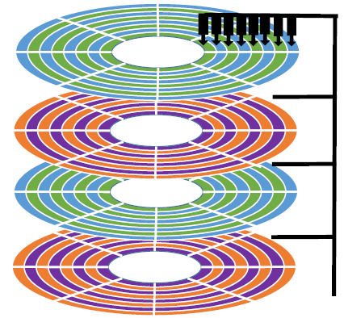

# 第四章 文件管理2 - 磁盘管理

### 磁盘的物理地址

可用 **柱面号，盘面号，扇区号** 来定位任意一个“磁盘块”

磁臂可以来回伸缩的称为 **活动头磁盘**，来带动磁头定位磁道

磁头不可移动的称为 **固定头磁盘**，这种磁盘中每个磁道有一个磁头。

### 磁盘调度算法

一次磁盘读/写操作需要的时间：

1. 寻道时间：启动磁头臂、移动磁头所花的时间
2. 延迟时间：将目标扇区转到刺头下面所花的时间
3. 传输时间：读 / 写数据花费的时间

#### 影响磁盘“寻道时间”的算法

操作系统的磁盘调度算法会直接影响 **寻道时间**

##### 先来先服务算法（FCFS）

根据进程请求访问磁盘的先后顺序进行调度。

##### 最短寻找时间优先（SSTF）

优先处理的磁道是与当前磁头最近的磁道。可以保证每次的寻道时间最短，但是并不能保证总的寻道时间最短。（其实就是贪心算法的思想，只是选择眼前最优，但是总体未必最优）

##### 扫描算法（SCAN）

只有磁头移动到最外侧磁道的时候才能往内移动，移动到最内侧磁道的时候才能往外移动。这就是扫描算法（SCAN）的思想。由于磁头移动的方式很像电梯，因此也叫电梯算法。

##### 扫描算法的改进：LOOK调度算法

如果在磁头移动方向上已经没有别的请求，就可以立即改变磁头移动方向。（边移动边观察，因此叫LOOK）

##### 扫描算法的改进：循环扫描算法（C-SCAN）

只有磁头朝某个特定方向移动时才处理磁道访问请求，而返回时直接快速移动至起始端而不处理任何请求。

#### 减少磁盘“延迟时间”的方法

延迟时间：将目标扇区转到刺头下面所花的时间

需要解决的问题：磁头读入一个扇区数据后，需要时间处理，物理上相邻的扇区可能来不及处理，磁头还没有准备好，只能等该扇区再次划过磁头再读入，导致延迟时间长

##### 交替编号（同一个盘面内的扇区交替编号）

即让逻辑上相邻的扇区在物理上有一定的间隔，可以使读取连续的逻辑扇区所需要的延迟时间更小

思考：为什么磁盘的物理地址是（柱面号，盘面号，扇区号）而不是（盘面号，柱面号，扇区号）？

答：读取地址连续的磁盘块时，采用（柱面号，盘面号，扇区号）的地址结构可以减少磁头移动消耗的时间

##### 错位命名（不同盘面之间扇区错位命名）

所有盘面都是一起连轴转的，读完 0 号盘面的磁盘块后，需要时间处理，才能读取 1 号扇区的磁盘块。采用错位命名法，可以留出处理时间。

### 磁盘的管理

#### 磁盘初始化

1. 低级格式化（物理格式化），将磁盘的各个磁道划分为扇区。一个扇区通常可分为头、数据区域（如512B大
   小）、尾三个部分组成。管理扇区所需要的各种数据结构一般存放在头、尾两个部分，包括扇区校验码（如奇偶校验、CRC循环冗余校验码等，校验码用于校验扇区中的数据是否发生错误）
2. 将磁盘分区，每个分区由若干柱面组成（即分为我们熟悉的C盘、D盘、E盘）
3. 进行逻辑格式化，创建文件系统。包括创建文件系统的根目录、初始化存储空间管理所用的数据结构（如位示图、空闲分区表）

#### 引导块

计算机开机时需要进行一系列初始化的工作，这些初始化工作是通过执行初始化程序（自举程序）完成的。

ROM中只存放很小的“自举装入程序”，开机时计算机先运行“自举装入程序”，通过执行该程序就可找到引导块在硬盘中的位置，并将完整的“自举程序”读入内存，完成初始化。

拥有启动分区的磁盘称为启动磁盘或系统磁盘（C:盘）

#### 坏块的管理

坏了、无法正常使用的扇区就是“坏块”。

对于简单的磁盘，可以在逻辑格式化时（建立文件系统时）对整个磁盘进行坏块检查，标明哪些扇区是坏扇区，比如：在FAT表上标明。（在这种方式中，坏块对操作系统不透明）

对于复杂的磁盘，磁盘控制器（磁盘设备内部的一个硬件部件）会维护一个坏块链表。在磁盘出厂前进行低级格式化（物理格式化）时就将坏块链进行初始化。会保留一些“备用扇区”，用于替换坏块。这种方案称为扇区备用。且这种处理方式中，坏块对操作系统透明。