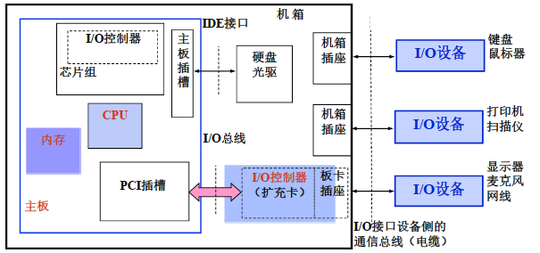
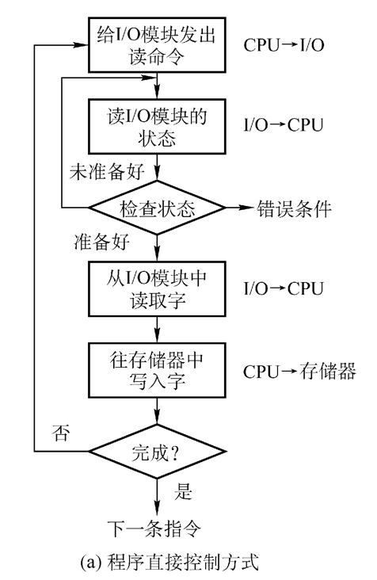
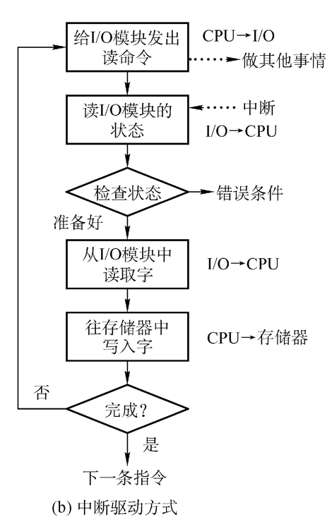
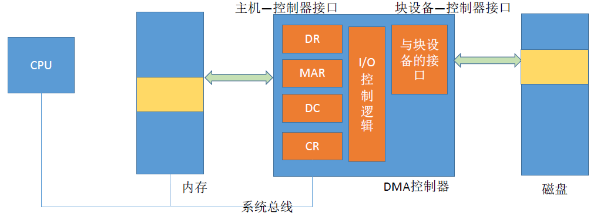
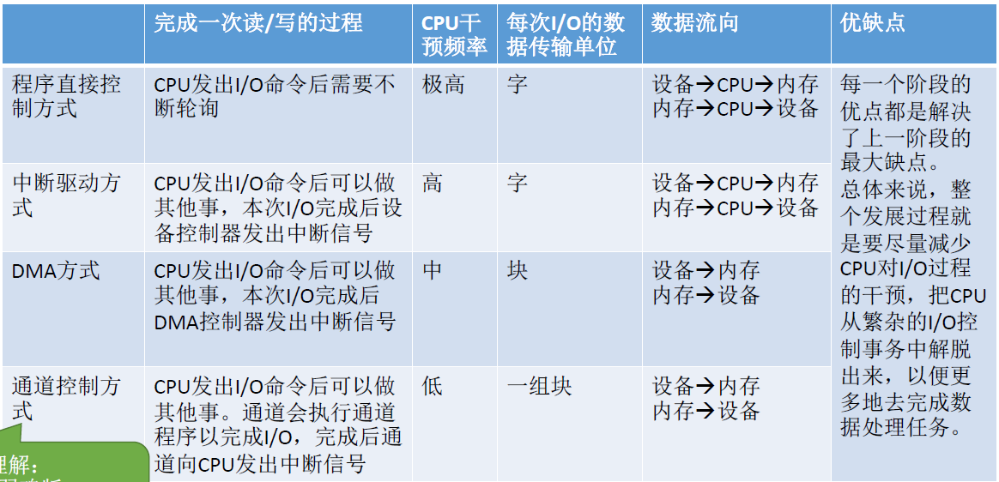
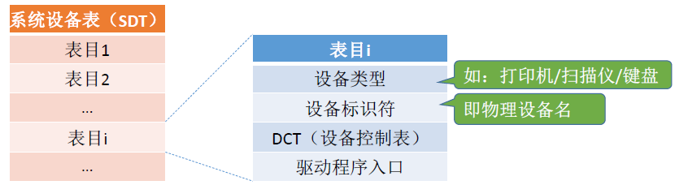
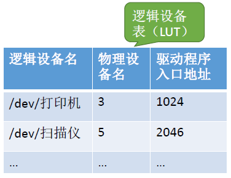
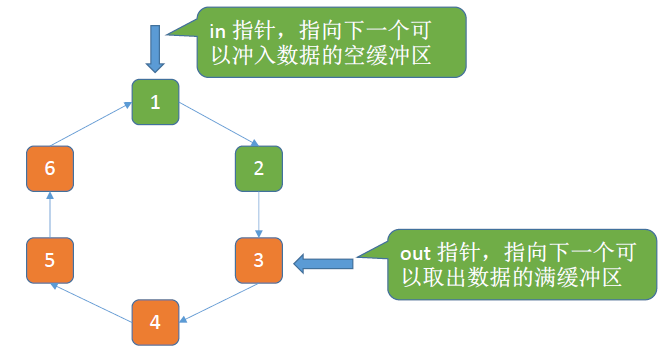

# 第5章 设备管理

### I/O 设备

UNIX系统将外部设备抽象为一种特殊的文件，用户可以使用与文件操作相同的方式对外部设备进行操作。

##### 按使用特性分类

人机交互类外部设备、存储设备、网络通信设备

##### 按传输速率分类

低速设备、中速设备、高速设备

##### 按信息交换的单位分类

块设备（传输快，可寻址）、字符设备（传输慢，不可寻址，常采用中断驱动方式）

### I/O 控制器

#### 为什么有 I/O 控制器？

想要把 printf("hello, world”) 这样的用户I/O请求，转换为对设备的控制命令，并完成设备I/O任务，需要I/O软件与I/O硬件之间的协调工作。

为达到模块化、通用性的设计目标，通常将I/O设备（又称外围设备、控制设备）中的 **机械部件** 和 **电子部件** 分开处理。CPU无法直接控制 **I/O设备** 的 **机械部件**，因此 I/O 设备还要有一个 **电子部件** 作为 CPU 和 I/O 设备机械部件之间的“中介”，用于实现CPU对设备的控制。这个 **电子部件** 就是 **I/O控制器**，又称设备控制器。CPU可控制I/O控制器，又由I/O控制器来控制设备的机械部件。

操作系统与控制器交互，而非与设备交互，外设通过电缆与设备控制器（I/O接口）进行数据、状态和控制信息的传送。

#### I/O 控制器在哪里？

I/O控制器（I/O接口）在 **扩展卡** 或者 **南桥芯片** 内，通过I/O总线、北桥芯片连接CPU

I/O硬件建立了外设与主机之间的“通路”：主机 --- 北桥 --- I/O总线 --- **南桥（设备控制器）** --- 电缆 --- 外设

##### 主要功能

- 接收和识别 CPU 发出的命令（要有控制寄存器）
- 向 CPU 报告设备的状态（要有状态寄存器）
- 数据交换（要有数据寄存器，暂存输入 / 输出的数据）
- 地址识别（由 I/O 逻辑实现）

##### 组成

- CPU 与控制器之间的接口（实现控制器与 CPU 之间的通信）
- I/O 逻辑（负责识别 CPU 发出的命令，并向设备发出命令）
- 控制器与设备之间的接口（实现控制器与设备之间的通信）

##### 两种寄存器编址方式

- 内存映射 I/O
  - 控制器中的寄存器与内存统一编址
  - 可以采用对内存进行操作的指令来对控制器进行操作
- 寄存器独立编址
  - 控制器中的寄存器独立编址
  - 需要设置专门的指令来操作控制器

### I/O 控制方式

#### 程序解控制方式

忙等待 I/O 方式：当 CPU 等待 I/O 操作完成时，CPU 不能继续执行。适合采用忙等待 I/O 的系统有：

- 专门用来控制单 I/O 设备的系统
- 运行一个单任务操作系统的个人计算机

优点：实现简单。在读/写指令之后，加上实现循环检查的一系列指令即可（因此才称为“程序直接控制方式”）

缺点：CPU 和 I/O 设备只能串行工作，CPU 需要一直轮询检查，长期处于“忙等”状态，CPU利用率低。

#### 中断驱动方式

优点：与“程序直接控制方式”相比，在“中断驱动方式”中，I/O控制器会通过中断信号主动报告I/O已完成，CPU不再需要不停地轮询。CPU和I/O设备可并行工作，CPU利用率得到明显提升。

缺点：每个字在I/O设备与内存之间的传输，都需要经过CPU。而频繁的中断处理会消耗较多的CPU时间。

#### DMA 方式

Direct Memory Access（存储器直接访问）。这是指一种高速的数据传输操作，允许在外部设备和存储器之间直接读写数据。整个数据传输操作在一个称为"DMA控制器"的控制下进行的。CPU除了在数据传输开始和结束时做一点处理外（开始和结束时候要做中断处理），在传输过程中CPU可以进行其他的工作（前提是未设置停止CPU访问）。这样，在大部分时间里，CPU和输入输出都处于并行操作。因此，使整个计算机系统的效率大大提高。

DMA方式主要适用于一些高速的I/O设备。这些设备传输字节或字的速度非常快。对于这类高速I/O设备，如果用输入输出指令或采用中断的方法来传输字节信息，会大量占用CPU的时间，同时也容易造成数据的丢失。而DMA方式能使I/O设备直接和存储器进行成批数据的快速传送。

##### DMA 控制器

DR（Data Register，数据寄存器）：暂存从设备到内存，或从内存到设备的数据。
MAR（Memory Address Register，内存地址寄存器）：在输入时，MAR表示数据应放到内存中的什么位置；输出时MAR表示要输出的数据放在内存中的什么位置。
DC（Data Counter，数据计数器）：表示剩余要读/写的字节数。
CR（Command Register，命令/状态寄存器）：用于存放CPU发来的I/O命令，或设备的状态信息。

优点：数据传输以“块”为单位，CPU介入频率进一步降低。数据的传输不再需要先经过CPU再写入内存，数据传输效率进一步增加。CPU和I/O设备的并行性得到提升。

缺点：CPU每发出一条I/O指令，只能读/写一个或多个连续的数据块。如果要读/写多个离散存储的数据块，或者要将数据分别写到不同的内存区域时，CPU要分别发出多条I/O指令，进行多次中断处理才能完成。

#### 通道控制方式

通道又称I/O控制器，用于实现 **内存** 与 **外设** 之间的信息传输。在设置的通道后，CPU只需向通道发出一条I/O指令，通道在收到该指令后，便从内存中取出本次要执行的通道程序，然后执行该通道程序，仅当通道完成规定的I/O任务后，才向CPU发送中断信号。

通道：一种 **硬件**，可以理解为是“弱鸡版的CPU”。通道可以识别并执行一系列 **通道指令**

缺点：实现复杂，需要专门的通道硬件支持

优点：CPU、通道、I/O设备可并行工作，资源利用率很高。

#### I/O 控制方式总结

### I/O 软件层次结构

- 用户通过调用 **用户层软件** 提供的 **库函数** 发出的I/O请求

- 用户层软件通过 **系统调用** 请求 **设备独立性软件层** 的服务
- 设备独立性软件层根据LUT调用设备对应的 **驱动程序**（设备驱动程序功能：例如，计算数据所在磁盘的柱面号、磁头号、扇区号）
- 驱动程序向 **I/O控制器** 发出具体命令
- 等待I/O完成的进程应该被阻塞，因此需要进程切换，而进程切换必然需要 **中断处理**

### I/O 核心子系统

I/O核心子系统要实现的功能，其实就是上述中间三层要实现的功能，包括：I/O调度、设备保护、假脱机技术（SPOOLing技术）、设备分配与回收、缓冲区管理（即缓冲与高速缓存）

#### SPOOLing 技术（假脱机技术）

在早期的手工操作计算机中，所谓脱机，即脱离主机的控制，由外围控制机（磁带机）进行输入 / 输出操作

现在的假脱机技术，是用软件的方式模拟脱机技术。SPOOLing系统的组成如下：

打印机是种“独占式设备”，SPOOLing技术可以把一台物理设备虚拟成逻辑上的多台设备，可将独占式设备改造成共享设备。用户进程实际分配到的是内存区，即虚拟设备。用户暂时未能打印的数据首先会被送到输出井（磁盘上的一块固定区域）中。

SPOOLing 技术是操作系统中以空间换时间的技术，减少了进程等待读入/读出信息的时间，加快了作业执行的速度。

#### 设备的分配与回收

设备分配时应考虑的因素：设备的固有属性、设备的分配算法、设备分配中的安全性

设备的固有属性可分为三种：独占设备、共享设备、虚拟设备。

- 独占设备——一个时段只能分配给一个进程（如打印机）
- 共享设备——可同时分配给多个进程使用（如磁盘），进程往往宏观上共享使用设备，微观上交替使用。
- 虚拟设备——采用SPOOLing技术将独占设备改造成虚拟的共享设备，可同时分配给多个进程使用（如采用SPOOLing技术实现的共享打印机）

设备的分配算法：

- 先来先服务
- 优先级高者优先
- 短任务优先

设备分配中的安全性：

- 安全分配方式：为进程分配一个设备后就将进程阻塞，本次I/O完成后才将进程唤醒。破坏了死锁发生的“请求和保持”条件，不会导致死锁。
- 不安全分配方式：进程发出I/O请求后，系统为其分配I/O设备，进程可继续执行，之后还可以发出新的I/O请求。直到只有某个I/O请求得不到满足时，才将进程阻塞。有可能发生死锁，可以使用银行家算法避免。

#### 设备分配管理中的数据结构

**设备控制表**（DCT）：系统为每个设备配置一张DCT，用于记录设备情况。包含：

- 设备类型：如，打印机/扫描仪/键盘
- 设备标识符：即物理设备名，系统中的每个设备的物理设备名唯一
- 设备状态：忙碌/空闲/故障…
- 指向控制器表的指针：每个设备由一个控制器控制，该指针可找到相应控制器的信息
- 重复执行次数或时间：当重复执行多次I/O操作后仍不成功，才认为此次I/O失败
- 设备队列的队首指针：指向正在等待该设备的进程队列（由进程PCB组成队列）

**控制器控制表**（COCT）：每个设备控制器都会对应一张COCT。操作系统根据COCT的信息对控制器进行操作和管理。

- 控制器标识符：各个控制器的唯一ID
- 控制器状态：忙碌/空闲/故障…
- 指向通道表的指针：每个控制器由一个通道控制，该指针可找到相应通道的信息
- 控制器队列的队首指针：指向正在等待该控制器的进程队列（由进程PCB组成队列）
- 控制器队列的队尾指针：同上

**通道控制表**（CHCT）：每个通道都会对应一张CHCT。操作系统根据CHCT的信息对通道进行操作和管理。

- 通道标识符：各个通道的唯一ID
- 通道状态：忙碌/空闲/故障…
- 与通道连接的控制器表首址：可通过该指针找到该通道管理的所有控制器相关信息（COCT）
- 通道队列的队首指针：指向正在等待该通道的进程队列（由进程PCB组成队列）
- 通道队列的队尾指针：同上

**系统设备表**（SDT）：记录了系统中全部设备的情况，每个设备对应一个表目。

#### 优化后的设备分配步骤

1. 根据进程请求的逻辑设备名查找SDT（注：用户编程时提供的逻辑设备名其实就是“设备类型”，例如打印机）

2. 查找SDT，找到用户进程指定类型的、并且空闲的设备，将其分配给该进程。操作系统在逻辑设备表（LUT）中新增一个表项。

   

3. 根据DCT找到COCT，若控制器忙碌则将进程PCB挂到控制器等待队列中，不忙碌则将控制器分配给进程。

4. 根据COCT找到CHCT，若通道忙碌则将进程PCB挂到通道等待队列中，不忙碌则将通道分配给进程。

### 缓冲区管理

使用 **硬件作为缓冲区** 的成本较高，容量也较小，一般仅用在对速度要求非常高的场合（如存储器管理中用的联想寄存器，即 **快表**，由于对页表的访问频率极高，因此使用速度很快的联想寄存器来存放页表项的副本）

一般情况下，更多的是利用内存作为缓冲区，“设备独立性软件”的缓冲区管理就是要组织管理好这些缓冲区

#### 单缓冲策略

当缓冲区数据非空时，不能往缓冲区冲入数据，只能从缓冲区把数据传出；当缓冲区为空时，可以往缓冲区冲入数据，但必须把缓冲区充满以后，才能从缓冲区把数据传出。

#### 双缓冲策略

假设某用户进程请求某种块设备读入若干块的数据。若采用双缓冲的策略，操作系统会在主存中为其分配两个缓冲区（若题目中没有特别说明，一个缓冲区的大小就是一个块）

结论：采用双缓冲策略，处理一个数据块的平均耗时为Max (T, C+M)

两台机器之间通信时，可以配置缓冲区用于数据的发送和接受。

注：管道通信中的“管道”其实就是缓冲区。要实现数据的双向传输，必须设置两个管道

##### 关于管道：

管道实际上是一种固定大小的缓冲区，管道对于管道两端的进程而言，就是一个文件，但它不是普通的文件，它不属于某种文件系统，而是自立门户，单独构成一种文件系统，并且只存在于内存中。它类似于通信中半双工信道的进程通信机制，一个管道可以实现双向的数据传输，而同一个时刻只能最多有一个方向的传输，不能两个方向同时进行。管道的容量大小通常为内存上的一页。当管道满时，进程写管道会被阻塞，而当管道空时，进程读管道会被阻塞。

#### 循环缓冲区

将多个大小相等的缓冲区链接成一个循环队列。

注：以下图示中，橙色表示已充满数据的缓冲区，绿色表示空缓冲区。

#### 缓冲池

缓冲池由系统中共用的缓冲区组成。这些缓冲区按使用状况可以分为：空缓冲队列、装满输入数据的缓冲队列（输入队列）、装满输出数据的缓冲队列（输出队列）。

另外，根据一个缓冲区在实际运算中扮演的功能不同，又设置了四种工作缓冲区：

- 用于收容输入数据的工作缓冲区（hin）

- 用于提取输入数据的工作缓冲区（sin）

- 用于收容输出数据的工作缓冲区（hout）

- 用于提取输出数据的工作缓冲区（sout）

**缓冲池** 是系统共用资源，可供 **多个进程** 共享，并且既能用于输入，又能用于输出。而 **单缓冲策略 / 双缓冲策略 / 循环缓冲区** 不能很好地支持多个进程使用。