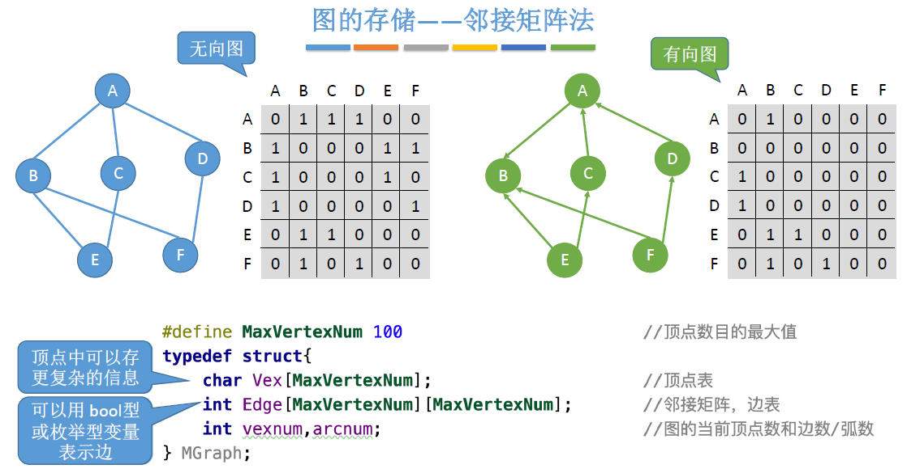

# 图

### 邻接矩阵




### 邻接表


### 最短路径Floid算法（天勤P208，试题2016-896算法阅读）

```c++
#define maxSize 99

typedef struct {
    int no;
    char info;
} VertexType;

typedef struct {
    int edges[maxSize][maxSize];
    int n, e;
    VertexType vex[maxSize];
} MGraph;

void Floyd(MGraph g, int path[][maxSize]) {
    int i, j, k;
    int A[maxSize][maxSize];
    for (int i = 0; i < g.n; ++i) { 	// 对数组A[][]和Path[][]进行初始化
        for (int j = 0; j < g.n; ++j) {
            A[i][j] = g.edges[i][j];	// 初始将邻接矩阵赋值给A[][]
            path[i][i] = -1;
        }
    }
    // 完成以k为中间点，对所有顶点对(i,j)进行检测和修改，O(n^3)
    for (int k = 0; k < g.n; ++k) {
        for (int i = 0; i < g.n; ++i) {
            for (int j = 0; j < g.n; ++j) {
                if (A[i][j] > A[i][k] + A[k][j]) {
                    A[i][j] = A[i][k] + A[k][j];
                    path[i][j] = k;
                }
            }
        }
    }
}
```


### 图的非递归深度优先搜索（邻接表存储）（试题2016-896算法设计是邻接矩阵）

邻接表存储有向图


邻接表存储无向图


```c++
// 边
typedef struct ArcNode {
    int adjvex;                //该边所指向的结点的位置
    struct ArcNode *nextarc;   //指向下一条边的指针
    int info;                  //该边的相关信息（如权值）
} ArcNode;

// 顶点
typedef struct {
    char data;                 //顶点信息
    ArcNode *firstarc;         //指向第一条边的指针
} VNode;

// 邻接表
typedef struct {
    VNode adjlist[maxSize];    //邻接表
    int n, e;                  //顶点数和边数
} AGraph;


void DFS(AGraph *g, int v) { // G为要进行DFS的图，v为指定的入口顶点
    ArcNode *p;
    int stack[maxSize], top = -1;
    int visit[maxSize]; // 记录顶点是否已经访问过。0表示未访问，1表示访问过
    for (int i = 0; i < g->n; ++i) { // 所有顶点全部标记为未访问过，初始化为0
        visit[i] = 0;
    }
    Visit(v);
    visit[v] = 1;
    stack[++top] = v;
    while (top != -1) {
        int k = stack[top];
        p = g->adjlist[k].firstarc; // 顶点k的第一条边
        while (p != NULL && visit[p->adjvex] == 1) { // 当前边已经访问过
            p = p->nextarc; // 则访问顶点k的下一条边
        }	// 循环结束后，p指向顶点k的第一个没有访问过的边
        if (p == NULL) { // 顶点k的所有边都被访问过了，则出栈一个新的顶点
            --top;
        } else { // 成功找到顶点k的一个没有被访问过的边
            Visit(p->adjvex); // 访问该边指向的顶点
            visit[p->adjvex] = 1; // 进行访问标记
            stack[++top] = p->adjvex; // 将该边指向的顶点入栈
        }
    }
}
```

