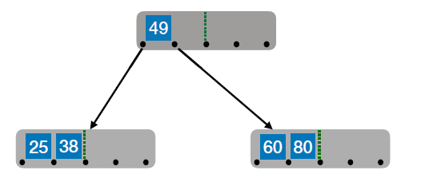

# 搜索结构

### 折半查找

```c++
int search(keytype key[], int n, keytype k) {
    int low = 0, high = n - 1, mid;
    while (low <= high) {
        mid = (low + high) / 2;
        if (key[mid] == k)
            return mid;    //查找成功，返回mid 
        if (k > key[mid])
            low = mid + 1;    //在后半序列中查找 
        else
            high = mid - 1;    //在前半序列中查找 
    }
    return -1;//查找失败，返回-1 
}
```


## B树


### B树的插入

##### 核心要求：

① 对m阶B树：除根节点外，结点关键字个数 ≤ n ≤ m-1

② 子树0<关键字1<子树1<关键字2<子树2<….

##### 插入过程：

- 在插⼊key后，若导致原结点关键字数 **超过上限**，则从中间位置 ⌈m/2⌉ 将其中的关键字分为两部分，左部分包
  含的关键字放在原结点中，右部分包含的关键字放到新结点中，中间位置 ⌈m/2⌉ 的结点插入原结点的父结点。

- 若此时导致其⽗结点的关键字个数也超过了上限，则继续进行这种分裂操作，直⾄这个过程传到根结点为止，进而导致B树⾼度增1。

##### 举个例子：

例如，5阶B树插入节点80后，点关键字数 **超过上限**：


于是进行分裂：



注意，新元素⼀定是插⼊到最底层“终端节点”，用“查找”来确定插入位置。这样才能保证B树的失败结点只能出现在最下面⼀层。


### B树的删除

- 若被删除关键字在 **终端节点**

  - 若节点关键字个数足够，即不低于下限 ⌈m/2⌉ − 1，则直接删除该关键字

  - 若节点关键字个数不够，看其兄弟是否够借

    - 若兄弟够借：被删除关键字所在结点删除前的关键字个数低于下限，且与此结点右（或左）兄弟结
      点的关键字个数还很宽裕，则需要调整该结点、右（或左）兄弟结点及其双亲结点（父子换位法）

      说白了，当右兄弟很宽裕时，⽤ **当前结点的后继**、**后继的后继** 来填补空缺
      
    - 若兄弟不够借：被删除关键字所在结点删除前的关键字个数低于下限，且此时与该结点相邻的左、右兄弟结点的关键字个数均=⌈m/2⌉ − 1，则将关键字删除后与 **左（或右）兄弟结点** 及 **双亲结点** 中的关键字进行 **合并**
    
    
      

- 若被删除关键字在 **非终端节点**，则⽤ **直接前驱** 或 **直接后继** 来替代被删除的关键字。对 **非终端结点** 关键字的删除，必然可以 **转化为** 对 **终端结点** 的删除操作。

  - 直接前驱：当前关键字左侧指针所指⼦树中 **最右下** 的元素
  - 直接后继：当前关键字右侧指针所指⼦树中 **最左下** 的元素


### 总结

