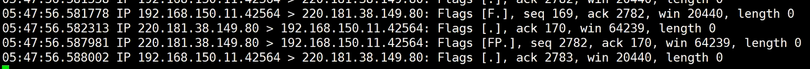

# 网络IO

### 同步模型、异步模型

- 同步模型：程序自己读取，程序在IO上的模型就叫 **同步模型**
- 异步模型：程序把读取的过程交给内核，自己做自己的事情，叫 **异步模型**

允许程序去调用内核，来监控更多的客户端，直到一个或多个文件描述符是可用的状态，再返回。减少了用户态、内核态的无用切换。


### BIO

- 阻塞式的 `ServerSocket`
  - 阻塞地等待客户端的连接，连接后抛出一个线程
  - 阻塞地等待客户端发送消息
  - C10K 问题，如果有1万个连接，就要抛出1万个线程
  
  

### NIO

Java：New IO 新的IO包

OS：Non-Blocking IO 非阻塞的IO

- 非阻塞式的 `ServerSocketChannel`
  - `ss.configBlocking(false)` 设置非阻塞
  - 在`accept(3,`中空转，要么返回client的描述符，要么返回-1，如果拿到了新的连接，调用clientList.add()
- 缺点
  - `ByteBuffer`只有一个指针，用起来有很多坑
  - NIO的存在的问题：C10K问题

    - 放大：C10K当并发量很大的时候，需要遍历的文件描述符会很多，**每循环 **一次，**都要调用 10K 次recv 系统调用**（复杂度O(n)），进行用户态到内核态的切换，性能损耗大。
    - 缩小：你调用了 **那么多次 recv 系统调用**，但是如果 C10K 只有 1 个 Client 发来了数据，**只有 1 次系统调用是有效的**，剩余 n-1 次的监听都是无效的。我们希望，能够有一种方式，只需要调用 **有效** 的 **recv 系统调用** 就可以。
    
    

### 多路复用

OS 提供的**多路复用器**有 `select`, `pool`, `epoll`, `kqueue` 等

select，poll 的缺点是，每次你调用的时候，都需要将所有的 fds （文件描述符的集合）作为参数传递给函数，而 epoll 的优势是在内核中开辟了一个空间（调用的是 epoll_create）

 Java 把所有的多路复用器封装成了 **Selector 类**

可以在启动时，指定使用哪种多路复用器（默认优先选择 epoll），注意 windows 上是没有 epoll 的。

```java
-Djava.nio.channels.spi.SelectorProvider=sun.nio.ch.EPollSelectorProvider
```

- Linux内核提供的 `select` 多路复用器，会返回给程序一个 list，告诉程序 **哪些 fd 是可以读/写的状态**，然后**程序要自己读取**，这是 IO 同步模型。

  只有当 read 系统调用不需要你程序自己去做的时候，才属于异步的 IO，目前只有 windows iocp 实现了。

- 缺点
  
  - 如果有很多长连接，内核每次都要给程序传递很多连接对象


### epoll

- epoll 也是多路复用器，但是它有一个 **存放结果集的链表**，**它与 select / poll 的区别如下：**

  - select：应用程什么时候调用 select，内核就什么时候遍历所有的文件描述符，修正 fd 的状态。

  - epoll：应用程序在内核的 **红黑树** 中存放过一些fd，那么，内核基于中断处理完 fd 的 buffer/状态 之后，继续把有状态的 fd 拷贝到链表中。

    即便应用程序不调用内核，内核也会随着中断，完成所有fd状态的设置。这样，程序调用`epoll_wait`可以及时去取链表包含中有状态的 fd 的结果集。规避了对于文件描述符的全量遍历。

    拿到 fd 的结果集之后，**程序需要自己取处理 accept / recv 等系统调用的过程**。所以`epoll_wait`依然是同步模型。

- 它不负责读取 IO，只关心返回结果

- Epoll是Event poll，把有数据这个事件通知给程序，还需要程序自己取读取数据

- `man epoll` 帮助文档：

  The `epoll` API performs a similar task to `poll`(2): monitoring multiple file descriptors to see if I/O is possible on any of them.  The `epoll` API can be used either as an edge-triggered(边缘触发) or a  level-triggered(条件触发)  interface and scales well to large numbers of watched file descriptors(可以很好地扩展到大量监视文件描述符).  The following system calls are provided to create and manage an epoll instance:  [ 注：这里 (2) 的意思是 2 类系统调用。类似地，还有 7 类杂项]

  - `epoll_create` creates an epoll instance  and  returns  a  file  descriptor  referring  to  that instance.

    创建成功之后，返回一个 fd 文件描述符例如`fd6`。在内核开辟一块空间，里面存放红黑树。

  - `epoll_ctl`, This  system  call  performs  control  operations  on  the `epoll`(7) instance referred to by the file descriptor epfd.  It requests that the operation op be performed for the target file descriptor, fd.

    ```c
    int epoll_ctl(int epfd, int op, int fd, struct epoll_event *event);
    ```

    例如，在文件描述符`fd6`中，使用 `EPOLL_CTL_ADD` 添加服务器用于 listen 的文件描述符

    - `int op` 可选参数：`EPOLL_CTL_ADD`, `EPOLL_CTL_MOD`, `EPOLL_CTL_DEL`

  - `epoll_wait` waits for I/O events, blocking the calling thread if no events are currently available.

    **epoll_wait 不传递 fds，不触发内核遍历。**你的程序需要写一个死循环，一直调用 epoll_wait，可以设置阻塞，或者非阻塞

- 早期在没有上述三个系统调用的时候，需要应用程序调用 mmap 来实现两端的内存共享提速，后期在 2.6 内核版本之后，提供了这些系统调用，就不需要 mmap 这种实现方式了

##### 边沿触发

只要缓冲区还有东西可以读，只要你调用了epoll_wait函数，它就会继续通知你

##### 水平触发

就像高低电平一样，只有从高电平到低电平或者低电平到高电平时才会通知我们。只有客户端再次向服务器端发送数据时，epoll_wait 才会再返回给你


### AIO

- AIO 是异步的模型
- 使用的是 callback / hook / templateMethod 回调，是基于事件模型的 IO
- Netty封装的是NIO，不是AIO
  - AIO 只有 Window 支持（内核中使用CompletionPort完成端口）
  - 在 Linux 上的 AIO 只不过是对 NIO 的封装而已（是基于epoll 的轮询）


##### 关于 Linux 上的 同步/异步 IO

“停止使用这种只适用于特殊情况的垃圾，让所有人都在乎的系统核心尽其所能地运行好其基本的性能”，就是说，你cpu做你cpu该做的事，别净整些没用的。

就像系统调用那样，尽管Linux上建立一个新的系统调用非常容易，但并不提倡每出现一种新的抽象就简单的加入一个新的系统调用。这使得它的系统调用接口简洁得令人叹为观止（2.6版本338个），新系统调用增加频率很低也反映出它是一个相对较稳定并且功能已经较为完善的操作系统。

这也是为什么以前Linux版本的主内核树中没有类似于windows 上 AIO这样的通用的内核异步IO处理方案（在Linux 上的AIO只不过是对 NIO 的封装而已），因为不安全，会让内核做的事情太多，容易出bug。windows敢于这么做，是因为它的市场比较广，一方面是用户市场，一方面是服务器市场，况且windows比较注重用户市场，所以敢于把内核做的胖一些，也是因此虽然现在已经win10了，但是蓝屏啊，死机啊，挂机啊这些问题也还是会出现。

现在 Linux 对异步IO也开始上心了，根据 https://www.infoq.cn/article/zPhDatkQx5OPKd9J53mX Linux内核发展史，2019.5.5 发布的 5.1 版本的内核，包括用于异步 I/O 的高性能接口 io_uring， 是 Linux 中最新的原生异步 I/O 实现，是良好的 epoll 替代品。

参考文献：

> 异步IO一直是 Linux 系统的痛。Linux 很早就有 POSIX AIO 这套异步IO实现，但它是在用户空间自己开用户线程模拟的，效率极其低下。后来在 Linux 2.6 引入了真正的内核级别支持的异步IO实现（Linux aio），但是它只支持 Direct IO，只支持磁盘文件读写，而且对文件大小还有限制，总之各种麻烦。到目前为止（2019年5月），libuv 还是在用pthread+preadv的形式实现异步IO。
>
> 随着 [Linux 5.1 的发布](https://www.oschina.net/news/106489/linux-kernel-5-1-released)，Linux 终于有了自己好用的异步IO实现，并且支持大多数文件类型（磁盘文件、socket，管道等），这个就是本文的主角：io_uring
>
> 作者：CarterLi
>         链接：https://segmentfault.com/a/1190000019300089

> 前面的[文章](https://segmentfault.com/a/1190000019300089)说到 `io_uring` 是 Linux 中最新的原生异步 I/O 实现，实际上 `io_uring` 也支持 polling，是良好的 epoll 替代品。
>
> 作者：CarterLi
>         链接：https://segmentfault.com/a/1190000019361819?utm_source=tag-newest


### Netty

Netty主要用于网络通信。

- 很多网页游戏的服务器都是用Netty写的。
- Tomcat，Zookeeper，很多开源分布式的底层也是netty写的。


### TCP 

#### 三次握手

1. **C -> S (syn, `seq=j`)**    C 说，我想连接
2. **S -> C (syn+ack, `ack=j+1`, `syn=k`)**    发完之后，C 知道了 S 能收到自己的消息
3. **C -> S (ack, `ack=k+1`)**    发完之后，S 知道了 C 能收到自己的消息（确认是双向的），这就是为什么需要第三次握手

三次握手之后，双方开辟资源，建立了 socket


#### 四次分手



1. **C -> S (FIN)**    C 说，我想断开
2. **S -> C (FIN+ack)**    S 知道了 C 想断开
3. **S -> C (FIN)**    S 说，我也想断开
4. **C -> S (ack)**    C 说，好的，断开吧

**为什么握手需要三次，分手需要四次？** 如果类比三次握手，在第二次挥手的时候同时发 FIN + ACK 明显不合理，因为被动方可能没有数据发送完，你这么关太草率了，所以需要四次。

**为什么四次分手之后，还会等两个传输时间，才会释放资源？** 因为如果最后 C 端返回的 ACK 号丢失了，这时 S 端没有收到 ACK，会重发一遍 FIN，如果此时客户端的套接字已经被删除了，会发生什么呢？套接字被删除，端口被释放，这时别的应用可能创建新的套接字，恰好分配了同一个端口号，而服务器重发的 FIN 正好到达，这个 FIN 就会错误的跑到新的套接字里面，新的套接字就开始执行断开操作了。为了避免这样的误操作，C 端会等几分钟再删除套接字。


#### socket

套接字，`ip:port ip:port` 四元组，为了区分每一个 socket 对应关系


### IP

- IP 地址 `‭11000000‬ ‭10101000‬ ‭10010110‬ 0000‭0011‬ (192.168.150.11)`

- 子网掩码：二进制按位与 `11111111 11111111 11111111 00000000 (255.255.255.0)` 

- 子网：`‭11000000‬ ‭10101000‬ ‭10010110‬ 0000‭0000 (192.168.150.0)`‬

- 下一跳机制

  - 路由表

    
    
  - 通过修改 mac 地址找下一跳。在不考虑 NAT 的情况下，ip 地址不会改变
  
    - mac 地址记录在 arp 表中
    - 链路层